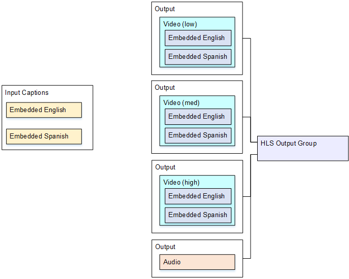

# Setup with Embedded or object-style

captions

This example for captions in MediaLive shows how to implement [the fourth use
case](use-case-one-captions-output-multiple-video-encodes.md "use-case-one-captions-output-multiple-video-encodes.md") from the typical scenarios. For example, you want to produce an HLS
output with three video encodes (one for low-resolution video, one for medium, one for
high) and one audio. You also want to include embedded captions (in English and Spanish)
and associate them with all three video encodes.

To set up for this use case, follow this procedure.

1. In the channel that you are creating, in the navigation pane, in **Input
   attachments**, choose the input.
2. For **General input settings**, choose **Add captions
   selector** to create one captions selector. Set **Selector
   settings** to **Embedded source**.
3. Create an HLS output group.
4. Create one output and set up the video and audio for low-resolution video.
5. In that same output, create one captions asset with the following:
   - **Captions selector name**: Captions selector 1.
   - **Captions settings**: One of the Embedded formats.
   - **Language code** and **Language
     description**: Leave blank; with embedded passthrough captions, all the
     languages are included.

6. Create a second output and set up the video and audio for medium-resolution
   video.
7. In that same output, create one captions asset with the following:
   - **Captions selector name**: Captions selector 1.
   - **Captions settings**: One of the Embedded formats.
   - **Language code** and **Language
     description**: Keep blank. With embedded captions, all the languages
     are included.

8. Create a third output and set up the video and audio for high-resolution
   video.
9. In that same output, create one captions asset with the following:
   - **Captions selector name**: Captions selector 1.
   - **Captions settings**: One of the Embedded formats.
   - **Language code** and **Language
     description**: Keep blank. With embedded captions, all the languages
     are included.

10. Finish setting up the channel and save it.
