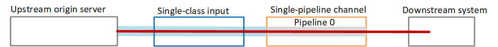
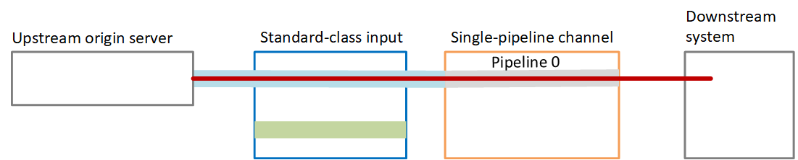

# Setting up a single-pipeline channel

without upgrade potential

When you followed the [guidelines](pipeline-redundancy-guidelines.md "pipeline-redundancy-guidelines.md")
for implementing pipeline redundancy in a MediaLive channel, you might have decided one of
the following:

- You might have decided that you don't want to implement pipeline redundancy in
  the channel now or in the future.
- Or you might have determined that you can't implement pipeline redundancy
  because all the inputs for the channel can only be single-class inputs.

###### Note

Before you decide to implement this option, read the information about [setting up without pipeline redundancy, but
with the option to easily upgrade later on](single-channel-upgrade.md "single-channel-upgrade.md").

Follow these guidelines when you plan the workflow:

- When you [create inputs](medialive-inputs.md "medialive-inputs.md"), set up the
  inputs as follows:
  - Some inputs can only be standard-class inputs. You can still attach
    these inputs to the channel. Create the inputs in the regular way.
  - Some inputs can only be single-class inputs. Create these inputs in
    the regular way.
  - Set up all other inputs as single-class inputs. To set up the input in
    this way, set the **Input class** field to
    **Single input**.

- When you create the channel, do the following:
  - Set up the channel as a single-pipeline channel. See [Complete channel and input details](creating-a-channel-step1.md "creating-a-channel-step1.md").
  - At the step to [attach inputs
    to the channel](creating-a-channel-step2.md "creating-a-channel-step2.md"), attach the inputs that you have
    identified.

- Contact the upstream system and request that they provide _one_ content source. Even for standard-class inputs,
  the upstream system should provide only one source.

## How a single-pipeline channel

works

When you set up a single-pipeline channel without any upgrade provision, the
channel is a single-pipeline channel. The inputs can be a combination of
single-class inputs and standard-class inputs.

- The channel contains one pipeline—pipeline 0.
- Each single-class input that is attached to the channel contains one
  pipeline. The input is connected to one content source.

As this diagram illustrates, the upstream system provides one instance of
the source content to the input, to the pipeline that is indicated by the
blue line. The input provides that one instance to the one pipeline in the
channel. The channel produces one instance of the output for the downstream
system.

- Each standard-class input input contain two pipelines. However, only one
  of the pipelines is connected to a content source. The other input pipeline
  is inactive.

As this diagram illustrates, the upstream system provides one instance of
the source content to the input, to the pipeline that is indicated by the
blue line. The input provides that one instance to the one pipeline in the
channel. The channel produces one instance of the output for the downstream
system. The other pipeline in the input (the green pipeline) is always
inactive.

## Failure handling

If there is a problem that causes a pipeline to stop functioning, MediaLive stops
producing output. The downstream system stops receiving output.
