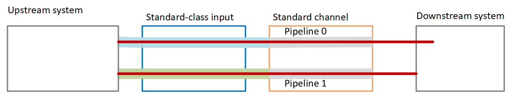
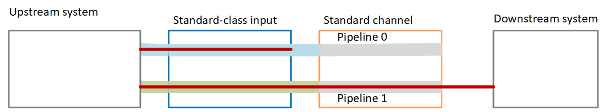

# Setting up a standard

channel

When you followed the [guidelines](pipeline-redundancy-guidelines.md "pipeline-redundancy-guidelines.md")
for implementing pipeline redundancy in a MediaLive channel, you might have decided that you
might want to implement pipeline redundancy. In this case, make sure that you set up the
inputs as standard-class inputs and set up the channel as a standard channel.

Follow these guidelines when you plan the workflow:

- Make sure that the upstream system can provide you with
  two instances of the source content. See [Assess source formats and packaging](uss-obtain-info.md "uss-obtain-info.md").
- When you [create
  inputs](medialive-inputs.md "medialive-inputs.md"), set up all the inputs as standard-class
  inputs.

Some inputs are always set up as standard-class inputs. For all other inputs,
set the **Input class** field to **Standard
input**.

- When you create the channel, do the following:
  - Set up the channel as a standard channel. See
    [Complete channel and input details](creating-a-channel-step1.md "creating-a-channel-step1.md").
  - At the step to [attach inputs
    to the channel](creating-a-channel-step2.md "creating-a-channel-step2.md"), attach only
    standard-class inputs. If you try to attach a
    single-class input to a standard channel, you won't
    be able to create the channel.

- Contact the upstream system and request that they provide
  two content sources.

## How pipeline

redundancy works

When you set up a standard channel, the channel has two
pipelines—pipeline 0 and pipeline 1. Each input also contains
two pipelines. A content source is connected to each
pipeline.

As this diagram illustrates, the upstream system provides two
instances of the content to the input. One instance goes to the
pipeline that is indicated by the blue line, the other goes to
the pipeline indicated by the green line. Each of these lines is
attached to one of the two pipelines in the channel. The channel
produces two identical instances of the output for the
downstream system. The downstream system chooses to handle one
instance (the output from blue pipeline) and to ignore the other
instance (the output from the green pipeline).

## Failure

handling

There might be a problem that causes a pipeline to stop functioning.

- If the failed pipeline is the pipeline that the
  downstream system is handling (for example, the blue
  pipeline), the downstream system can switch to the other
  output.
- After a few minutes, the failed pipeline automatically
  restarts and produces output. The downstream system can
  continue to handle the output from the green pipeline,
  or it can go back to the blue pipeline. That decision
  has no impact on MediaLive.

In this diagram, notice that the upstream system is still
sending source content to the blue pipeline, which indicates
that the upstream system is working but pipeline 0 has failed.
The downstream system has started handling pipeline 1 instead,
using the source content from the green pipeline.

