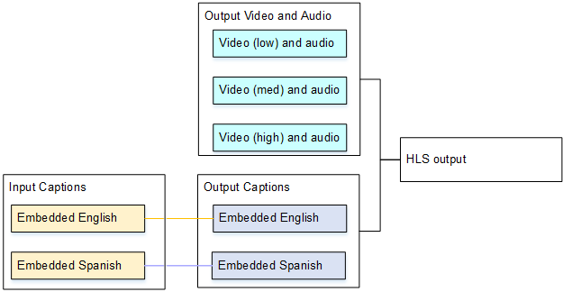

# Use case D: One captions output shared by multiple video encodes

This use case for deals with including captions in an ABR workflow in MediaLive.

For example, assume that there are three video/audio media combinations: one for
low-resolution video, one for medium, and one for high. Assume that there is one output
captions asset (English and Spanish embedded) that you want to associate with all three
video/audio media combinations.

