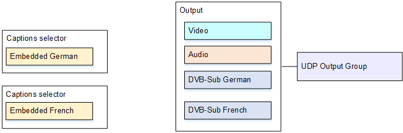

# Use case B: One

input format converted to one different output format

This example for captions in MediaLive shows how to implement [the second use
case](use-case-one-input-format-to-different-output-formats.md "use-case-one-input-format-to-different-output-formats.md") from the typical scenarios. The input includes two captions
languages, and the single output converts those captions. For example, the input has
embedded captions in German and French. You want to produce a UDP output with both captions
converted to DVB-Sub, plus one video and one audio.

To set up for this use case, follow this procedure.

1. In the channel that you are creating, in the navigation pane, for **Input
   attachments**, choose the input.
2. For **General input settings**, choose **Add captions
   selector** twice, to create Captions selector 1 (for German) and Captions
   selector 2 (for French). In both cases, set **Selector settings** to
   **Embedded source**.
3. Create a UDP output group.
4. Create one output and set up the video and audio.
5. In this output, choose **Add captions** to create a captions
   encode.
   - **Captions selector name**: Captions selector 1.
   - **Captions settings**: DVB-Sub.
   - **Language code** and **Language
     description**: German.
   - Other fields: Keep the defaults or complete as desired.

6. Choose **Add captions** again to create another captions encode.
   Set up this encode for the French captions. Make sure that you set up the font fields
   for German and French in exactly the same way.
7. Finish setting up the channel and save it.
