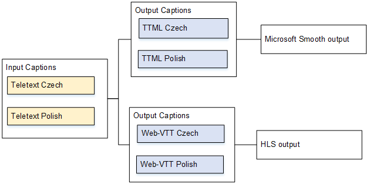

# Use case C: One input

format converted to different formats, one format for each output

In this use case for including captions in a MediaLive output, the input is set up with one
format of captions and two or more languages. Assume that you want to produce several
different types of output, and that in each output you want to convert the captions to a
different format but include all the languages.

For example, the input has Teletext captions in Czech and Polish. You want to produce a
Microsoft Smooth output and an HLS output. In the Microsoft Smooth output, you want to
convert both captions to TTML. In the HLS output, you want to convert both captions to
WebVTT.

