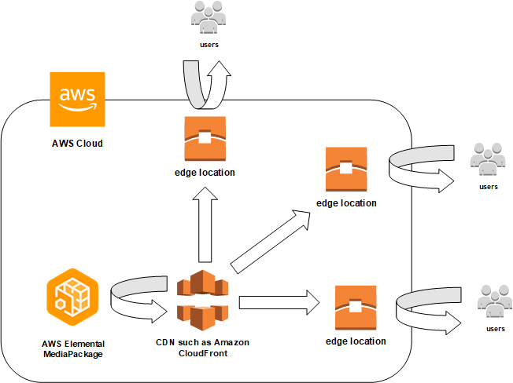

# Working with CDNs

You can use a content delivery network (CDN) such as [Amazon CloudFront](../../../AmazonCloudFront/latest/DeveloperGuide.md "../../../AmazonCloudFront/latest/DeveloperGuide.md") to serve the content that you store in AWS Elemental MediaPackage. A CDN is a
globally distributed set of servers that caches content such as videos. When a user requests
your content, the CDN routes the request to the edge location that provides the lowest
latency. If your content is already cached in that edge location, the CDN delivers it
immediately. If your content is not currently in that edge location, the CDN retrieves it
from your origin (in this case, the MediaPackage endpoint) and distributes it to the user.
The following illustration shows this process.

The following sections provide procedures for working with distributions from
Amazon CloudFront.

###### Topics

- [Creating a Distribution](cdns-create.md "cdns-create.md")
- [Viewing a Distribution](cdns-view.md "cdns-view.md")
- [Editing a Distribution](cdns-edit.md "cdns-edit.md")
- [Deleting a Distribution](cdns-delete.md "cdns-delete.md")
