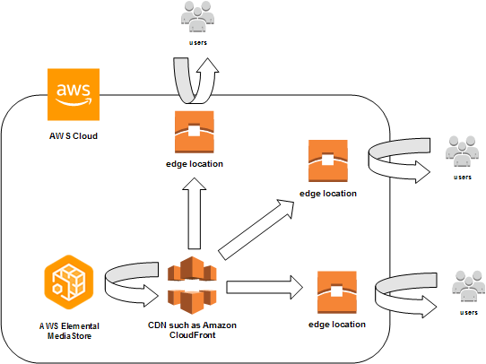

End of support notice: On November 13, 2025, AWS will discontinue support
for AWS Elemental MediaStore. After November 13, 2025, you will no longer be able to access the MediaStore console
or MediaStore resources. For more information, visit this
[blog post](https://aws.amazon.com/blogs/media/support-for-aws-elemental-mediastore-ending-soon/ "https://aws.amazon.com/blogs/media/support-for-aws-elemental-mediastore-ending-soon/").

# Working with content delivery networks (CDNs)

You can use a content delivery network (CDN) such as [Amazon CloudFront](../../../AmazonCloudFront/latest/DeveloperGuide.md "../../../AmazonCloudFront/latest/DeveloperGuide.md") to serve the content that you store in AWS Elemental MediaStore. A CDN is a
globally distributed set of servers that caches content such as videos. When a user requests
your content, the CDN routes the request to the edge location that provides the lowest
latency. If your content is already cached in that edge location, the CDN delivers it
immediately. If your content is not currently in that edge location, the CDN retrieves it
from your origin (such as your MediaStore container) and distributes it to the
user.

###### Topics

- [Allowing Amazon CloudFront to
  access your AWS Elemental MediaStore container](cdns-allowing-cloudfront-to-access-mediastore.md "cdns-allowing-cloudfront-to-access-mediastore.md")
- [AWS Elemental MediaStore's
  interaction with HTTP caches](cdn-mediastore-interaction-with-http-caches.md "cdn-mediastore-interaction-with-http-caches.md")
