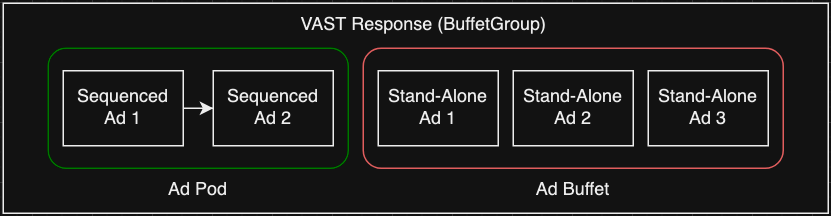

# Ad buffet

The Interactive Advertising Bureau (IAB) Video Ad Serving Template (VAST) specification defines ad pods and ad buffet. This mechanism supports
ordered ad insertion with automatic fallback on ad insertion failure. In an ad pod,
sequenced ads play in order. Standalone ads serve as a buffet from which MediaTailor
selects replacement ads when a sequenced ad fails.

AWS Elemental MediaTailor supports this specification through the `AdSequencingMode`
setting in the `AdDecisionServerConfiguration` of the
`PlaybackConfiguration`. When set to
`FOLLOW_AD_SEQUENCE`, MediaTailor inserts sequenced ads in order and uses standalone
ads only as substitutes when a sequenced ad fails to insert.

## Example VAST response

The following example shows a VAST response that contains sequenced ads and
standalone ads:

```
<VAST>
  <Ad sequence="1" id="sequencedAd1">...</Ad>    <!-- Sequenced Ad 1 -->
  <Ad sequence="2" id="sequencedAd2">...</Ad>    <!-- Sequenced Ad 2 -->
  <Ad id="standAloneAd1">...</Ad>                <!-- Standalone Ad 1 -->
  <Ad id="standAloneAd2">...</Ad>                <!-- Standalone Ad 2 -->
  <Ad id="standAloneAd3">...</Ad>                <!-- Standalone Ad 3 -->
</VAST>
```

In this example, the two sequenced ads form an ad pod. The three standalone ads
form the ad buffet. Together they constitute one buffet group. If
`sequencedAd1` fails, MediaTailor first attempts to replace it with an eligible
standalone ad from the same buffet group. If no eligible standalone ad is available
in that group, MediaTailor selects from standalone ads in other buffet groups.

The following diagram shows a VAST response with an ad pod (sequenced ads) and an
ad buffet (standalone ads) that together form a buffet group.



## Key concepts

The following terms describe the core concepts of ad buffet:

- **Sequenced ads** – Ads with a
  `sequence` attribute in the `<Ad>` element. These
  form an ordered ad pod and are inserted in increasing sequence order.
- **Standalone (buffet) ads** – Ads
  without a `sequence` attribute. These are used only as substitutes
  when a sequenced ad fails to insert.
- **Buffet group** – MediaTailor pairs an ad
  pod with its standalone ads within a single VAST response. When a sequenced
  ad is a wrapper, its redirected VAST forms its own independent buffet group.
  When replacing a failed sequenced ad, MediaTailor prioritizes standalone ads from
  the same buffet group. If no eligible standalone ad exists in the same buffet
  group, MediaTailor falls back to standalone ads from other buffet groups.

###### Note

`sequence` refers to the `<Ad>` element-level
attribute, not the `sequence` attribute found in the
`<Creative>` element.

## Benefits of ad buffet

Without ad buffet, MediaTailor treats all ads identically, which can result in the
following issues:

- **VOD** – Standalone ads are inserted
  even when no failures occur, disrupting agreed-upon ad break positions and
  overfilling ad breaks.
- **Live** – Lower-revenue standalone ads
  can be inserted before sequenced ads and occupy avail duration, leaving no
  room for higher-revenue sequenced ads.

With ad buffet enabled, MediaTailor inserts only sequenced ads and uses standalone ads
only as substitutes when a sequenced ad fails to insert. This ensures that the
highest-revenue ads are played first.

###### Warning

If your Ad Decision Server (ADS) response does not contain any sequenced ads
(no `<Ad>` element has a `sequence` attribute),
enabling ad buffet results in no ad insertion.

## Enabling ad buffet

Ad buffet is an opt-in feature that you configure for each playback configuration using the
`PutPlaybackConfiguration` API.

### AdSequencingMode values

The following table describes the available
`AdSequencingMode` values.

| Value                          | Description                                                                                                                              |
| ------------------------------ | ---------------------------------------------------------------------------------------------------------------------------------------- |
| `IGNORE_AD_SEQUENCE` (default) | MediaTailor inserts ads in the order they appear in the VAST<br>response, regardless of sequence attributes.                             |
| `FOLLOW_AD_SEQUENCE`           | MediaTailor inserts sequenced ads in order for both live and VOD<br>workflows. Failed sequenced ads are replaced with standalone<br>ads. |
| `FOLLOW_AD_SEQUENCE_ONLY_LIVE` | Ad buffet behavior is enabled for live workflows<br>only.                                                                                |
| `FOLLOW_AD_SEQUENCE_ONLY_VOD`  | Ad buffet behavior is enabled for VOD workflows<br>only.                                                                                 |

###### Note

When you enable ad buffet, MediaTailor respects the
`Wrapper.fallbackOnNoAd` and
`Wrapper.allowMultipleAds` attributes.

### Midroll configuration

The following example enables ad buffet for both live and VOD
workflows:

```
{
    "PlaybackConfiguration": {
        "AdDecisionServerConfiguration": {
            "VastResponse": {
                "AdSequencingMode": "FOLLOW_AD_SEQUENCE"
            }
        }
    }
}
```

The following example enables ad buffet for live workflows only:

```
{
    "PlaybackConfiguration": {
        "AdDecisionServerConfiguration": {
            "VastResponse": {
                "AdSequencingMode": "FOLLOW_AD_SEQUENCE_ONLY_LIVE"
            }
        }
    }
}
```

The following example enables ad buffet for VOD workflows only:

```
{
    "PlaybackConfiguration": {
        "AdDecisionServerConfiguration": {
            "VastResponse": {
                "AdSequencingMode": "FOLLOW_AD_SEQUENCE_ONLY_VOD"
            }
        }
    }
}
```

### Live preroll configuration

The following example enables ad buffet for live preroll ads:

```
{
    "PlaybackConfiguration": {
        "LivePrerollConfiguration": {
            "AdDecisionServerConfiguration": {
                "VastResponse": {
                    "AdSequencingMode": "FOLLOW_AD_SEQUENCE"
                }
            }
        }
    }
}
```

###### Note

`LivePrerollConfiguration` only supports
`FOLLOW_AD_SEQUENCE` and `IGNORE_AD_SEQUENCE`.
Configure ad buffet for VOD preroll through the midroll
configuration.

## How ad buffet works

### Ad replacement conditions

If a sequenced ad encounters one of the following failure cases, MediaTailor
attempts to replace the sequenced ad with an eligible standalone ad from the
same buffet group. If no standalone ad is available in the same buffet group,
MediaTailor uses a standalone ad from other buffet groups, if available.

| Failure case                    | Description                                                                                                                                                                                          |
| ------------------------------- | ---------------------------------------------------------------------------------------------------------------------------------------------------------------------------------------------------- |
| VAST parse failure              | A sequenced ad fails to parse because of missing required VAST<br>elements (for example, `MediaFiles`, `Creatives`, or<br>`Impression` are missing, or `MediaFile` or<br>`VASTAdTagURI` is invalid). |
| VAST wrapper resolution failure | A redirect times out, fails, or returns an empty<br>response.                                                                                                                                        |
| VPAID ad dropped                | A sequenced ad is VPAID and the session uses server-side<br>reporting or has no slate configured.                                                                                                    |
| Ad transcode not ready          | A sequenced ad's transcode status is not SUCCESS (for<br>example, IN\_PROGRESS or ERROR).                                                                                                            |
| Avail duration exceeded         | A sequenced ad's duration exceeds the remaining avail<br>duration (live workflows).                                                                                                                  |

### Standalone ad eligibility

To be eligible as a replacement, a standalone ad must meet the following
criteria:

- Not be a VPAID ad
- Have a completed transcode
- Have a duration that fits within the remaining avail duration

### Standalone ad selection

When a sequenced ad fails, MediaTailor selects a replacement from eligible
standalone ads using the following priority:

1. **Same buffet group first** –
   MediaTailor prefers standalone ads from the failed ad's own buffet
   group.
2. **Other buffet groups** – Used
   only if no eligible ad exists in the same buffet group.

If no eligible standalone ad is found, the position is unfilled and the
appropriate `SkippedReason` is emitted.

## VAST wrapper behavior

The handling of a Wrapper redirect response by MediaTailor depends on the value of two
Wrapper variables: `Wrapper.fallbackOnNoAd` and
`Wrapper.allowMultipleAds`.

- `fallbackOnNoAd` takes effect when the redirect response is
  empty, times out, or an error occurs during the ADS request.
- `allowMultipleAds` takes effect if the ADS response contains
  one or more ads.

### Empty VAST, request error, or request timeout

The following table describes MediaTailor behavior when the redirect response is
empty, times out, or an error occurs.

| fallbackOnNoAd   | MediaTailor behavior                                                                                                                                                                                   |
| ---------------- | ------------------------------------------------------------------------------------------------------------------------------------------------------------------------------------------------------ |
| `true` (default) | MediaTailor selects a standalone ad to replace the failed<br>wrapper, preferring the same buffet group. If no eligible<br>same-group ad is available, MediaTailor selects from other buffet<br>groups. |
| `false`          | MediaTailor drops the ad position and moves on to the next ad in<br>the pod. No replacement occurs.                                                                                                    |

###### Example fallbackOnNoAd=true (redirect fails)

**Parent VAST:**

```
<VAST>
  <Ad sequence="1" id="seqAd1">...</Ad>
  <Ad sequence="2">
    <Wrapper fallbackOnNoAd="true">
      <VASTAdTagURI>https://ads.example.com/vast</VASTAdTagURI>
    </Wrapper>
  </Ad>
  <Ad id="standAloneAd1">...</Ad>
  <Ad id="standAloneAd2">...</Ad>
</VAST>
```

**Wrapper redirect response:** Empty VAST, times out, or errors.

**Resolved VAST:**

```
<VAST>
  <Ad sequence="1" id="seqAd1">...</Ad>
  <!-- standAloneAd1 replaced failed Wrapper Ad and now has the Wrapper's sequence (2) -->
  <Ad sequence="2" id="standAloneAd1">...</Ad>
  <Ad id="standAloneAd2">...</Ad>
</VAST>
```

**Playback order:**

1. seqAd1
2. standAloneAd1

###### Example fallbackOnNoAd=false (redirect fails)

**Parent VAST:**

```
<VAST>
  <Ad sequence="1" id="seqAd1">...</Ad>
  <Ad sequence="2">
    <Wrapper fallbackOnNoAd="false">
      <VASTAdTagURI>https://ads.example.com/vast</VASTAdTagURI>
    </Wrapper>
  </Ad>
  <Ad id="standAloneAd1">...</Ad>
  <Ad id="standAloneAd2">...</Ad>
</VAST>
```

**Wrapper redirect response:** Empty VAST, times out, or errors.

**Resolved VAST:**

```
<VAST>
  <Ad sequence="1" id="seqAd1">...</Ad>
  <!-- sequence 2 is not replaced -->
  <Ad id="standAloneAd1">...</Ad>
  <Ad id="standAloneAd2">...</Ad>
</VAST>
```

**Playback order:**

1. seqAd1

### Response contains one or more ads

The following table describes MediaTailor behavior when the redirect response
contains one or more ads.

| allowMultipleAds  | MediaTailor behavior                                                                                                                                                                                                                                                                                                                                           |
| ----------------- | -------------------------------------------------------------------------------------------------------------------------------------------------------------------------------------------------------------------------------------------------------------------------------------------------------------------------------------------------------------- |
| `false` (default) | MediaTailor selects one ad from the redirect response and<br>discards the remaining ads. The selected ad inherits the<br>sequence value from the parent Wrapper Ad. Selection strategy:<br>MediaTailor selects the lowest sequenced ad in the redirect response.<br>If there is no sequenced ad available, MediaTailor picks a standalone<br>ad, if available. |
| `true`            | When the wrapper has a sequence attribute, MediaTailor inserts<br>redirect ads at the wrapper's position. When the wrapper has no<br>sequence attribute, MediaTailor inserts redirect ads after the parent's<br>sequenced ads. The resolved ads form their own buffet<br>group.                                                                                |

###### Example allowMultipleAds=false, wrapper has sequence=2

**Parent VAST:**

```
<VAST>
  <Ad sequence="1" id="seqAd1">...</Ad>
  <Ad sequence="2">
    <Wrapper allowMultipleAds="false">
      <VASTAdTagURI>https://ads.example.com/vast</VASTAdTagURI>
    </Wrapper>
  </Ad>
  <Ad sequence="3" id="seqAd3">...</Ad>
  <Ad id="standAloneAd1">...</Ad>
  <Ad id="standAloneAd2">...</Ad>
</VAST>
```

**Wrapper redirect response:**

```
<VAST>
  <Ad sequence="1" id="redirectSeqAd1">...</Ad>
  <Ad sequence="2" id="redirectSeqAd2">...</Ad>
  <Ad id="redirectStandAloneAd1">...</Ad>
</VAST>
```

**Resolved VAST:**

```
<VAST>
  <Ad sequence="1" id="seqAd1">...</Ad>
  <Ad sequence="2" id="redirectSeqAd1">...</Ad> <!-- redirectSeqAd1 selected, inherits Wrapper's sequence (2) -->
  <Ad sequence="3" id="seqAd3">...</Ad>
  <Ad id="standAloneAd1">...</Ad>
  <Ad id="standAloneAd2">...</Ad>
</VAST>
```

**Playback order:**

1. seqAd1
2. redirectSeqAd1
3. seqAd3

###### Example allowMultipleAds=false, wrapper has no sequence

**Parent VAST:**

```
<VAST>
  <Ad sequence="1" id="seqAd1">...</Ad>
  <Ad>
    <Wrapper allowMultipleAds="false">
      <VASTAdTagURI>https://ads.example.com/vast</VASTAdTagURI>
    </Wrapper>
  </Ad>
  <Ad sequence="3" id="seqAd3">...</Ad>
  <Ad id="standAloneAd1">...</Ad>
  <Ad id="standAloneAd2">...</Ad>
</VAST>
```

**Wrapper redirect response:**

```
<VAST>
  <Ad sequence="1" id="redirectSeqAd1">...</Ad>
  <Ad sequence="2" id="redirectSeqAd2">...</Ad>
  <Ad id="redirectStandAloneAd1">...</Ad>
</VAST>
```

**Resolved VAST:**

```
<VAST>
  <Ad sequence="1" id="seqAd1">...</Ad>
  <Ad id="redirectSeqAd1">...</Ad> <!-- redirectSeqAd1 selected, inherits Wrapper's sequence (UNDEFINED) -->
  <Ad sequence="3" id="seqAd3">...</Ad>
  <Ad id="standAloneAd1">...</Ad>
  <Ad id="standAloneAd2">...</Ad>
</VAST>
```

**Playback order:**

1. seqAd1
2. seqAd3

###### Note

redirectSeqAd1 is not played because it has no sequence
defined.

###### Example allowMultipleAds=true, wrapper has sequence=2

**Parent VAST:**

```
<VAST>
  <Ad sequence="1" id="seqAd1">...</Ad>
  <Ad sequence="2">
    <Wrapper allowMultipleAds="true">
      <VASTAdTagURI>https://ads.example.com/vast</VASTAdTagURI>
    </Wrapper>
  </Ad>
  <Ad sequence="3" id="seqAd3">...</Ad>
  <Ad id="standAloneAd1">...</Ad>
  <Ad id="standAloneAd2">...</Ad>
</VAST>
```

**Wrapper redirect response:**

```
<VAST>
  <Ad sequence="1" id="redirectSeqAd1">...</Ad>
  <Ad sequence="2" id="redirectSeqAd2">...</Ad>
  <Ad id="redirectStandAloneAd1">...</Ad>
</VAST>
```

**Resolved VAST:**

```
<VAST>
  <Ad sequence="1" id="seqAd1">...</Ad>
  <!-- Redirect response merged at sequence 2 -->
  <Ad sequence="1" id="redirectSeqAd1">...</Ad>
  <Ad sequence="2" id="redirectSeqAd2">...</Ad>
  <Ad id="redirectStandAloneAd1">...</Ad>
  <Ad sequence="3" id="seqAd3">...</Ad>
  <Ad id="standAloneAd1">...</Ad>
  <Ad id="standAloneAd2">...</Ad>
</VAST>
```

**Playback order:**

1. seqAd1
2. redirectSeqAd1
3. redirectSeqAd2
4. seqAd3

###### Example allowMultipleAds=true, wrapper has no sequence

**Parent VAST:**

```
<VAST>
  <Ad sequence="1" id="seqAd1">...</Ad>
  <Ad>
    <Wrapper allowMultipleAds="true">
      <VASTAdTagURI>https://ads.example.com/vast</VASTAdTagURI>
    </Wrapper>
  </Ad>
  <Ad sequence="3" id="seqAd3">...</Ad>
  <Ad id="standAloneAd1">...</Ad>
  <Ad id="standAloneAd2">...</Ad>
</VAST>
```

**Wrapper redirect response:**

```
<VAST>
  <Ad sequence="1" id="redirectSeqAd1">...</Ad>
  <Ad sequence="2" id="redirectSeqAd2">...</Ad>
  <Ad id="redirectStandAloneAd1">...</Ad>
</VAST>
```

**Resolved VAST:**

```
<VAST>
  <Ad sequence="1" id="seqAd1">...</Ad>
  <Ad sequence="3" id="seqAd3">...</Ad>
  <!-- Redirect response merged after sequenced ads -->
  <Ad sequence="1" id="redirectSeqAd1">...</Ad>
  <Ad sequence="2" id="redirectSeqAd2">...</Ad>
  <Ad id="redirectStandAloneAd1">...</Ad>
  <Ad id="standAloneAd1">...</Ad>
  <Ad id="standAloneAd2">...</Ad>
</VAST>
```

**Playback order:**

1. seqAd1
2. seqAd3
3. redirectSeqAd1
4. redirectSeqAd2

## Metrics and log monitoring

### Changes to existing metrics

When ad buffet is enabled, the following existing metrics change
behavior.

| Metric                      | Behavior with ad buffet                                 |
| --------------------------- | ------------------------------------------------------- |
| `AdDecisionServer.Ads`      | Count of sequenced ads parsed from the ADS<br>response. |
| `AdDecisionServer.Duration` | Total duration of sequenced ads only.                   |
| `AdDecisionServer.FillRate` | Fill rate calculated using sequenced ads only.          |

### New metrics

The following new metrics are available when ad buffet is enabled.

| Metric                                | Description                                                                                                 |
| ------------------------------------- | ----------------------------------------------------------------------------------------------------------- |
| `AdNotReady.SequencedAd`              | Number of sequenced ads not ready for<br>insertion.                                                         |
| `AdNotReady.StandaloneAd`             | Number of standalone ads not ready for insertion (excludes<br>ads skipped with<br>`StandaloneAdNotNeeded`). |
| `Avail.FillRate.SequencedAd`          | Percentage of avail filled by sequenced ads.                                                                |
| `Avail.FillRate.StandaloneAd`         | Percentage of avail filled by standalone ads.                                                               |
| `Avail.FilledDuration.SequencedAd`    | Duration of avail filled with sequenced ads.                                                                |
| `Avail.FilledDuration.StandaloneAd`   | Duration of avail filled with standalone ads.                                                               |
| `AdsBilled.SequencedAd`               | Number of billed ads that are sequenced.                                                                    |
| `AdsBilled.StandaloneAd`              | Number of billed ads that are standalone.                                                                   |
| `SkippedReason.StandaloneAdNotNeeded` | Emitted when a standalone ad was not needed because all<br>sequenced ads were successfully inserted.        |

### New skipped ad reason

The following new skipped ad reason is available when ad buffet is
enabled.

| Reason                     | Description                                                                                                                       |
| -------------------------- | --------------------------------------------------------------------------------------------------------------------------------- |
| `STANDALONE_AD_NOT_NEEDED` | A standalone ad was eligible but not needed because all<br>sequenced ads were successfully inserted. No error beacon is<br>fired. |

For standalone ads that are not eligible for insertion (for example, VPAID or
transcode not ready), the actual failure reason is emitted (for example,
`TRANSCODE_IN_PROGRESS` or `VPAID_AD`) as
`SkippedReason`.

### Error beaconing

MediaTailor handles error beacons for ad buffet as follows:

- Sequenced ads that fail – error beacons are fired (existing
  behavior).
- Standalone ads that are not ready (ad transcode status is not SUCCESS)
  – error beacons are fired (same as sequenced ads).
- Unused standalone ads that were eligible for insertion but not needed
  – no error beacons are fired.

## ADS event changes

When ad buffet is enabled, MediaTailor adds the following fields to two ADS
events:

### VAST\_RESPONSE event

Each `VastAd` in the `VAST_RESPONSE` event includes
the following fields.

| Field         | Type   | Description                                                                        |
| ------------- | ------ | ---------------------------------------------------------------------------------- |
| `buffetGroup` | String | MediaTailor generated string that defines which buffet group<br>the ad belongs to. |
| `sequence`    | Int    | The sequence value from the `Ad`<br>element.                                       |

### FILLED\_AVAIL event

Each entry in `creativeAds` and `skippedAds` in the
`FILLED_AVAIL` event includes the following fields.

| Field         | Type   | Description                                                                        |
| ------------- | ------ | ---------------------------------------------------------------------------------- |
| `buffetGroup` | String | MediaTailor generated string that defines which buffet group<br>the ad belongs to. |
| `sequence`    | Int    | The sequence value from the `Ad`<br>element.                                       |

These fields allow you to determine:

- Which ads were parsed as sequenced versus standalone
- Which ads were inserted and their type
- Why a sequenced ad was skipped and whether a standalone ad replaced
  it
- Why a standalone ad was unavailable

## See also

For more information about the `PutPlaybackConfiguration` API and the
IAB VAST specification, see the following:

- [PutPlaybackConfiguration API Reference](../apireference/API_PutPlaybackConfiguration.md "../apireference/API_PutPlaybackConfiguration.md") – Full parameter
  reference for configuring `AdSequencingMode` and related
  settings.
- [IAB VAST 4.x
  Specification](https://iabtechlab.com/standards/vast/ "https://iabtechlab.com/standards/vast/") on the IAB Tech Lab website – The industry
  standard defining ad pods, sequenced ads, and standalone ads.
- [Monitoring AWS Elemental MediaTailor with Amazon CloudWatch metrics](monitoring-cloudwatch-metrics.md "monitoring-cloudwatch-metrics.md") – Full reference
  for all MediaTailor CloudWatch metrics, including new ad buffet metrics.
