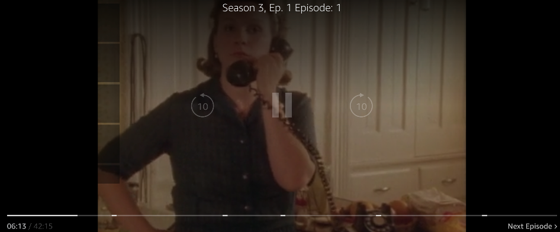
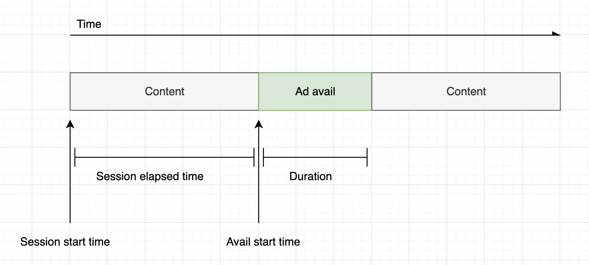
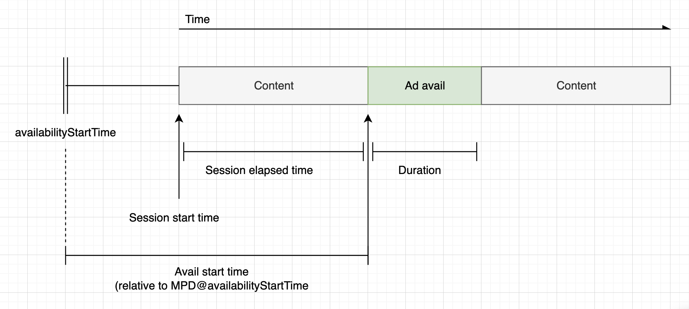
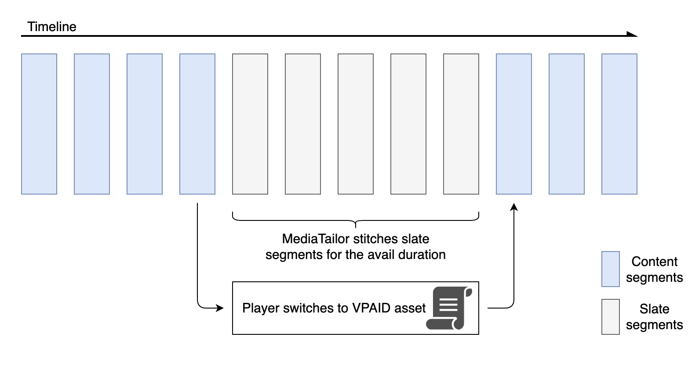

# Player controls

and functionality for client-side ad tracking

MediaTailor client-side tracking metadata supports various player controls and functionality. The
following list describes popular player controls.

###### Topics

- [Scrubbing](#ad-reporting-client-side-ad-tracking-schema-player-controls-scrubbing "#ad-reporting-client-side-ad-tracking-schema-player-controls-scrubbing")
- [Ad
  countdown timer](#ad-reporting-client-side-ad-tracking-schema-player-controls-ad-countdown-timer "#ad-reporting-client-side-ad-tracking-schema-player-controls-ad-countdown-timer")
- [Skippable ads](#ad-reporting-client-side-ad-tracking-schema-player-controls-skippable-ads "#ad-reporting-client-side-ad-tracking-schema-player-controls-skippable-ads")
- [Ad click-through](#ad-reporting-client-side-ad-tracking-schema-player-controls-ad-clickthrough "#ad-reporting-client-side-ad-tracking-schema-player-controls-ad-clickthrough")
- [Companion ads](#ad-reporting-client-side-ad-tracking-schema-player-controls-companion-ads "#ad-reporting-client-side-ad-tracking-schema-player-controls-companion-ads")
- [Interactive ads (SIMID)](#ad-reporting-client-side-ad-tracking-schema-player-controls-simid-ads "#ad-reporting-client-side-ad-tracking-schema-player-controls-simid-ads")
- [Interactive ads (VPAID)](#ad-reporting-client-side-ad-tracking-schema-player-controls-vpaid-ads "#ad-reporting-client-side-ad-tracking-schema-player-controls-vpaid-ads")
- [Icons
  for Google Why This Ad (WTA)](#ad-reporting-client-side-ad-tracking-schema-player-controls-google-wta "#ad-reporting-client-side-ad-tracking-schema-player-controls-google-wta")

## Scrubbing

To enhance the playback experience, the player can display ad positions in the playback
timeline. MediaTailor makes these ad positions available in the form of
`startTimeInSeconds` values in the client-side tracking response.

###### Note

Some streaming providers prevent scrubbing past an ad position.



The following client-side tracking payload JSON response shows the avail (ad break) start
time inside the root JSON object of the avails array. The player uses this data to show the
location of the ad break on the player timeline, at 28 seconds.

```
{
  "avails": [
    {
      "adBreakTrackingEvents": [],
      "adMarkerDuration": null,
      "ads": [...],
      "availId": "7",
      "availProgramDateTime": null,
      "duration": "PT30S",
      "durationInSeconds": 30,
      "meta": null,
      "nonLinearAdsList": [],
      "startTime": "PT28S",
      "startTimeInSeconds": 28
    }
  ],
  "dashAvailabilityStartTime": null,
  "hlsAnchorMediaSequenceNumber": null,
  "nextToken": "UFQxMk0zNC44NjhTXzIwMjMtMDctMjFUMjA6MjM6MDcuNzc1NzE2MzAyWl8x",
  "nonLinearAvails": []
}
```

## Ad

countdown timer

With MediaTailor you can use an ad countdown timer to help keep your audience engaged during
ad-break viewing. The audience can use the timer to understand when the ad break ends and
their program resumes.


The elements in the client-side tracking metadata that play a role in the ad countdown
timer are `startTime`, `startTimeInSeconds`, `duration`, and
`durationInSeconds`. The player uses this metadata, along with the session's
elapsed time that it tracks separately, to determine when to display the timer and the value
it should be counting down from.

The following client-side tracking payload JSON response shows the information needed to
display an ad countdown timer.

```
{
  "avails": [
    {
      "adBreakTrackingEvents": [],
      "adMarkerDuration": null,
      "ads": [...],
      "availId": "7",
      "availProgramDateTime": null,
      "duration": "PT30S",
      "durationInSeconds": 30,
      "meta": null,
      "nonLinearAdsList": [],
      "startTime": "PT28S",
      "startTimeInSeconds": 28
    }
  ],
  "dashAvailabilityStartTime": null,
  "hlsAnchorMediaSequenceNumber": null,
  "nextToken": "UFQxMk0zNC44NjhTXzIwMjMtMDctMjFUMjA6MjM6MDcuNzc1NzE2MzAyWl8x",
  "nonLinearAvails": []
}
```

When the session's elapsed time reaches the avail's start time, the player displays a
countdown timer with a value that matches the avail's duration. The countdown-timer value
decreases as the elapsed time progresses beyond the avail's start time.

###### Example formula: Countdown timer for HLS (live and VOD) and DASH (VOD)

- `session_start_time` = the sum of all
  `EXT-INF` duration values - the duration value of the three newest
  `EXT-INF` media sequences
- timer value = `duration` - (`session_elapsed_time`

* `startTime`)



###### Example formula: Countdown timer for DASH (live)

- `session_start_time` = (newest segment's
  `startTime` + `duration`) / `timescale`

* `MPD@suggestedPresentationDelay`

- timer value = `duration` - (`session_elapsed_time`

* `startTime`)



## Skippable ads

_Skippable ads_ are ad spots that allow the viewer to skip some of the
ad to resume viewing the program. In VAST, the `Linear@skipOffset` attribute
identifies a skippable ad.

The following VAST response shows how to use a skippable ad:

```
<?xml version="1.0" encoding="UTF-8"?>
<VAST xmlns:xsi="http://www.w3.org/2001/XMLSchema-instance" xsi:noNamespaceSchemaLocation="vast.xsd" version="3.0">
  <Ad>
    <InLine>
      ...
      <Creatives>
        <Creative id="1" sequence="1">
          <Linear skipoffset="00:00:05">
            <Duration>00:00:15</Duration>
            <MediaFiles>
              <MediaFile id="EMT" delivery="progressive" width="640" height="360" type="video/mp4" bitrate="143" scalable="true" maintainAspectRatio="true"><![CDATA[`https://ads.com/file.mp4`]]></MediaFile>
            </MediaFiles>
          </Linear>
        </Creative>
      </Creatives>
      ...
    </InLine>
  </Ad>
</VAST>
```

The following client-side tracking payload JSON response shows the ad metadata inside the
`ads` array. The array contains the `skipOffset` value that MediaTailor
obtained from the VAST response.

```
{
  "avails": [
    {
      "adBreakTrackingEvents": [],
      "adMarkerDuration": null,
      "ads": [
        {
          "adId": "1",
          "adParameters": "",
          "adProgramDateTime": "2023-07-31T16:11:40.693Z",
          "adSystem": "2.0",
          "adTitle": "AD-skiing-15",
          "adVerifications": [],
          "companionAds": [...],
          "creativeId": "1",
          "creativeSequence": "1",
          "duration": "PT15.015S",
          "durationInSeconds": 15.015,
          "extensions": [],
          "mediaFiles": {
            "mediaFilesList": [],
            "mezzanine": ""
          },
          "skipOffset": "00:00:05",
          "startTime": "PT9.943S",
          "startTimeInSeconds": 9.943,
          "trackingEvents": [
            {
              "beaconUrls": [
                "https://adserverbeaconing.com/v1/impression"
              ],
              "duration": "PT15.015S",
              "durationInSeconds": 15.015,
              "eventId": "2697726",
              "eventProgramDateTime": null,
              "eventType": "impression",
              "startTime": "PT9.943S",
              "startTimeInSeconds": 9.943
            }
          ],
          "vastAdId": ""
        }
      ],
      "availId": "2697726",
      "availProgramDateTime": "2023-07-31T16:11:40.693Z",
      "duration": "PT15.015S",
      "durationInSeconds": 15.015,
      "meta": null,
      "nonLinearAdsList": [],
      "startTime": "PT9.943S",
      "startTimeInSeconds": 9.943
    }
  ],
  "dashAvailabilityStartTime": null,
  "hlsAnchorMediaSequenceNumber": null,
  "nextToken": "",
  "nonLinearAvails": []
}
```

## Ad click-through

Click-through URIs allow advertisers to measure how successful an ad is in capturing
viewers' attention. After a viewer clicks the active video frame of an ad in progress, a web
browser opens the URI for the advertiser's home page or campaign landing page. The player
developer determines the click behavior, such as overlaying a button or label on the ad video,
with a message to click to learn more. Player developers often pause the ad's video after
viewers click on the active video frame.


MediaTailor can parse and make available any linear video click-through event URLs returned in
the VAST response. The following VAST response shows an ad click-through example.

```
<?xml version="1.0" encoding="UTF-8"?>
<VAST xmlns:xsi="http://www.w3.org/2001/XMLSchema-instance" xsi:noNamespaceSchemaLocation="vast.xsd" version="3.0">
  <Ad>
    <InLine>
      ...
      <Creatives>
        <Creative id="1" sequence="1">
          <Linear>
            <Duration>00:00:15</Duration>
            <MediaFiles>
              <MediaFile id="EMT" delivery="progressive" width="1280" height="720" type="video/mp4" bitrate="143" scalable="true" maintainAspectRatio="true"><![CDATA[`https://ads.com/file.mp4`]]></MediaFile>
            </MediaFiles>
            <VideoClicks>
              <ClickThrough id="EMT"><![CDATA[`https://aws.amazon.com`]]></ClickThrough>
              <ClickTracking id="EMT"><![CDATA[`https://myads.com/beaconing/event=clicktracking`]]></ClickTracking>
            </VideoClicks>
          </Linear>
        </Creative>
      </Creatives>
      ...
    </InLine>
  </Ad>
</VAST>
```

The following client-side tracking payload JSON response shows how MediaTailor displays the
click-through and click-tracking URLs inside the `trackingEvents` array. The
`clickThrough` event type represents the click-through ad, and the
`clickTracking` event type represents the click-tracking URL.

```
{
  "avails": [
    {
      "adBreakTrackingEvents": [],
      "adMarkerDuration": null,
      "ads": [
        {
          "adId": "1",
          "adParameters": "",
          "adProgramDateTime": "2023-07-31T16:53:40.577Z",
          "adSystem": "2.0",
          "adTitle": "1",
          "adVerifications": [],
          "companionAds": [],
          "creativeId": "00006",
          "creativeSequence": "1",
          "duration": "PT14.982S",
          "durationInSeconds": 14.982,
          "extensions": [],
          "mediaFiles": {
            "mediaFilesList": [],
            "mezzanine": ""
          },
          "skipOffset": null,
          "startTime": "PT39.339S",
          "startTimeInSeconds": 39.339,
          "trackingEvents": [
            {
              "beaconUrls": [
                "https://myads.com/beaconing/event=impression"
              ],
              "duration": "PT14.982S",
              "durationInSeconds": 14.982,
              "eventId": "2698188",
              "eventProgramDateTime": null,
              "eventType": "impression",
              "startTime": "PT39.339S",
              "startTimeInSeconds": 39.339
            },
            {
              "beaconUrls": [
                "https://aws.amazon.com"
              ],
              "duration": "PT14.982S",
              "durationInSeconds": 14.982,
              "eventId": "2698188",
              "eventProgramDateTime": null,
              "eventType": "clickThrough",
              "startTime": "PT39.339S",
              "startTimeInSeconds": 39.339
            },
            {
              "beaconUrls": [
                "https://myads.com/beaconing/event=clicktracking"
              ],
              "duration": "PT14.982S",
              "durationInSeconds": 14.982,
              "eventId": "2698795",
              "eventProgramDateTime": null,
              "eventType": "clickTracking",
              "startTime": "PT39.339S",
              "startTimeInSeconds": 39.339
            }
          ],
          "vastAdId": ""
        }
      ],
      "availId": "2698188",
      "availProgramDateTime": "2023-07-31T16:53:40.577Z",
      "duration": "PT14.982S",
      "durationInSeconds": 14.982,
      "meta": null,
      "nonLinearAdsList": [],
      "startTime": "PT39.339S",
      "startTimeInSeconds": 39.339
    }
  ],
  "dashAvailabilityStartTime": null,
  "hlsAnchorMediaSequenceNumber": null,
  "nextToken": "UFQzOS4zMzlTXzIwMjMtMDctMzFUMTY6NTQ6MDQuODA1Mzk2NTI5Wl8x",
  "nonLinearAvails": []
}
```

## Companion ads

A _companion ad_ appears alongside a linear creative. Use companion ads
to increase the effectiveness of an ad spot by displaying product, logo, and brand
information. The display ad can feature Quick Response (QR) codes and clickable areas to
promote audience engagement.

MediaTailor supports companion ads in the VAST response. It can pass through metadata from
`StaticResource`, `iFrameResource`, and `HTMLResource`
nodes, respectively.

The following VAST response shows an example location and format of the linear ad and
companion ad.

```
<?xml version="1.0" encoding="UTF-8"?>
<VAST xmlns:xsi="http://www.w3.org/2001/XMLSchema-instance" xsi:noNamespaceSchemaLocation="vast.xsd" version="3.0">
  <Ad>
    <InLine>
      ...
      <Creatives>
        <Creative id="1" sequence="1">
          <Linear>
            <Duration>00:00:10</Duration>
            <MediaFiles>
              <MediaFile id="EMT" delivery="progressive" width="640" height="360" type="video/mp4" bitrate="143" scalable="true" maintainAspectRatio="true"><![CDATA[`https://ads.com/file.mp4`]]></MediaFile>
            </MediaFiles>
          </Linear>
        </Creative>
        <Creative id="2" sequence="1">
          <CompanionAds>
            <Companion id="2" width="300" height="250">
              <StaticResource creativeType="image/png"><![CDATA[`https://emt.com/companion/9973499273`]]></StaticResource>
              <TrackingEvents>
                <Tracking event="creativeView"><![CDATA[`https://beacon.com/1`]]></Tracking>
              </TrackingEvents>
              <CompanionClickThrough><![CDATA[`https://beacon.com/2`]]></CompanionClickThrough>
            </Companion>
            <Companion id="3" width="728" height="90">
              <StaticResource creativeType="image/png"><![CDATA[`https://emt.com/companion/1238901823`]]></StaticResource>
              <TrackingEvents>
                <Tracking event="creativeView"><![CDATA[`https://beacon.com/3`]]></Tracking>
              </TrackingEvents>
              <CompanionClickThrough><![CDATA[`https://beacon.com/4`]]></CompanionClickThrough>
            </Companion>
          </CompanionAds>
        </Creative>
      </Creatives>
      ...
    </InLine>
  </Ad>
</VAST>
```

The data appears in the client-side tracking response in the
`/avail/x/ads/y/companionAds` list. Each linear creative can contain up to 6
companion ads. As shown in the example below, the companion ads appear in a list

###### Note

As a best practice, application developers should implement logic to explicitly remove
or unload the companion ad at the end of the creative.

```
{
  "avails": [
    {
      "adBreakTrackingEvents": [],
      "adMarkerDuration": null,
      "ads": [
        {
          "adId": "0",
          "adParameters": "",
          "adProgramDateTime": null,
          "adSystem": "EMT",
          "adTitle": "sample",
          "adVerifications": [],
          "companionAds": [
            {
              "adParameters": null,
              "altText": null,
              "attributes": {
                "adSlotId": null,
                "apiFramework": null,
                "assetHeight": null,
                "assetWidth": null,
                "expandedHeight": null,
                "expandedWidth": null,
                "height": "250",
                "id": "2",
                "pxratio": null,
                "renderingMode": null,
                "width": "300"
              },
              "companionClickThrough": "https://beacon.com/2",
              "companionClickTracking": null,
              "htmlResource": null,
              "iFrameResource": null,
              "sequence": "1",
              "staticResource": "https://emt.com/companion/9973499273",
              "trackingEvents": [
                {
                  "beaconUrls": [
                    "https://beacon.com/1"
                  ],
                  "eventType": "creativeView"
                }
              ]
            },
            {
              "adParameters": null,
              "altText": null,
              "attributes": {
                "adSlotId": null,
                "apiFramework": null,
                "assetHeight": null,
                "assetWidth": null,
                "expandedHeight": null,
                "expandedWidth": null,
                "height": "90",
                "id": "3",
                "pxratio": null,
                "renderingMode": null,
                "width": "728"
              },
              "companionClickThrough": "https://beacon.com/4",
              "companionClickTracking": null,
              "htmlResource": null,
              "iFrameResource": null,
              "sequence": "1",
              "staticResource": "https://emt.com/companion/1238901823",
              "trackingEvents": [
                {
                  "beaconUrls": [
                    "https://beacon.com/3"
                  ],
                  "eventType": "creativeView"
                }
              ]
            }
          ],
          "creativeId": "1",
          "creativeSequence": "1",
          "duration": "PT10S",
          "durationInSeconds": 10,
          "extensions": [],
          "mediaFiles": {
            "mediaFilesList": [],
            "mezzanine": ""
          },
          "skipOffset": null,
          "startTime": "PT0S",
          "startTimeInSeconds": 0,
          "trackingEvents": [
            {
              "beaconUrls": [
                "https://beacon.com/impression/1"
              ],
              "duration": "PT10S",
              "durationInSeconds": 10,
              "eventId": "0",
              "eventProgramDateTime": null,
              "eventType": "impression",
              "startTime": "PT0S",
              "startTimeInSeconds": 0
            }
          ],
          "vastAdId": ""
        }
      ],
      "availId": "0",
      "availProgramDateTime": null,
      "duration": "PT10S",
      "durationInSeconds": 10,
      "meta": null,
      "nonLinearAdsList": [],
      "startTime": "PT0S",
      "startTimeInSeconds": 0
    }
  ],
  "dashAvailabilityStartTime": null,
  "hlsAnchorMediaSequenceNumber": null,
  "nextToken": "UFQxMFNfMjAyMy0wNy0wNlQyMToxMDowOC42NzQ4NDA1NjJaXzE%3D",
  "nonLinearAvails": []
}
```

## Interactive ads (SIMID)

_SecureInteractive Media Interface Definition_ (SIMID) is a standard for interactive
advertising that was introduced in the VAST 4.x standard from the Interactive Advertising Bureau (IAB).
SIMID decouples the loading of interactive elements from the primary linear
creative on the player, referencing both in the VAST response. MediaTailor stitches in the
primary creative to maintain the playback experience, and places metadata for the interactive
components in the client-side tracking response.

In the following example VAST 4 response, the SIMID payload is inside the
`InteractiveCreativeFile` node.

```
<?xml version="1.0"?>
<VAST xmlns:xsi="https://www.w3.org/2001/XMLSchema-instance" xsi:noNamespaceSchemaLocation="vast.xsd" version="3.0">
  <Ad id="1234567">
    <InLine>
      <AdSystem>SampleAdSystem</AdSystem>
      <AdTitle>Linear SIMID Example</AdTitle>
      <Description>SIMID example</Description>
      <Error>`https://www.beacons.com/error`</Error>
      <Impression>`https://www.beacons.com/impression`</Impression>
      <Creatives>
        <Creative sequence="1">
          <Linear>
            <Duration>00:00:15</Duration>
            <TrackingEvents>
                ...
            </TrackingEvents>
            <VideoClicks>
              <ClickThrough id="123">`https://aws.amazon.com`</ClickThrough>
              <ClickTracking id="123">`https://www.beacons.com/click`</ClickTracking>
            </VideoClicks>
            <MediaFiles>
              <MediaFile delivery="progressive" type="video/mp4">
                                `https://interactive-ads.com/interactive-media-ad-sample/media/file.mp4`
                            </MediaFile>
              <InteractiveCreativeFile type="text/html" apiFramework="SIMID" variableDuration="true">
                                `https://interactive-ads.com/interactive-media-ad-sample/sample_simid.html`
                            </InteractiveCreativeFile>
            </MediaFiles>
          </Linear>
        </Creative>
      </Creatives>
    </InLine>
  </Ad>
</VAST>
```

In the following VAST 3 response, the SIMID payload is inside the `Extensions`
node.

```
<?xml version="1.0"?>
<VAST xmlns:xsi="https://www.w3.org/2001/XMLSchema-instance" xsi:noNamespaceSchemaLocation="vast.xsd" version="3.0">
  <Ad id="1234567">
    <InLine>
      <AdSystem>SampleAdSystem</AdSystem>
      <AdTitle>Linear SIMID Example</AdTitle>
      <Description>SIMID example</Description>
      <Impression>`https://www.beacons.com/impression`</Impression>
      <Creatives>
        <Creative id="1" sequence="1">
          <Linear>
            <Duration>00:00:15</Duration>
            <TrackingEvents>
                ...
            </TrackingEvents>
            <VideoClicks>
              <ClickThrough id="123">`https://aws.amazon.com`</ClickThrough>
              <ClickTracking id="123">`https://myads.com/beaconing/event=clicktracking`</ClickTracking>
            </VideoClicks>
            <MediaFiles>
              <MediaFile delivery="progressive" type="video/mp4">
                                `https://interactive-ads.com/interactive-media-ad-sample/media/file.mp4`
                            </MediaFile>
            </MediaFiles>
          </Linear>
        </Creative>
      </Creatives>
      <Extensions>
        <Extension type="InteractiveCreativeFile">
          <InteractiveCreativeFile type="text/html" apiFramework="SIMID" variableDuration="true">
            `https://interactive-ads.com/interactive-media-ad-sample/sample_simid.html`
          </InteractiveCreativeFile>
        </Extension>
      </Extensions>
    </InLine>
  </Ad>
</VAST>
```

In the following client-side tracking response, the SIMID data appears in the
`/avails/x/ads/y/extensions` list.

```
{
  "avails": [
    {
      "adBreakTrackingEvents": [],
      "adMarkerDuration": null,
      "ads": [
        {
          "adId": "1",
          "adParameters": "",
          "adProgramDateTime": "2023-07-31T16:53:40.577Z",
          "adSystem": "2.0",
          "adTitle": "Linear SIMID Example",
          "adVerifications": [],
          "companionAds": [],
          "creativeId": "1",
          "creativeSequence": "1",
          "duration": "PT14.982S",
          "durationInSeconds": 14.982,
          "extensions": [
            {
              "content": "<InteractiveCreativeFile type=\"text/html\" apiFramework=\"SIMID\" variableDuration=\"true\">\n`https://interactive-ads.com/interactive-media-ad-sample/sample_simid.html`</InteractiveCreativeFile>",
              "type": "InteractiveCreativeFile"
            }
          ],
          "mediaFiles": {
            "mediaFilesList": [],
            "mezzanine": ""
          },
          "skipOffset": null,
          "startTime": "PT39.339S",
          "startTimeInSeconds": 39.339,
          "trackingEvents": [
            {
              "beaconUrls": [
                "`https://myads.com/beaconing/event=impression`"
              ],
              "duration": "PT14.982S",
              "durationInSeconds": 14.982,
              "eventId": "2698188",
              "eventProgramDateTime": null,
              "eventType": "impression",
              "startTime": "PT39.339S",
              "startTimeInSeconds": 39.339
            },
            {
              "beaconUrls": [
                "https://aws.amazon.com"
              ],
              "duration": "PT14.982S",
              "durationInSeconds": 14.982,
              "eventId": "2698188",
              "eventProgramDateTime": null,
              "eventType": "clickThrough",
              "startTime": "PT39.339S",
              "startTimeInSeconds": 39.339
            },
            {
              "beaconUrls": [
                "`https://myads.com/beaconing/event=clicktracking`"
              ],
              "duration": "PT14.982S",
              "durationInSeconds": 14.982,
              "eventId": "2698795",
              "eventProgramDateTime": null,
              "eventType": "clickTracking",
              "startTime": "PT39.339S",
              "startTimeInSeconds": 39.339
            }
          ],
          "vastAdId": ""
        }
      ],
      "availId": "2698188",
      "availProgramDateTime": "2023-07-31T16:53:40.577Z",
      "duration": "PT14.982S",
      "durationInSeconds": 14.982,
      "meta": null,
      "nonLinearAdsList": [],
      "startTime": "PT39.339S",
      "startTimeInSeconds": 39.339
    }
  ],
  "dashAvailabilityStartTime": null,
  "hlsAnchorMediaSequenceNumber": null,
  "nextToken": "UFQzOS4zMzlTXzIwMjMtMDctMzFUMTY6NTQ6MDQuODA1Mzk2NTI5Wl8x",
  "nonLinearAvails": []
}
```

## Interactive ads (VPAID)

The _Video Player Ad Interface Definition_ (VPAID) specifies the
protocol between the ad and the video player that enables ad interactivity and other
functionality. For live streams, MediaTailor supports the VPAID format by stitching slate segments
in for the duration of the avail, and placing metadata for the VPAID creatives in the
client-side tracking response that the video player consumes. The player downloads the VPAID
files and plays the linear creative and executes the client's scripts. The player should
_not_ ever play the slate segments.

###### Note

VPAID is deprecated as of VAST 4.1.



The following example shows the VPAID content in the VAST response.

```
<?xml version="1.0"?>
<VAST xmlns:xsi="http://www.w3.org/2001/XMLSchema-instance" xsi:noNamespaceSchemaLocation="vast.xsd" version="3.0">
  <Ad id="1234567">
    <InLine>
      <AdSystem>GDFP</AdSystem>
      <AdTitle>VPAID</AdTitle>
      <Description>Vpaid Linear Video Ad</Description>
      <Error>`http://www.example.com/error`</Error>
      <Impression>`http://www.example.com/impression`</Impression>
      <Creatives>
        <Creative sequence="1">
          <Linear>
            <Duration>00:00:00</Duration>
            <TrackingEvents>
              <Tracking event="start">`http://www.example.com/start`</Tracking>
              <Tracking event="firstQuartile">`http://www.example.com/firstQuartile`</Tracking>
              <Tracking event="midpoint">`http://www.example.com/midpoint`</Tracking>
              <Tracking event="thirdQuartile">`http://www.example.com/thirdQuartile`</Tracking>
              <Tracking event="complete">`http://www.example.com/complete`</Tracking>
              <Tracking event="mute">`http://www.example.com/mute`</Tracking>
              <Tracking event="unmute">`http://www.example.com/unmute`</Tracking>
              <Tracking event="rewind">`http://www.example.com/rewind`</Tracking>
              <Tracking event="pause">`http://www.example.com/pause`</Tracking>
              <Tracking event="resume">`http://www.example.com/resume`</Tracking>
              <Tracking event="fullscreen">`http://www.example.com/fullscreen`</Tracking>
              <Tracking event="creativeView">`http://www.example.com/creativeView`</Tracking>
              <Tracking event="acceptInvitation">`http://www.example.com/acceptInvitation`</Tracking>
            </TrackingEvents>
            <AdParameters><![CDATA[ {"videos":[ {"url":"`https://my-ads.com/interactive-media-ads/media/media_linear_VPAID.mp4`","mimetype":"video/mp4"}]} ]]></AdParameters>
            <VideoClicks>
              <ClickThrough id="123">http`://google.com`</ClickThrough>
              <ClickTracking id="123">`http://www.example.com/click`</ClickTracking>
            </VideoClicks>
            <MediaFiles>
              <MediaFile delivery="progressive" apiFramework="VPAID" type="application/javascript" width="640" height="480"> `https://googleads.github.io/googleads-ima-html5/vpaid/linear/VpaidVideoAd.js` </MediaFile>
            </MediaFiles>
          </Linear>
        </Creative>
      </Creatives>
    </InLine>
  </Ad>
</VAST>
```

The following example shows the tracking information.

```
{
  "avails": [
    {
      "adBreakTrackingEvents": [],
      "adMarkerDuration": null,
      "ads": [
        {
          "adId": "1",
          "adParameters": "",
          "adProgramDateTime": "2023-07-31T16:53:40.577Z",
          "adSystem": "2.0",
          "adTitle": "1",
          "adVerifications": [],
          "companionAds": [],
          "creativeId": "00006",
          "creativeSequence": "1",
          "duration": "PT14.982S",
          "durationInSeconds": 14.982,
          "extensions": [],
          "mediaFiles": {
            "mediaFilesList": [],
            "mezzanine": ""
          },
          "skipOffset": null,
          "startTime": "PT39.339S",
          "startTimeInSeconds": 39.339,
          "trackingEvents": [
            {
              "beaconUrls": [
                "https://myads.com/beaconing/event=impression"
              ],
              "duration": "PT14.982S",
              "durationInSeconds": 14.982,
              "eventId": "2698188",
              "eventProgramDateTime": null,
              "eventType": "impression",
              "startTime": "PT39.339S",
              "startTimeInSeconds": 39.339
            },
            {
              "beaconUrls": [
                "https://aws.amazon.com"
              ],
              "duration": "PT14.982S",
              "durationInSeconds": 14.982,
              "eventId": "2698188",
              "eventProgramDateTime": null,
              "eventType": "clickThrough",
              "startTime": "PT39.339S",
              "startTimeInSeconds": 39.339
            },
            {
              "beaconUrls": [
                "https://myads.com/beaconing/event=clicktracking"
              ],
              "duration": "PT14.982S",
              "durationInSeconds": 14.982,
              "eventId": "2698795",
              "eventProgramDateTime": null,
              "eventType": "clickTracking",
              "startTime": "PT39.339S",
              "startTimeInSeconds": 39.339
            }
          ],
          "vastAdId": ""
        }
      ],
      "availId": "2698188",
      "availProgramDateTime": "2023-07-31T16:53:40.577Z",
      "duration": "PT14.982S",
      "durationInSeconds": 14.982,
      "meta": null,
      "nonLinearAdsList": [],
      "startTime": "PT39.339S",
      "startTimeInSeconds": 39.339
    }
  ],
  "dashAvailabilityStartTime": null,
  "hlsAnchorMediaSequenceNumber": null,
  "nextToken": "UFQzOS4zMzlTXzIwMjMtMDctMzFUMTY6NTQ6MDQuODA1Mzk2NTI5Wl8x",
  "nonLinearAvails": []
}{
  "avails": [
    {
      "adBreakTrackingEvents": [],
      "adMarkerDuration": null,
      "ads": [
        {
          "adId": "2922274",
          "adParameters": "",
          "adProgramDateTime": "2023-08-14T19:49:53.998Z",
          "adSystem": "Innovid Ads",
          "adTitle": "VPAID",
          "adVerifications": [],
          "companionAds": [],
          "creativeId": "",
          "creativeSequence": "",
          "duration": "PT16.016S",
          "durationInSeconds": 16.016,
          "extensions": [],
          "mediaFiles": {
            "mediaFilesList": [
              {
                "apiFramework": "VPAID",
                "bitrate": 0,
                "codec": null,
                "delivery": "progressive",
                "height": 9,
                "id": "",
                "maintainAspectRatio": false,
                "maxBitrate": 0,
                "mediaFileUri": "http://my-ads.com/mobileapps/js/vpaid/1h41kg?cb=178344c0-8e67-281a-58ca-962e4987cd60&deviceid=&ivc=",
                "mediaType": "application/javascript",
                "minBitrate": 0,
                "scalable": false,
                "width": 16
              }
            ],
            "mezzanine": "http://my-ads.com/mobileapps/js/vpaid/1h41kg?cb=178344c0-8e67-281a-58ca-962e4987cd60&deviceid=&ivc="
          },
          "skipOffset": null,
          "startTime": "PT8M42.289S",
          "startTimeInSeconds": 522.289,
          "trackingEvents": [
            {
              "beaconUrls": [
                "about:blank"
              ],
              "duration": "PT16.016S",
              "durationInSeconds": 16.016,
              "eventId": "2922274",
              "eventProgramDateTime": null,
              "eventType": "impression",
              "startTime": "PT8M42.289S",
              "startTimeInSeconds": 522.289
            }
          ],
          "vastAdId": "1h41kg"
        }
      ],
      "availId": "2922274",
      "availProgramDateTime": "2023-08-14T19:49:53.998Z",
      "duration": "PT16.016S",
      "durationInSeconds": 16.016,
      "meta": null,
      "nonLinearAdsList": [],
      "startTime": "PT8M42.289S",
      "startTimeInSeconds": 522.289
    }
  ],
  "dashAvailabilityStartTime": null,
  "hlsAnchorMediaSequenceNumber": null,
  "nextToken": "UFQ4TTQyLjI4OVNfMjAyMy0wOC0xNFQxOTo1MDo0MS4zOTc5MjAzODVaXzE%3D",
  "nonLinearAvails": []
}
```

## Icons

for Google Why This Ad (WTA)

_AdChoices_ is an industry standard that provides viewers with
information about the ads they see, including how those ads were targeted to them.


The MediaTailor client-side tracking API supports icon metadata carried in the VAST extensions
node of the VAST response. For more information about WTA in the VAST response, see [this sample VAST XML response](https://storage.googleapis.com/interactive-media-ads/ad-tags/ima_wta_sample_vast_3.xml "https://storage.googleapis.com/interactive-media-ads/ad-tags/ima_wta_sample_vast_3.xml").

###### Note

MediaTailor currently supports VAST version 3 only.

```
<VAST>
    <Ad>
    <InLine>
       ...
      <Extensions>
        <Extension type="IconClickFallbackImages">
          <IconClickFallbackImages program="GoogleWhyThisAd">
            <IconClickFallbackImage width="400" height="150">
              <AltText>Alt icon fallback</AltText>
              <StaticResource creativeType="image/png"><![CDATA[`https://storage.googleapis.com/interactive-media-ads/images/wta_dialog.png`]]></StaticResource>
            </IconClickFallbackImage>
          </IconClickFallbackImages>
          <IconClickFallbackImages program="AdChoices">
            <IconClickFallbackImage width="400" height="150">
              <AltText>Alt icon fallback</AltText>
              <StaticResource creativeType="image/png"><![CDATA[`https://storage.googleapis.com/interactive-media-ads/images/wta_dialog.png?size=1x`]]></StaticResource>
            </IconClickFallbackImage>
            <IconClickFallbackImage width="800" height="300">
              <AltText>Alt icon fallback</AltText>
              <StaticResource creativeType="image/png"><![CDATA[`https://storage.googleapis.com/interactive-media-ads/images/wta_dialog.png?size=2x`]]></StaticResource>
            </IconClickFallbackImage>
          </IconClickFallbackImages>
        </Extension>
      </Extensions>
    </InLine>
  </Ad>
</VAST>
```

The following example shows the client-side tracking response in the
`/avails/x/ads/y/extensions` list.

```
{
  "avails": [
    {
      "adBreakTrackingEvents": [],
      "adMarkerDuration": null,
      "ads": [
        {
          "adId": "0",
          "adParameters": "",
          "adProgramDateTime": null,
          "adSystem": "GDFP",
          "adTitle": "Google Why This Ad VAST 3 Sample",
          "adVerifications": [],
          "companionAds": [],
          "creativeId": "7891011",
          "creativeSequence": "1",
          "duration": "PT10S",
          "durationInSeconds": 10,
          "extensions": [
            {
              "content": "<IconClickFallbackImages program=\"GoogleWhyThisAd\">
                          <IconClickFallbackImage height=\"150\" width=\"400\">
                          <AltText>Alt icon fallback</AltText>
                          <StaticResource creativeType=\"image/png\"><![CDATA[`https://storage.googleapis.com/interactive-media-ads/images/wta_dialog.png`]]>
                          </StaticResource>
                          </IconClickFallbackImage>
                          </IconClickFallbackImages>
                          <IconClickFallbackImages program=\"AdChoices\">
                          <IconClickFallbackImage height=\"150\" width=\"400\">
                          <AltText>Alt icon fallback</AltText>
                          <StaticResource creativeType=\"image/png\"><![CDATA[`https://storage.googleapis.com/interactive-media-ads/images/wta_dialog.png?size=1x`]]>
                          </StaticResource>
                          </IconClickFallbackImage>
                          <IconClickFallbackImage height=\"300\" width=\"800\">
                          <AltText>Alt icon fallback</AltText>
                          <StaticResource creativeType=\"image/png\"><![CDATA[`https://storage.googleapis.com/interactive-media-ads/images/wta_dialog.png?size=2x`]]>
                          </StaticResource>
                          </IconClickFallbackImage>
                          </IconClickFallbackImages>",
              "type": "IconClickFallbackImages"
            }
          ],
          "mediaFiles": {
            "mediaFilesList": [],
            "mezzanine": ""
          },
          "skipOffset": "00:00:03",
          "startTime": "PT0S",
          "startTimeInSeconds": 0,
          "trackingEvents": [
            {
              "beaconUrls": [
                "https://example.com/view"
              ],
              "duration": "PT10S",
              "durationInSeconds": 10,
              "eventId": "0",
              "eventProgramDateTime": null,
              "eventType": "impression",
              "startTime": "PT0S",
              "startTimeInSeconds": 0
            }
          ],
          "vastAdId": "123456"
        }
      ],
      "availId": "0",
      "availProgramDateTime": null,
      "duration": "PT10S",
      "durationInSeconds": 10,
      "meta": null,
      "nonLinearAdsList": [],
      "startTime": "PT0S",
      "startTimeInSeconds": 0
    }
  ],
  "dashAvailabilityStartTime": null,
  "hlsAnchorMediaSequenceNumber": null,
  "nextToken": "UFQxMFNfMjAyMy0wNy0wNlQyMDo0MToxNy45NDE4MDM0NDhaXzE%3D",
  "nonLinearAvails": []
}
```
