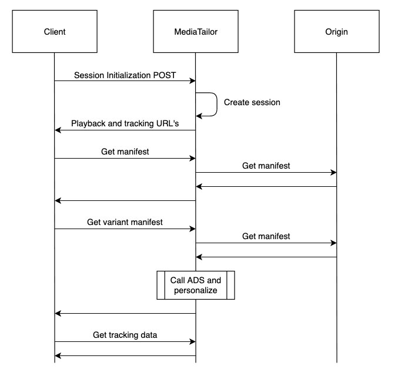

# Client-side ad tracking

Using the AWS Elemental MediaTailor client-side tracking API, you can incorporate player controls during
ad breaks in streaming workflows. In client-side tracking, the player or client emits
tracking events, such as impression and quartile ad beaconing, to the Ad Decision Server
(ADS) and other ad-verification entities. These events track both the overall ad break
status and the individual ad avails within each break. For more information about impression
and quartile (ADS) and other ad-verification entities. For more information about impression
and quartile ad beaconing, see [Client-side beaconing](ad-reporting-client-side-beaconing.md "ad-reporting-client-side-beaconing.md"). For more information about ADS and
other ad-verification entities, see [Client-side ad-tracking
integrations](ad-reporting-client-side-ad-tracking-integrations.md "ad-reporting-client-side-ad-tracking-integrations.md").

For information about passing player parameters and session data to the ADS for
client-side tracking, see [MediaTailor player variables for ADS requests](variables-player.md "variables-player.md") and [MediaTailor session variables for ADS requests](variables-session.md "variables-session.md").

Client-side tracking enables functionality like the following:

- Ad-break countdown timers - For more information, see [Ad
  countdown timer](ad-reporting-client-side-ad-tracking-schema-player-controls.md#ad-reporting-client-side-ad-tracking-schema-player-controls-ad-countdown-timer "ad-reporting-client-side-ad-tracking-schema-player-controls.md#ad-reporting-client-side-ad-tracking-schema-player-controls-ad-countdown-timer").
- Ad click-through - For more information, see [Ad click-through](ad-reporting-client-side-ad-tracking-schema-player-controls.md#ad-reporting-client-side-ad-tracking-schema-player-controls-ad-clickthrough "ad-reporting-client-side-ad-tracking-schema-player-controls.md#ad-reporting-client-side-ad-tracking-schema-player-controls-ad-clickthrough").
- Display of companion ads - For more information, see [Companion ads](ad-reporting-client-side-ad-tracking-schema-player-controls.md#ad-reporting-client-side-ad-tracking-schema-player-controls-companion-ads "ad-reporting-client-side-ad-tracking-schema-player-controls.md#ad-reporting-client-side-ad-tracking-schema-player-controls-companion-ads").
- Skippable ads - For more information, see [Skippable ads](ad-reporting-client-side-ad-tracking-schema-player-controls.md#ad-reporting-client-side-ad-tracking-schema-player-controls-skippable-ads "ad-reporting-client-side-ad-tracking-schema-player-controls.md#ad-reporting-client-side-ad-tracking-schema-player-controls-skippable-ads").
- Display of VAST icons for privacy compliance - For more information, see [Icons
  for Google Why This Ad (WTA)](ad-reporting-client-side-ad-tracking-schema-player-controls.md#ad-reporting-client-side-ad-tracking-schema-player-controls-google-wta "ad-reporting-client-side-ad-tracking-schema-player-controls.md#ad-reporting-client-side-ad-tracking-schema-player-controls-google-wta").
- Control of player scrubbing during ads - For more information, see [Scrubbing](ad-reporting-client-side-ad-tracking-schema-player-controls.md#ad-reporting-client-side-ad-tracking-schema-player-controls-scrubbing "ad-reporting-client-side-ad-tracking-schema-player-controls.md#ad-reporting-client-side-ad-tracking-schema-player-controls-scrubbing").
  Using the MediaTailor client-side tracking API, you can send metadata to the playback device
  that enables functionality in addition to client-side tracking:

## Client-side reporting

workflow

The following diagram shows the complete client-side reporting workflow from session
initialization through ad playback and beaconing:


The client-side reporting workflow includes the following steps:

1. **Session initialization** - The video player
   sends a POST request to the MediaTailor session endpoint with JSON metadata including
   `adsParams`, origin tokens, and session features. MediaTailor responds
   with `manifestUrl` and `trackingUrl` for the
   session.
2. **Manifest request and ad decision** - The player
   requests the personalized manifest from MediaTailor. MediaTailor requests the original
   content manifest from the origin, makes an ad request to the Ad Decision Server
   (ADS) using player parameters, receives a VAST response with ad metadata, and
   delivers a personalized manifest with ad markers to the player.
3. **Tracking data retrieval** - The player polls
   the tracking URL at regular intervals (matching target duration for HLS or
   minimum update period for DASH). MediaTailor returns JSON tracking metadata containing
   avails, ads, tracking events, beacon URLs, and ad verification data.
4. **Ad playback and beaconing** - During ad breaks,
   the player parses the tracking metadata, fires impression beacons when ads begin
   rendering, fires quartile beacons (start, firstQuartile, midpoint,
   thirdQuartile, complete) at appropriate timing, loads and executes ad
   verification JavaScript if required, and sends viewability/verification events
   to third-party verification services.
5. **Continuous polling** - The player continues
   polling the tracking URL throughout the session to receive updated metadata for
   upcoming ad breaks and dynamic content.

This workflow enables advanced features such as ad countdown timers, click-through
functionality, companion ads, skippable ads, and VAST icon display for privacy
compliance.

###### Topics

- [Enabling client-side
  tracking](#ad-reporting-client-side-enabling "#ad-reporting-client-side-enabling")
- [Ad server
  parameters](#ad-reporting-client-side-ad-server-parameters "#ad-reporting-client-side-ad-server-parameters")
- [Origin
  interaction query parameters](#ad-reporting-client-side-origin-interaction-query-parameters "#ad-reporting-client-side-origin-interaction-query-parameters")
- [Session-configured features](#ad-reporting-client-side-session-configured-features "#ad-reporting-client-side-session-configured-features")
- [Best practices for client-side
  tracking](#ad-reporting-client-side-best-practices "#ad-reporting-client-side-best-practices")
- [Client-side ad-tracking
  schema and properties](ad-reporting-client-side-ad-tracking-schema.md "ad-reporting-client-side-ad-tracking-schema.md")
- [Ad-tracking
  activity timing](ad-reporting-client-side-ad-tracking-schema-activity-timing.md "ad-reporting-client-side-ad-tracking-schema-activity-timing.md")
- [Player controls
  and functionality for client-side ad tracking](ad-reporting-client-side-ad-tracking-schema-player-controls.md "ad-reporting-client-side-ad-tracking-schema-player-controls.md")
- [Client-side beaconing](ad-reporting-client-side-beaconing.md "ad-reporting-client-side-beaconing.md")
- [Hybrid mode with server-side ad beacons](ad-reporting-hybrid-mode.md "ad-reporting-hybrid-mode.md")
- [Client-side ad-tracking
  integrations](ad-reporting-client-side-ad-tracking-integrations.md "ad-reporting-client-side-ad-tracking-integrations.md")
- [Paging through ad beacons with GetTracking](#gettracking "#gettracking")

## Enabling client-side

tracking

You enable client-side tracking for each session. The player makes an HTTP
`POST` to the MediaTailor configuration's session-initialization prefix
endpoint. Optionally, the player can send additional metadata for MediaTailor to use when
making ad calls, calling the origin for a manifest, and invoking or disabling MediaTailor
features at the session level.

The following example shows the structure of the JSON metadata:

```
{
  "adsParams": {                  # 'adsParams' is case sensitive
    "param1": "value1",           # key is not case sensitive
    "param2": "value2",           # Values can contain spaces. For example, 'value 2' is an allowed value.
    },
  "origin_access_token":"abc123", # this is an example of a query parameter designated for the origin
  "overlayAvails":"on"            # 'overlayAvails' is case sensitive. This is an example of a feature that is enabled at the session level.
}
```

Use the MediaTailor console or API to configure the ADS request template URL to reference
these parameters. In the following example, `player_params.param1` are the
player parameters for `param1`, and `player_params.param2` are the
player parameters for `param2`.

```
https://my.ads.com/path?`param1=[player_params.param1]`&`param2=[player_params.param2]`
```

## Ad server

parameters

At the topmost level of the JSON structure is an `adsParams` JSON object.
Inside this object are key/value pairs that MediaTailor can read and send to the ad server in
all session requests. MediaTailor supports the following ad servers:

- Google Ad Manager
- SpringServe
- FreeWheel
- Publica

## Origin

interaction query parameters

Any reserved key/value pairs within the topmost level of the JSON structure, such as
`adsParams`, `availSuppression`, and
`overlayAvails`, aren’t added to the origin request URL in the form of
query parameters. Every session manifest request that MediaTailor makes to the origin contains
these query parameters. The origin ignores extraneous query parameters. For example,
MediaTailor can use the key/value pairs to send access tokens to the origin.

## Session-configured features

Use the session-initialization JSON structure to enable, disable, or override MediaTailor
features such as `overlayAvails`, `availSuppression`, and
`adSignaling`. Any feature configurations passed during session
initialization override the setting at the MediaTailor configuration level.

###### Note

The metadata submitted to MediaTailor at session initialization is immutable, and
additional metadata cannot be added for the duration of the session. Use SCTE-35
markers to carry data that changes during the session. For more information, see
[MediaTailor session variables for ADS requests](variables-session.md "variables-session.md").

###### Example : Performing client-side ad tracking for HLS

```
POST `mediatailorURL`/v1/session/`hashed-account-id`/`origin-id`/`asset-id`.m3u8

        {
            "adsParams": {
               "deviceType": "ipad"   # This value does not change during the session.
               "uid": "abdgfdyei-2283004-ueu"
           }
        }
```

###### Example : Performing client-side ad tracking for DASH

```
POST `mediatailorURL`/v1/session/`hashed-account-id`/`origin-id`/`asset-id`.mpd

        {
            "adsParams": {
               "deviceType": "androidmobile",
               "uid": "xjhhddli-9189901-uic"
           }
        }
```

### Reporting mode

parameter

You can specify the reporting mode when initializing a session by including the
`reportingMode` parameter in the request body. This parameter
controls whether MediaTailor performs client-side or server-side ad tracking for the
session.

- `client` - The player performs ad tracking and sends beacons to
  the ad server. This is the default mode if no `reportingMode` is
  specified.
- `server` - MediaTailor performs server-side ad tracking and sends
  beacons directly to the ad server.

###### Example Session initialization with server-side reporting mode

```
POST `mediatailorURL`/v1/session/`hashed-account-id`/`origin-id`/`asset-id`.m3u8

        {
            "adsParams": {
               "deviceType": "ipad",
               "uid": "abdgfdyei-2283004-ueu"
           },
           "reportingMode": "server"
        }
```

###### Example Session initialization with client-side reporting mode (explicit)

```
POST `mediatailorURL`/v1/session/`hashed-account-id`/`origin-id`/`asset-id`.mpd

        {
            "adsParams": {
               "deviceType": "androidmobile",
               "uid": "xjhhddli-9189901-uic"
           },
           "reportingMode": "client"
        }
```

###### Note

The `reportingMode` parameter is set at session initialization and
cannot be changed during the session. If no `reportingMode` is
specified, MediaTailor defaults to client-side reporting to maintain backward
compatibility.

A successful response is an HTTP `200` with a response body. The body
contains a JSON object with a `manifestUrl` and a `trackingUrl`
key. The values are relative URLs that the player can use for both playback and ad-event
tracking purposes.

```
{
  "manifestUrl": "/v1/`dash``master`/`hashed-account-id`/`origin-id`/`asset-id`.m3u8?aws.sessionId=`session-id`",
  "trackingUrl": "/v1/tracking/`hashed-account-id`/`origin-id`/`session-id`"
}
```

For more information on the client-side tracking schema, see [Client-side ad-tracking
schema and properties](ad-reporting-client-side-ad-tracking-schema.md "ad-reporting-client-side-ad-tracking-schema.md").

## Best practices for client-side

tracking

This section outlines the best practices for client-side tracking in MediaTailor for
both live and VOD workflows.

### Live

workflows

Poll the tracking endpoint at an interval matching every target duration for HLS,
or minimum update period for DASH, in order to always have the most current
ad-tracking metadata. Matching this interval is especially important in workflows
where the creatives might have an interactive or overlay component.

###### Note

Some players support event listeners, which could be used as an alternative to
polling. For example, the MediaTailor ad ID decoration feature would need to be
enabled for each session. For more information, see [Ad ID decoration](ad-id-decoration.md "ad-id-decoration.md"). Using this
feature puts a date range (HLS) or event element (DASH) identifier over each ad
in the avail. Players can use these manifest tags as a prompt to call the MediaTailor
tracking endpoint for the session.

### VOD workflows

Following a successful session initialization, and after MediaTailor receives the first
manifest containing media, you only need to call the tracking endpoint once.



## Paging through ad beacons with GetTracking

Use the `GetTracking` endpoint to narrow the number of ad returned to a player.
For instance, if a manifest window is wide, spanning a lot of time, the number of returned ad
beacons can impact player performance.

`GetTracking` returns a `NextToken` value you can use to narrow the
number of returned beacons by paging through the list of returned beacons. You can cycle through
the `NextToken` values to find the desired value of an ad beacon's
`StartTimeInSeconds` field.

- On the first call to `GetTracking`, all possible ads falling in the
  manifest window are returned, including a `NextToken` and value of each.
- If a `GetTracking` request does _not_
  include a `NextToken`, all ads in the manifest window are returned.
- If a `GetTracking` request contains a `NextToken` but there are
  no new beacons to return, MediaTailor returns the same value for `NextToken`
  that you sent on the original request.
- When there are no more beacons corresponding to an ad, `GetTracking` removes the ad from its response.
- Tokens from `GetTracking` expire after 24 hours. If a
  `NextToken` value is greater than 24 hours old, the next call to
  `GetTracking` returns a null-value `NextToken`.

### Generalized calling sequence of GetTracking from

player

From the client player, a `GetTracking` request is a POST with a request body
that contains the `NextToken` and ads and beacons related to the token.

```

https://*YouMediaTailorUrl*/v1/tracking
{

     "NextToken": "*value*"
     .
     .
     .
}

```

The general sequence for using `GetTracking` with `NextToken` is as follows:

1. Make the first call to `GetTracking`.

All ads and beacons and the first `NextToken` for subsequent calls are returned. 2. If the value of `NextToken` is null, MediaTailor returns all ad beacons. 3. If the `NextToken` is expired, MediaTailor returns an HTTP return code 400 error message.

Make a fresh call to `GetTracking` to retrieve valid `NextToken`s. 4. Scan the entire response to find the `StartTimeInSeconds` of an ad beacon that is
in the desired range. 5. Make a new call to `GetTracking` with the value of `NextToken`
associated with the desired `StartTimeInSeconds`. 6. If necessary, cycle again through the returned ads until you find the exact ones you want to play.

#### Extended example

This example shows how to use
`GetTracking`'s `NextToken` to constrain the number of ad beacons returned to a
player.

MediaTailor receives a `GetTracking` request. The response contains an ad
with ID 9935407 and two beacons with `StartTimeInSeconds` values 52.286 and
48.332 seconds.

MediaTailor sends the JSON response with `NextToken` as follows:

```

  {
  "NextToken": JF57ITe48t1441mv7TmLKuZLroxDzfIslp6BiSNL1IJmzPVMDN0lqrBYycgMbKEb
  "avails": [
    {
      "ads": [
        {
          "adId": "9935407",
          "adVerifications": [],
          "companionAds": [],
          "creativeId": "",
          "creativeSequence": "",
          "duration": "PT15S",
          "durationInSeconds": 15,
          "extensions": [],
          "mediaFiles": {
            "mediaFilesList": [],
            "mezzanine": ""
          },
          "startTime": "PT30S",
          "StartTimeInSeconds": 45,
          "trackingEvents": [
            {
              "beaconUrls": [
                "http://adserver.com/tracking?event=Impression "
              ],
              "duration": "PT0S",
              "durationInSeconds": 0,
              "eventId": "9935414",
              "eventType": "secondQuartile",
              "startTime": "PT52.286S",
              "StartTimeInSeconds": 52.286
            },
            {
              "beaconUrls": [
                "http://adserver.com/tracking?event=firstQuartile"
              ],
              "duration": "PT0S",
              "durationInSeconds": 0,
              "eventId": "9935412",
              "eventType": "firstQuartile",
              "startTime": "PT48.332S",
              "StartTimeInSeconds": 48.332
            }
          ],
          "vastAdId": ""
        }
      ],
      "startTime": "PT46.47S",
      "StartTimeInSeconds": 46.47
    }
  ]
}

```

On the next `GetTracking` request, MediaTailor responds with the
`NextToken` value,:
JF57ITe48t1441mv7TmLKuZLroxDzfIslp6BiSNL1IJmzPVMDN0lqrBYycgMbKEb.

MediaTailor responds with ads and beacons that match the `StartTimeInSeconds`
that are set in the `NextToken` of the previous call.

Assume that now the response includes another ad with ID 9235407 in addition to the
previous ad with ID 9935407. The beacons of ad ID 9235407 have
`StartTimeInSeconds`s 132.41 and 70.339.

MediaTailor iterates over all the beacons in the session to select the ones with
`StartTimeInSeconds` greater than 52.286 seconds, which are beacon 3 and beacon
4 from the ad with ID 9235407:

```

{
  "NextToken": ZkfknvbfsdgfbsDFRdffg12EdffecFRvhjyjfhdfhnjtsg5SDGN
  "avails": [
    {
      "ads": [
        {
          "adId": "9235407",
          "adVerifications": [],
          "companionAds": [],
          "creativeId": "",
          "creativeSequence": "",
          "duration": "PT15.816S",
          "durationInSeconds": 19.716,
          "extensions": [],
          "mediaFiles": {
            "mediaFilesList": [],
            "mezzanine": ""
          },
          "startTime": "PT2M0S",
          "StartTimeInSeconds": 120.0,
          "trackingEvents": [
            {
              "beaconUrls": [
                "http://adserver.com/tracking?event=complete"
              ],
              "duration": "PT0S",
              "durationInSeconds": 0,
              "eventId": "8935414",
              "eventType": "firstQuartile",
              "startTime": "PT1M10.330S",
              "StartTimeInSeconds": 70.339
            },
            {
              "beaconUrls": [
                "http://adserver.com/tracking?event=thirdQuartile"
              ],
              "duration": "PT0S",
              "durationInSeconds": 0,
              "eventId": "8935412",
              "eventType": "secondQuartile",
              "startTime": "PT2M12.41S",
              "StartTimeInSeconds": 132.41
            }
          ],
          "vastAdId": ""
        },
      ],
      "startTime": "PT36.47S",
      "StartTimeInSeconds": 36.47
    }
  ]
}

```
