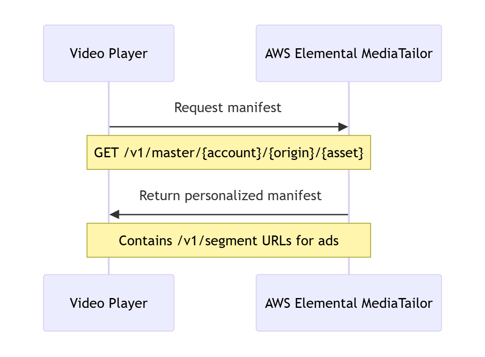
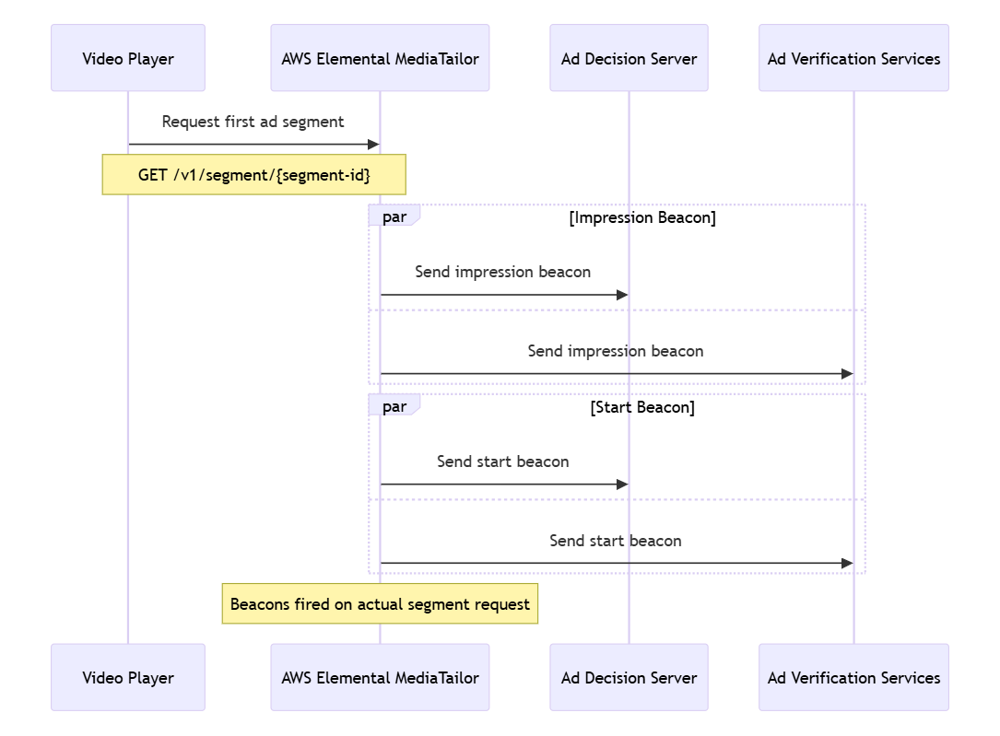
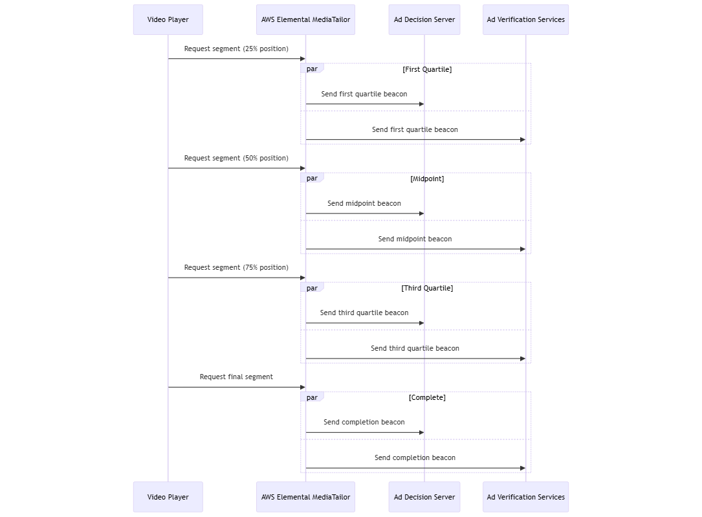
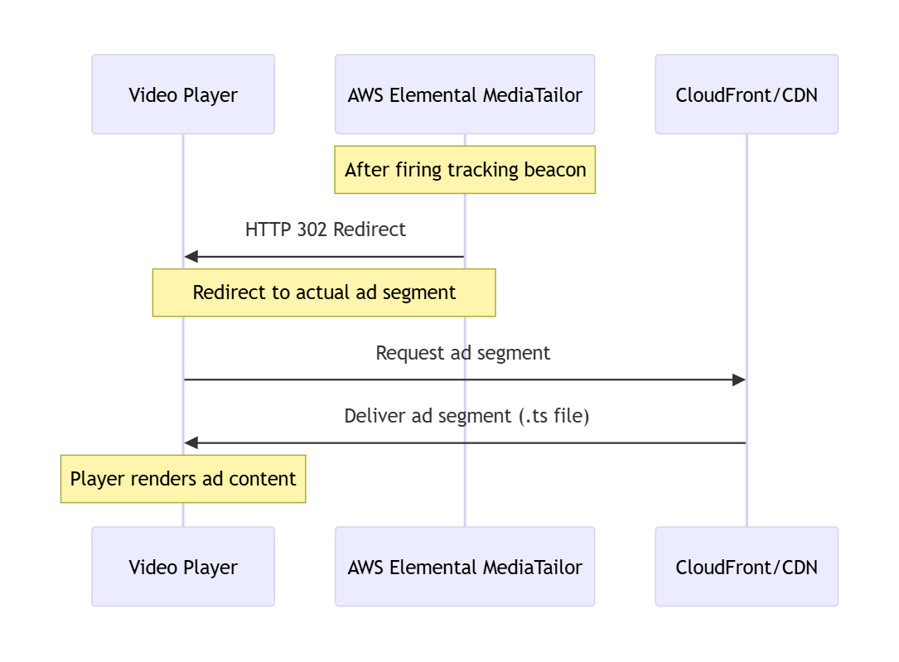

# Server-side ad tracking

AWS Elemental MediaTailor defaults to server-side reporting. With server-side reporting, when
the player requests an ad URL from the manifest, the service reports ad consumption
directly to the ad tracking URL. After the player initializes a playback session with
MediaTailor, no further input is required from you or the player to perform
server-side reporting. As each ad is played back, MediaTailor sends beacons to the ad
server to report how much of the ad has been viewed. MediaTailor sends beacons for the
start of the ad and for the ad progression in quartiles: the first quartile, midpoint,
third quartile, and ad completion.

## Server-side tracking

timing and caching behavior

In server-side reporting, MediaTailor fires tracking events based on actual segment
requests from the player, not on manifest parsing or pre-loading activities. This
approach ensures accurate impression counting that aligns with industry standards
for video ad measurement.

### Key timing

principles

MediaTailor server-side tracking follows these fundamental timing principles:

- **Tracking events fire on actual segment
  requests** - Beacons are sent only when the player makes
  HTTP requests to `/v1/segment` URLs, not during manifest
  parsing or caching.
- **Player caching and pre-loading of manifests does
  NOT trigger events** - Players can parse, cache, or
  pre-load manifest information without generating any tracking
  events.
- **Segment pre-fetching _will_ trigger events** - If players
  pre-fetch actual ad segments before playback, this follows industry
  standard behavior where segment requests constitute valid
  impressions.
- **Each /v1/segment request triggers appropriate
  beacon** - The specific tracking event (impression,
  quartile, completion) is determined by the ad position and segment being
  requested.
- **Timing aligns with IAB standards** -
  The approach follows Interactive Advertising Bureau guidelines for video
  ad measurement and impression counting.

### Server-side

tracking workflow

The following diagrams illustrate the complete server-side tracking workflow,
showing when tracking events are fired in relation to player requests:

**Phase 1: Session initialization**

The player requests a manifest from MediaTailor, which returns a
personalized manifest containing ad segment URLs:



**Phase 2: Ad request and impression tracking**

When the player requests the first ad segment, MediaTailor fires
impression and start beacons to both the Ad Decision Server and Ad
Verification Services:



**Phase 3: Quartile tracking**

MediaTailor fires quartile beacons (first quartile, midpoint, third
quartile, completion) based on subsequent segment requests:



**Phase 4: Segment delivery**

After firing tracking beacons, MediaTailor redirects to the actual ad
segment from Amazon CloudFront or your CDN:



The server-side tracking workflow includes the following key timing
behaviors:

1. **Session initialization** - The player
   requests a manifest from MediaTailor. MediaTailor returns a personalized manifest
   containing ad segment URLs with the `/v1/segment`
   path.
2. **Manifest parsing and caching** - The
   player parses the manifest and may pre-load or cache segment
   information. **No tracking events are fired during
   this phase**, regardless of player caching behavior.
3. **Ad segment request and impression
   tracking** - When the player actually requests the first ad
   segment (typically for playback), MediaTailor fires the impression beacon and
   start tracking event to both the Ad Decision Server and Ad Verification
   Services. This occurs on the actual HTTP request to the
   `/v1/segment` URL, not when the manifest is
   parsed.
4. **Quartile tracking based on segment
   requests** - MediaTailor fires quartile beacons (first quartile,
   midpoint, third quartile, completion) to both the Ad Decision Server and
   Ad Verification Services based on subsequent segment requests that
   correspond to the calculated quartile positions within the ad
   duration.
5. **Segment delivery** - After firing the
   appropriate tracking beacon, MediaTailor issues an HTTP redirect to the actual
   ad segment (either from Amazon CloudFront or your CDN).

### Player caching and pre-loading considerations

MediaTailor server-side tracking is designed to be compatible with various player
caching and pre-loading strategies while maintaining accurate impression
measurement:

- **Manifest pre-loading** - Players that
  pre-load or cache manifest information do not trigger tracking events.
  Tracking events are only fired when actual segment requests are
  made.
- **Segment pre-fetching** - If a player
  pre-fetches ad segments before playback, tracking events will fire when
  those segments are requested, potentially earlier than the actual
  playback time. This behavior aligns with industry standards that
  consider segment requests as valid impressions.
- **Player buffering** - Standard player
  buffering behavior (requesting segments slightly ahead of playback) will
  trigger tracking events at the appropriate times based on the segment
  request pattern.

### Troubleshooting tracking discrepancies

If you notice discrepancies between MediaTailor server-side tracking and third-party
metrics, consider the following factors:

- **Player behavior differences** -
  Different players may have varying pre-fetching and buffering strategies
  that affect when segment requests are made.
- **Network conditions** - Poor network
  conditions may cause players to request segments multiple times or at
  different intervals than expected.
- **CDN configuration** - Incorrect CDN
  caching of `/v1/segment` requests can lead to missed or
  duplicate tracking events.
- **Session management** - Ensure that each
  playback session uses a unique session identifier to prevent tracking
  event conflicts.

For detailed troubleshooting guidance, see [Troubleshooting common issues](monitoring-and-troubleshooting.md#troubleshooting-common-issues "monitoring-and-troubleshooting.md#troubleshooting-common-issues").

## Server-side tracking

beacon glossary

MediaTailor server-side tracking uses a standardized set of beacons to report ad viewing
progress to ad servers and verification services. These beacons align with
Interactive Advertising Bureau (IAB) standards for video ad measurement and provide
accurate reporting of ad impressions and completion rates.

| Server-side tracking beacon types | Beacon Type                                     | When Fired                                                                                | Purpose                                                                                                                                                                                                                                                                                                                              | Timing Details |
| --------------------------------- | ----------------------------------------------- | ----------------------------------------------------------------------------------------- | ------------------------------------------------------------------------------------------------------------------------------------------------------------------------------------------------------------------------------------------------------------------------------------------------------------------------------------ | -------------- |
| **Impression**                    | When the player requests the first ad segment   | Indicates that ad content has begun loading and is about to be<br>displayed to the viewer | Fired on the first `/v1/segment` request for an ad.<br>Aligns with IAB guidelines requiring ad content to begin loading<br>before counting an impression. See [Server-side<br>tracking workflow](#ad-reporting-server-side-timing-behavior-workflow "#ad-reporting-server-side-timing-behavior-workflow") for the complete sequence. |
| **Start**                         | When the player begins rendering the ad content | Confirms that ad playback has actually started                                            | Typically fired simultaneously with the impression beacon on the<br>first segment request, but represents the actual start of ad<br>rendering. This distinction is important for verification services<br>that track both impression and start events separately.                                                                    |
| **First Quartile**                | When the player reaches 25% of the ad duration  | Measures continued ad viewing through the first quarter of the<br>ad                      | Fired when the player requests the segment that contains the 25%<br>point of the ad duration. For example, in a 20-second ad with<br>2-second segments, this would typically fire on the request for the<br>3rd segment (at approximately 4-6 seconds into the ad).                                                                  |
| **Midpoint**                      | When the player reaches 50% of the ad duration  | Measures continued ad viewing through half of the ad                                      | Fired when the player requests the segment that contains the 50%<br>point of the ad duration. For example, in a 20-second ad with<br>2-second segments, this would typically fire on the request for the<br>5th segment (at approximately 8-10 seconds into the ad).                                                                 |
| **Third Quartile**                | When the player reaches 75% of the ad duration  | Measures continued ad viewing through three-quarters of the<br>ad                         | Fired when the player requests the segment that contains the 75%<br>point of the ad duration. For example, in a 20-second ad with<br>2-second segments, this would typically fire on the request for the<br>8th segment (at approximately 14-16 seconds into the ad).                                                                |
| **Complete**                      | When the player reaches the end of the ad       | Confirms that the entire ad was delivered to the viewer                                   | Fired when the player requests the final segment of the ad. This<br>indicates that the viewer has potentially seen the entire ad<br>content. For example, in a 20-second ad with 2-second segments, this<br>would typically fire on the request for the 10th segment (at<br>approximately 18-20 seconds into the ad).                |

###### Note

The exact timing of beacon firing depends on the segment duration and ad
length. MediaTailor calculates the appropriate segment request that corresponds to
each quartile position based on the specific ad duration and segment
structure.

###### To perform server-side ad reporting

- From the player, initialize a new MediaTailor playback session using a
  request in one of the following formats, according to your protocol:

      + Example: HLS format


      ```
      GET `<mediatailorURL>`/v1/master/`<hashed-account-id>`/`<origin-id>`/`<asset-id>`?ads.`<key-value-pairs-for-ads>`&`<key-value-pairs-for-origin-server>`
      ```
      + Example: DASH format


      ```
      GET `<mediatailorURL>`/v1/dash/`<hashed-account-id>`/`<origin-id>`/`<asset-id>`?ads.`<key-value-pairs-for-ads>`&`<key-value-pairs-for-origin-server>`
      ```

  The key-value pairs are the dynamic targeting parameters for ad tracking. For
  information about adding parameters to the request, see [MediaTailor dynamic ad variables for ADS requests](variables.md "variables.md").
  AWS Elemental MediaTailor responds to the request with the manifest URL. The manifest contains
  URLs for the media manifests. The media manifests contain embedded links for ad segment
  requests.

###### Note

When MediaTailor encounters a double-slash (//) in a tracking URL, it collapses the
slashes to one (/).

When the player requests playback from an ad segment URL (`/v1/segment`
path), AWS Elemental MediaTailor sends the appropriate beacon to the ad server through the ad
tracking URLs. At the same time, the service issues a redirect to the actual
`*.ts` ad segment. The ad segment is either in the Amazon CloudFront distribution
where MediaTailor stores transcoded ads, or in the content delivery network (CDN)
where you have cached the ad.
