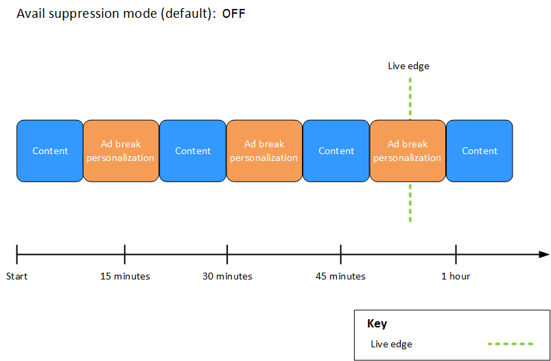
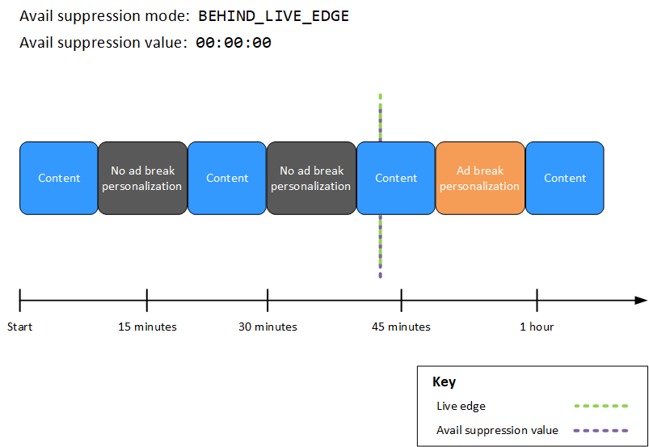
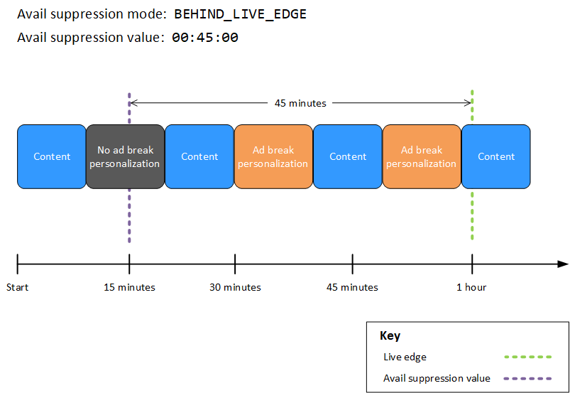
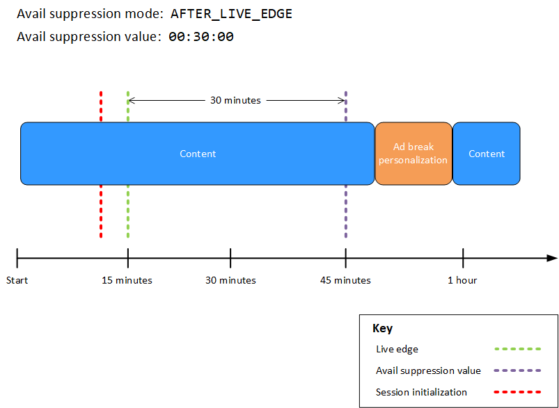

# Customizing ad break behavior with ad break suppression

When you create a configuration in AWS Elemental MediaTailor, you can specify optional ad break
configuration settings that govern the behavior of ad breaks, including the ability to
configure ad break suppression. This allows you to tailor the ad break experiences for your
video content to meet your specific requirements.

###### Compatibility restrictions

You can't use ad break suppression with the following:

- VOD and live-to-VOD workflows. Only live workflows are supported.
- Server-guided ad insertion (SGAI) methods. Server-guided methods handle ad
  decisioning differently and don't require suppression configuration.

###### Topics

- [Configuring ad break suppression](#ad-suppression "#ad-suppression")

## Configuring ad break suppression

You can configure MediaTailor to skip ad break personalization for live content.
This is known as _ad break suppression_, or _avail
suppression_. This topic shows you how, and it also explains how
configuring ad break suppression works.

Ad break suppression can be used for the following use cases:

- **Large manifest lookback window** – If a viewer
  starts playback at the live edge of a manifest but the lookback window is large,
  you might want to only insert ads starting after the viewer started watching.
  Or, insert ads for a portion of the total lookback window in the manifest. You
  can configure ad suppression so that MediaTailor personalizes ad breaks on or
  within a specified time range behind the live edge.
- **Mid-break join** – If the viewer starts
  watching a live video stream in the middle of an ad break, that user is likely
  to change the channel and not watch the advertisement. With ad suppression, you
  can skip ad break personalization if the ad break started before the viewer
  joined the stream.

### Configuring ad suppression

To use ad suppression, you configure an **avail suppression
mode**, **avail suppression value**, and
**avail suppression fill policy** in the following ways:

- In the MediaTailor console
- Using the AWS Command Line Interface (AWS CLI)
- Using MediaTailor API, or as parameters in your client's playback
  session request

For information about configuration with parameters, see [Configuring ad suppression parameters – playback session request](#configuring-ad-suppression-parameters-playback-session-request "#configuring-ad-suppression-parameters-playback-session-request").

#### Ad suppression

configuration parameters

You can choose to turn on or turn off ad suppression. If you turn on ad
suppression, you specify whether that suppression happens after the live
playback edge or before the live playback edge of a live stream. In either case,
you also specify a time, relative to the live edge, where MediaTailor doesn't
personalize ads. When you turn on avail suppression, you can specify an avail
suppression policy that MediaTailor uses for partial ad-break fills when a session
starts mid-break.

The following are the ad suppression configuration parameters:

- **Avail suppression mode** – Sets the ad
  suppression mode. By default, ad suppression is off. **Accepted values**: `OFF`,
  `BEHIND_LIVE_EDGE`, or
  `AFTER_LIVE_EDGE`.
  - `OFF`: There is no ad suppression and MediaTailor
    personalizes all ad breaks.
  - `BEHIND_LIVE_EDGE`: MediaTailor doesn't
    personalize ad breaks that start before the live edge, minus the
    **Avail suppression value**.
    This affects the entire ad break, not just individual ad
    avails.
  - `AFTER_LIVE_EDGE`: MediaTailor doesn't
    personalize ad breaks that are within the live edge, plus the
    **Avail suppression value**.
    This can be configured to affect either entire ad breaks or
    allow partial filling of ad avails.

- **Avail suppression value** – A time
  relative to the live edge in a live stream. **Accepted value**: A time value in
  `HH:MM:SS`.
- **Avail suppression fill policy**
  – Defines the policy that MediaTailor applies to the **Avail suppression mode**. **Accepted
  values**: `PARTIAL_AVAIL`,
  `FULL_AVAIL_ONLY`.
  - `BEHIND_LIVE_EDGE` mode always uses the
    `FULL_AVAIL_ONLY` suppression policy.
  - `AFTER_LIVE_EDGE` mode can be used to invoke
    `PARTIAL_AVAIL` ad break fills when a session
    starts mid-break.

#### Ad suppression settings

examples

The way in which the [ad suppression configuration parameters](#ad-suppression-configuration-parameters "#ad-suppression-configuration-parameters") interact with one another
lets you specify several different ways to handle ad suppression and avail
filling before, at, or after the live edge of the live stream. This section
provides examples that show you some of these interactions. Use these examples
to help you set up the configuration parameters for your particular
situation.

The following are examples of ad suppression settings:

###### Example 1: No ad suppression

When the **avail suppression mode** is
`OFF`, there is no ad suppression and MediaTailor personalizes all
ad breaks.

In the following figure, various blocks are arranged horizontally along a
timeline that progresses from left to right. Each block represents a portion
of time where the content of the live stream or a personalized ad break
plays. A dotted line represents the current live edge of the live stream.
Two ad breaks occur before the live edge, and another ad break is in
progress at the live edge. As shown in the figure, when the avail
suppression mode is `OFF`, MediaTailor personalizes all ad breaks that
occur before the live edge on the timeline. MediaTailor also personalizes the ad
break in progress at the live edge.



###### Example 2: `BEHIND_LIVE_EDGE` ad suppression with value in sync with

live edge

When **avail suppression mode** is set to
`BEHIND_LIVE_EDGE` and the **avail suppression
value** is set to `00:00:00`, the avail suppression
value is in sync with the live edge. MediaTailor doesn't personalize any
ad breaks that start on or before the live edge.

In the following figure, various blocks are arranged horizontally along a
timeline that progresses from left to right. Each block represents a portion
of time where the content of the live stream, a personalized ad break, or a
non-personalized ad break plays. A dotted line represents the current live
edge of the live stream. Another dotted line, representing the avail
suppression value set to `00:00:00`, overlaps the dotted line for
the live edge. Two ad breaks occur before the live edge, and another ad
break occurs after the live edge. As shown in the figure, when the avail
suppression mode is set to `BEHIND_LIVE_EDGE`, and the avail
suppression value is set to `00:00:00` so that it's in sync with
the live edge, MediaTailor doesn't personalize any ad breaks that occur before the
live edge on the timeline. MediaTailor personalizes the ad break that occurs
_after_ the live edge.



###### Example 3: `BEHIND_LIVE_EDGE` ad suppression with value behind live

edge

When the **avail suppression mode** is set to
`BEHIND_LIVE_EDGE`, MediaTailor doesn't personalize any ad
breaks on or before that time. In this example, MediaTailor personalizes
ad breaks that start up to 45 minutes behind the live edge. MediaTailor _doesn't_ personalize ad breaks that start more
than 45 minutes behind the live edge.

In the following figure, various blocks are arranged horizontally along a
timeline that progresses from left to right. Each block represents a portion
of time where the content of the live stream, a personalized ad break, or a
non-personalized ad break plays. A dotted line represents the current live
edge of the live stream. Another dotted line, representing the avail
suppression value set to `00:45:00`, occurs 45 minutes earlier in
the timeline with respect to the dotted line for the live edge. The
45-minute time period between the dotted lines represents the avail
suppression period. An ad break is in progress at the beginning of the avail
suppression period. Two other ad breaks occur during the avail suppression
period. As shown in the figure, when the avail suppression mode is set to
`BEHIND_LIVE_EDGE`, and the avail suppression value is set to
`00:45:00` behind the live edge, MediaTailor personalizes any ad
breaks that occur within the avail suppression period. MediaTailor _doesn't_ personalize the ad break in progress at
the beginning of the avail suppression period.



###### Example 4: `AFTER_LIVE_EDGE` ad suppression with no ad breaks

occurring during the avail suppression period

When the **avail suppression mode** is set to
`AFTER_LIVE_EDGE` and the **avail
suppression value** is greater than zero, MediaTailor doesn't
personalize any ad breaks until the elapsed time of the session has reached
that value.

In the following figure, various blocks are arranged horizontally along a
timeline that progresses from left to right. Each block represents a portion
of time where the content of the live stream or a personalized ad break
plays. A dotted line represents the current live edge of the live stream.
Another dotted line, representing the avail suppression value set to
`00:30:00`, occurs 30 minutes later in the timeline with
respect to the dotted line for the live edge. A third dotted line,
representing the session initialization, occurs earlier in the timeline with
respect to the dotted line for the live edge. The 30-minute time period
between the live-edge time and the avail-suppression-value time represents
the avail suppression period. An ad break occurs after the avail suppression
period. As shown in the figure, when the avail suppression mode is set to
`AFTER_LIVE_EDGE`, the avail suppression value is set to
`00:30:00` after the live edge, and the session
initialization occurs before the live edge, MediaTailor personalizes any ad breaks
that occur _after_ the avail suppression
period.



###### Example 5: `AFTER_LIVE_EDGE` ad suppression with

`PARTIAL_AVAIL` fill policy and an ad break in progress at
the end of the avail suppression period

When the **avail suppression mode** is set to
`AFTER_LIVE_EDGE` and the **avail suppression
value** is greater than zero, MediaTailor doesn't personalize
any ad breaks until the elapsed time of the session has reached that
value.

In the following figure, various blocks are arranged horizontally along a
timeline that progresses from left to right. Each block represents a portion
of time where the content of the live stream, a personalized ad break, or a
non-personalized ad break plays. A dotted line represents the current live
edge of the live stream. Another dotted line, representing the avail
suppression value set to `00:30:00`, occurs 30 minutes later in
the timeline with respect to the dotted line for the live edge. A third
dotted line, representing the session initialization, occurs earlier in the
timeline with respect to the dotted line for the live edge. The 30-minute
time period between the live-edge time and the avail-suppression-value time
represents the avail suppression period. An ad break is in progress at the
end of the avail suppression period. As shown in the figure, when the avail
suppression mode is set to `AFTER_LIVE_EDGE`, the avail
suppression value is set to `00:30:00` after the live edge, the
avail suppression fill policy is set to `PARTIAL_AVAIL`, and the
session initialization occurs before the live edge, MediaTailor personalizes any
ad breaks that occur _after_ the avail
suppression period. For the ad break in progress at the end of the avail
suppression period, MediaTailor personalizes the portion of that ad break which
occurs _after_ the avail suppression
period, but doesn't personalize the portion of that ad break which occurs
_during_ the avail suppression
period.


###### Example 6: `AFTER_LIVE_EDGE` ad suppression with

`PARTIAL_AVAIL` fill policy and an ad break in progress from
before session initialization to after the end of the avail suppression
period

When the **avail suppression mode** is set to
`AFTER_LIVE_EDGE` and the **avail suppression
value** is greater than zero, MediaTailor doesn't personalize
any ad breaks until the elapsed time of the session has reached that
value.

In the following figure, various blocks are arranged horizontally along a
timeline that progresses from left to right. Each block represents a portion
of time where the content of the live stream, a personalized ad break, or a
non-personalized ad break plays. A dotted line represents the current live
edge of the live stream. Another dotted line, representing the avail
suppression value set to `00:30:00`, occurs 30 minutes later in
the timeline with respect to the dotted line for the live edge. A third
dotted line, representing the session initialization, occurs earlier in the
timeline with respect to the dotted line for the live edge. The 30-minute
time period between the live-edge time and the avail-suppression-value time
represents the avail suppression period. An ad break is in progress from a
time before session initialization to a time after the avail suppression
period. As shown in the figure, when the avail suppression mode is set to
`AFTER_LIVE_EDGE`, the avail suppression value is set to
`00:30:00` after the live edge, the avail suppression fill
policy is set to `PARTIAL_AVAIL`, and the session initialization
occurs before the live edge, MediaTailor personalizes any ad breaks that occur
_after_ the avail suppression period.
For the ad break in progress before, during, and after the avail suppression
period, MediaTailor personalizes the portion of that ad break which occurs
_after_ the avail suppression period,
but doesn't personalize the portion of that ad break which occurs _before_ or _during_ the avail suppression period.


###### Example 7: `AFTER_LIVE_EDGE` ad suppression with an ad break in

progress at the beginning of the avail suppression period

When the **avail suppression mode** is set to
`AFTER_LIVE_EDGE` and the **avail suppression
value** is greater than zero, MediaTailor doesn't personalize
any ad breaks until the elapsed time of the session has reached that
value.

In the following figure, various blocks are arranged horizontally along a
timeline that progresses from left to right. Each block represents a portion
of time where the content of the live stream or a non-personalized ad break
plays. A dotted line represents the current live edge of the live stream.
Another dotted line, representing the avail suppression value set to
`00:30:00`, occurs 30 minutes later in the timeline with
respect to the dotted line for the live edge. A third dotted line,
representing the session initialization, occurs earlier in the timeline with
respect to the dotted line for the live edge. The 30-minute time period
between the live-edge time and the avail-suppression-value time represents
the avail suppression period. An ad break is in progress from a time before
session initialization to a time within the avail suppression period. As
shown in the figure, when the avail suppression mode is set to
`AFTER_LIVE_EDGE`, the avail suppression value is set to
`00:30:00` after the live edge, and the session
initialization occurs before the live-edge time but after the start of the
ad break, MediaTailor doesn't personalize that ad break.


#### Configuring ad suppression parameters – playback session request

You can configure ad suppression settings via parameters in your
_initial_ server-side or client-side playback session
request to MediaTailor. If you've already configured ad suppression settings
via the MediaTailor Console or AWS Elemental MediaTailor API, these parameters
override those settings.

Both the avail suppression mode and avail suppression value are required for
ad suppression to work. These parameters can't be configured from different
sources. For example, you can't configure one parameter with the MediaTailor console
and another with a query parameter.

MediaTailor supports the following ad suppression parameters.

| Name                         | Description                                                                                                                                                                                                                                                                                                                                                                                                                                                           | Accepted Values                                                                                                                                                           |
| ---------------------------- | --------------------------------------------------------------------------------------------------------------------------------------------------------------------------------------------------------------------------------------------------------------------------------------------------------------------------------------------------------------------------------------------------------------------------------------------------------------------- | ------------------------------------------------------------------------------------------------------------------------------------------------------------------------- |
| `availSuppressionMode`       | Sets the mode for ad suppression. By default, ad<br>suppression is `OFF`. When set to<br>`BEHIND_LIVE_EDGE`, MediaTailor doesn't<br>fill ad breaks on or behind the<br>`aws.availSuppressionValue` time. When set to<br>`AFTER_LIVE_EDGE`, MediaTailor doesn't fill<br>ad breaks on or behind the avail suppression period. The<br>avail suppression period spans from the live-edge time to<br>the `aws.availSuppressionValue` time, plus<br>additional buffer time. | • `OFF`<br>• `BEHIND_LIVE_EDGE`<br>• `AFTER_LIVE_EDGE`                                                                                                                    |
| `availSuppressionValue`      | A time relative to the live edge in a live stream.                                                                                                                                                                                                                                                                                                                                                                                                                    | A UTF-8 URL-encoded time code in `HH:MM:SS`. For<br>example, 1 hour and 30 minutes would be<br>`01%3A30%3A00`.                                                            |
| `availSuppressionFillPolicy` | Defines the policy to apply to the avail suppression mode.<br>`BEHIND_LIVE_EDGE` always uses the full avail<br>suppression policy. `AFTER_LIVE_EDGE` can be used to<br>invoke partial ad break fills when a session starts<br>mid-break.                                                                                                                                                                                                                              | • `PARTIAL_AVAIL` - not available for the<br>`BEFORE_LIVE_EDGE` suppression mode<br>• `FULL_AVAIL_ONLY` - the default value for<br>the `AFTER_LIVE_EDGE` suppression mode |

##### Server-side

configuration

The base query parameter is `aws.availSuppression`, which is
followed by optional parameter name and value pairs. To construct the query,
append `aws.availSuppression=` to the end of the playback session
request to MediaTailor, followed by parameter names and values. For more
information about how to construct a server-side playback session request,
see [MediaTailor server-side ad tracking and
reporting](ad-reporting-server-side.md "ad-reporting-server-side.md").

**Example**: HLS

```
GET `<mediatailorURL>`/v1/master/`<hashed-account-id>`/`<origin-id>`/index.m3u8?aws.availSuppressionMode=`BEHIND_LIVE_EDGE`&aws.availSuppressionValue=`00%3A00%3A21`
```

Server-side query syntax is listed in the following table.

| Query String Component | Description                                                                                                                                                                                                                                                                                                                                          |
| ---------------------- | ---------------------------------------------------------------------------------------------------------------------------------------------------------------------------------------------------------------------------------------------------------------------------------------------------------------------------------------------------- |
| `?`                    | A restricted character that marks the beginning of a<br>query.                                                                                                                                                                                                                                                                                       |
| `aws.`                 | The base query, which is followed by parameters<br>constructed of name and value pairs. For a list of all of<br>the available parameters, see [Configuring ad suppression parameters – playback session request](#configuring-ad-suppression-parameters-playback-session-request "#configuring-ad-suppression-parameters-playback-session-request"). |
| `=`                    | Associates the parameter name with a value. For example,<br>`aws.availSuppressionMode=`BEHIND_LIVE_EDGE``.                                                                                                                                                                                                                                           |
| `&`                    | Concatenates query parameters. For example,<br>`aws.availSuppressionMode=`BEHIND_LIVE_EDGE``&`aws.availSuppressionValue=`00:30:00`&aws.availSuppressionFillPolicy=`FULL_AVAIL_ONLY`>`.                                                                                                                                                               |

##### Client-side

configuration

Include `availSuppression` parameters in your client's POST
request to MediaTailor. For more information about how to construct a
client-side playback session request, see [Client-side ad tracking](ad-reporting-client-side.md "ad-reporting-client-side.md").

**Example**: HLS

```
POST parent.m3u8
    {
       "availSuppression": {
          "mode": "BEHIND_LIVE_EDGE",
          "value": "00:00:21",
          "fillPolicy": "FULL_AVAIL_ONLY"
       }
    }
```
