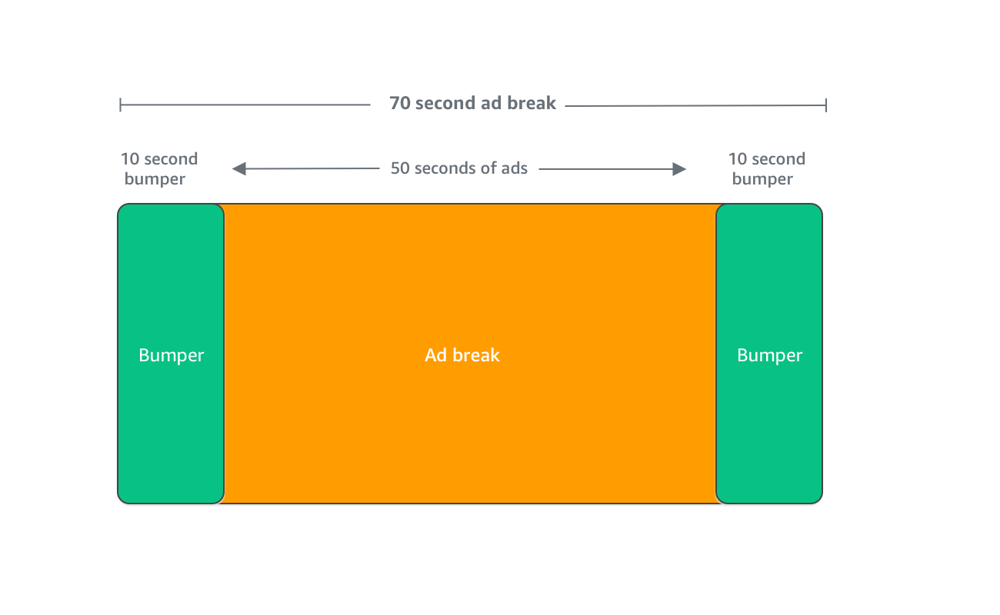

# MediaTailor bumper ad insertion

Bumpers are short, non-skippable video or audio clips that play at the start or before
the end of an ad break with AWS Elemental MediaTailor.

The following conditions apply to bumpers:

- Bumpers must be 10 seconds or less.
- Bumpers can be inserted at the start of an ad break, directly before the end
  of an ad break, or both.
- Bumpers play during every ad break in a playback session unless pre-roll is
  configured. If pre-roll is configured, bumpers won't play during the pre-roll
  break. Instead, they will play in every subsequent break after the
  pre-roll.
- For HLS, you must include the `duration` attribute with each
  SCTE-35 `EXT-X-CUE-OUT` tag.
- Bumpers are transcoded to match source content.
- You are not charged for bumpers.

## Configuring bumpers

To use bumpers, configure the bumper URLs with the MediaTailor console,
MediaTailor API, or the AWS Command Line Interface (AWS CLI). You can configure a start bumper, an
end bumper, or both. Bumpers are stored on a server, such as Amazon Simple Storage Service (Amazon S3). The
bumper URLs indicate the location of the stored bumper asset(s).

Example start and end bumper URLs:

Start bumper URL: `https://s3.amazonaws.com/startbumperad`

End bumper URL: `https://s3.amazonaws.com/endbumperad`

### Example

The following is an example of bumper ad behavior.

###### Example 1: Start and end bumpers

In this example, start and end bumpers are enabled. The ad decision server
has 50 seconds of personalized ads to fill a 70-second ad break. The
10-second start bumper plays at the start of the ad break, 50 seconds of ads
plays, then the 10-second end bumper.

