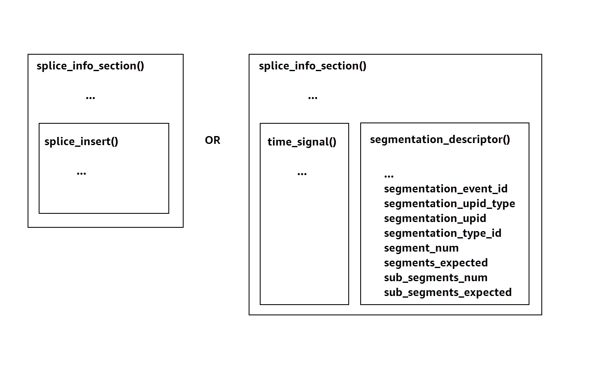

# SCTE-35 messages for ad breaks

With MediaTailor, you can create a content channel based off of
source
location and VOD source resources. You can then set up one or more ad
breaks for each of the programs on a channel's schedule. You use messages based on the SCTE-35
specification to condition the content for ad breaks. For example, you can use SCTE-35
messages to provide metadata about the ad breaks. For more information about the SCTE-35
specification, see [Digital Program Insertion Cueing Message](https://webstore.ansi.org/Standards/SCTE/ANSISCTE352022 "https://webstore.ansi.org/Standards/SCTE/ANSISCTE352022").

You set up the ad breaks in one of two ways:

- Attaching a `time_signal` SCTE-35 message with a
  `segmentation_descriptor` message. This `segmentation_descriptor`
  message contains more advanced metadata fields, like content identifiers, which convey
  more information about the ad break. MediaTailor writes the ad metadata to the output manifest
  as part of the `EXT-X-DATERANGE` (HLS) or `EventStream` (DASH) ad
  marker's SCTE-35 data.
- Attaching a `splice_insert` SCTE-35 message that provides basic metadata
  about the ad break.
- HLS:

      + When the Ad markup type is `Daterange`, MediaTailor specifies ad breaks as `EXT-X-DATERANGE` tags in the manifest.
      + When the Ad markup type is `Scte35 Enhanced`, MediaTailor specifies ad breaks using the following tags:

      	- MediaTailor places an `EXT-X-CUE-OUT` on the first segment of the ad slate, indicating a cut from content to the ad break. It contains the expected duration of ad break, such as `EXT-X-CUE-OUT:Duration=30`.
      	- `>EXT-X-ASSET`: This tag appears on the same segment as `EXT-X-CUE-OUT` and contains the ad-break metadata supplied in the AdBreak when the program is created or updated. It always contains `CAID`.
      	- `EXT-OATCLS-SCTE35`: This tag appears on the same segment as `EXT-X-CUE-OUT` and contains base64-encoded bytes of the SCTE-35 message.
      	- `EXT-X-CUE-OUT-CONT`: This tag appears on each subsequent segment within the ad slate, and contains duration and elapsed-time information. It also contains the base64-encoded SCTE-35 message, and the `CAID`.
      	- `EXT-X-CUE-IN`: This tag appears on the first segment of content after the ad break is over, and indicates a cut from an ad break back to content.

  The following illustration shows the two ways of setting up ad breaks in a channel using
  SCTE-35 messages:

- Use a `splice_insert()` message to set up ad breaks with basic
  metadata.
- Use a `time_signal()` message together with a
  `segmentation_descriptor()` message to set up ad breaks with more detailed
  metadata.

For information about using `time_signal`, see section 9.7.4 of the 2022
SCTE-35 specification, [Digital Program Insertion Cueing Message](https://webstore.ansi.org/Standards/SCTE/ANSISCTE352022 "https://webstore.ansi.org/Standards/SCTE/ANSISCTE352022").

The ad break information appears in the output `splice_info_section` SCTE-35
data. With MediaTailor, you can pair a single `segmentation_descriptor` message together
with a single `time_signal` message.

###### Note

If you send a `segmentation_descriptor` message, you must send it as part of
the `time_signal` message type. The `time_signal` message contains
only the `splice_time` field that MediaTailor constructs using a given
timestamp.

The following table describes the fields that MediaTailor requires for each
`segmentation_descriptor` message. For more information, see section 10.3.3.1 of
the 2022 SCTE-35 specification, which you can purchased at the [ANSI Webstore
website](https://webstore.ansi.org/Standards/SCTE/ANSISCTE352022 "https://webstore.ansi.org/Standards/SCTE/ANSISCTE352022").

| Required fields for a `segmentation_descriptor` message | Field   | Type                | Default value                                                                                                                                  | Description                                                                                                                                                                                                     |
| ------------------------------------------------------- | ------- | ------------------- | ---------------------------------------------------------------------------------------------------------------------------------------------- | --------------------------------------------------------------------------------------------------------------------------------------------------------------------------------------------------------------- | ------- | ---- | ------------------------------------------------------------------------------------------------------------------------------------------------------------------------------------------------------------------------------------------------------------------------------------------------------------------------------------------------------------------------------------------------------------------------------------------------------------------------------------------------------------------------------------------------------------------------------------------------------------------------------------------------------------------------------------------------------------------------------------------------------------------------------------------------------------------------------------------------------------------------------------------------------------------------------------------------------------------------------------------------------------------------------------------------------------------------------------------------------------------------------------------------------------------------------------------------------------------------------------------------------------------------------------------------------------------------------------------------------------------------------------------------------------------------------------------------------------------------------------------------------------------------------------------------------------------------------------------------------------------------------------------------------------------------------------------------------------------------------------------------------------------------------------------------------------------------------------------------------------------------------------------------------------------------------------------------------------------------------------------------------------------------------------------------------------------------------------------------------------------------------------------------------------------------------------------------------------------------------------------------------------ |
| `segmentation_event_id`                                 | integer | 1                   | This is written to `segmentation_descriptor.segmentation_event_id`.                                                                            |
| `segmentation_upid_type`                                | integer | 14 (0x0E)           | This is written to `segmentation_descriptor.segmentation_upid_type`. The value must be between 0 and 256, inclusive.                           |
| `segmentation_upid`                                     | string  | `""` (empty string) | This is written to `segmentation_descriptor.segmentation_upid`. The value must be a hexadecimal string, containing characters `0-9` and `A-F`. |
| `segmentation_type_id`                                  | integer | 48 (0x30)           | This is written to `segmentation_descriptor.segmentation_type_id`. The value must be between 0 and 256, inclusive.                             |
| `segment_num`                                           | integer | 0                   | This is written to `segmentation_descriptor.segment_num`. The value must be between 0 and 256, inclusive.                                      |
| `segments_expected`                                     | integer | 0                   | This is written to `segmentation_descriptor.segments_expected`. The value must be between 0 and 256, inclusive.                                |
| `sub_segment_num`                                       | integer | `null`              | This is written to `segmentation_descriptor.sub_segment_num`. The value must be between 0 and 256, inclusive.                                  |
| `sub_segments_expected`                                 | integer | `null`              | This is written to `segmentation_descriptor.sub_segments_expected`. The value must be between 0 and 256, inclusive.                            | The following table shows the values that MediaTailor automatically sets for some of the `segmentation_descriptor` message's fields. Values set by MediaTailor for a `segmentation_descriptor` message's fields | Field   | Type | Value                                                                                                                                                                                                                                                                                                                                                                                                                                                                                                                                                                                                                                                                                                                                                                                                                                                                                                                                                                                                                                                                                                                                                                                                                                                                                                                                                                                                                                                                                                                                                                                                                                                                                                                                                                                                                                                                                                                                                                                                                                                                                                                                                                                                                                                        |
| ---                                                     | ---     | ---                 |                                                                                                                                                | `segmentation_event_cancel_indicator`                                                                                                                                                                           | Boolean | True |
| `program_segmentation_flag`                             | Boolean | True                |                                                                                                                                                | `delivery_not_restricted_flag`                                                                                                                                                                                  | Boolean | True | MediaTailor always sets the `segmentation_duration_flag` to `True`. MediaTailor populates the `segmentation_duration` field with the duration, in ticks, of the state content. ###### Note When MediaTailor sends the `time_signal` messages, it sets the `splice_command_type` field in the `splice_info_section` message to 6 (0x06). In HLS output, for an `AdBreak` with a `time_signal` message, the output `EXT-X-DATERANGE` tag includes a `SCTE-35` field that is set to the serialized version of the `splice_info_section` message. For example, the following `EXT-X-DATERANGE` tag shows the serialized version of the `splice_info_section` message: `#EXT-X-DATERANGE:ID=\"1\",START-DATE=\"2020-09-25T02:13:20Z\",DURATION=300.0,SCTE35-OUT=0xFC002C00000000000000FFF00506800000000000160214435545490000000100E000019BFCC00E0030000000000000` In DASH output, for an `AdBreak` with a `time_signal` message, the output `EventStream` element includes a `scte35:SpliceInfoSection` element with `scte35:TimeSignal` and `scte35:SegmentationDescriptor` elements as its children. The `scte35:TimeSignal` element has a child `scte35:SpliceTime` element, and the `scte35:SegmentationDescriptor` element has a child `scte35:SegmentationUpid` element. For example, the following DASH output shows the `EventStream` element's child element structure: `<EventStream schemeIdUri="urn:scte:scte35:2013:xml" timescale="90000"> <Event duration="27000000"> <scte35:SpliceInfoSection protocolVersion="0" ptsAdjustment="0" tier="4095"> <scte35:TimeSignal> <scte35:SpliceTime ptsTime="0" /> </scte35:TimeSignal> <scte35:SegmentationDescriptor segmentNum="0" segmentationDuration="27000000" segmentationEventCancelIndicator="false" segmentationEventId="1" segmentationTypeId="48" segmentsExpected="0"> <scte35:SegmentationUpid segmentationUpidFormat="hexBinary" segmentationUpidType="14">012345</scte35:SegmentationUpid> </scte35:SegmentationDescriptor> </scte35:SpliceInfoSection> </Event> </EventStream>` You learned about using SCTE-35 messages to set up ad breaks in channel assembly, the structure and required fields for those messages, and sample HLS and DASH output that includes the SCTE-35 messages. |
