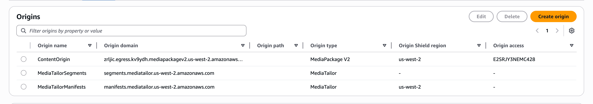
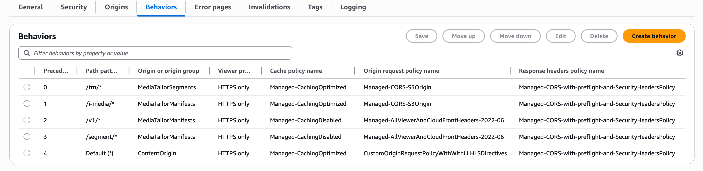

# Production-ready CloudFront configuration for

MediaTailor

This CloudFront distribution configuration provides everything you need to deliver MediaTailor content
with server-side ad insertion at scale. Copy this configuration and customize it with your
specific origins and requirements.

###### What this configuration accomplishes

This configuration creates a production-ready CloudFront distribution that handles all MediaTailor
request types with optimal caching and performance. It includes three origins (your
content, MediaTailor segments, and MediaTailor manifests) with four cache behaviors that route
requests correctly and cache content appropriately.

###### When to use this configuration

This setup is ideal for live streaming, video-on-demand, and hybrid workflows that
require server-side ad insertion.

## Three-origin architecture

MediaTailor uses a three-origin architecture pattern to optimize content delivery and ad
insertion performance. Each origin serves a specific purpose in the ad insertion
workflow:

Your content origin

This is your true content origin that feeds MediaTailor. For example, this could
be AWS Elemental MediaPackage V2 or another content delivery service. This origin serves your
original content before ad insertion. Common examples include:

- MediaPackage V2 packaging configurations
- Third-party content delivery networks
- On-premises streaming servers
- Amazon S3 buckets with static content

MediaTailor segments origin

This origin uses the hostname
`segments.mediatailor.`region`.amazonaws.com`
and serves the actual ad segments after MediaTailor has encoded them. These are
the video segments that contain the advertisements. This origin
handles:

- Transcoded ad segments in the same format as your content
- Redirected requests from the `/segment/*` path
  pattern
- Ad segments that have been processed for server-side ad
  insertion

MediaTailor manifests origin

This origin uses the hostname
`manifests.mediatailor.`region`.amazonaws.com`
and can be used as a regional hostname for playback configurations in the
specified AWS Region. MediaTailor selects the correct playback configuration
based on the path in the request. This origin provides:

- Personalized HLS and DASH manifests with viewer-specific ad
  insertion
- Server-guided ad insertion (SGAI) manifests for cacheable
  content
- Ad tracking and beacon handling for server-side reporting

With the origin hostname
`manifests.mediatailor.`region`.amazonaws.com`,
you can have multiple playback configurations that work with the same CloudFront distribution
if they're in the specified Region and you include the playback configuration name in
the request path. For example:

- `https://your-distribution.cloudfront.net/v1/master/playback-config-1/manifest.m3u8`
- `https://your-distribution.cloudfront.net/v1/master/playback-config-2/manifest.m3u8`

Select origin request policies based on content type to prevent cache poisoning while
ensuring proper functionality. The key distinction is between cacheable and non-cacheable
content:

- **Manifests (non-cacheable)**: Use
  `AllViewer` to forward all headers needed for dynamic content.
  Since manifests aren't cached, there's no cache poisoning risk.
- **Segments (cacheable)**: Use
  `None`
  for optimal performance.
- **S3 origins**: Use
  `CORS-S3Origin` for Amazon S3 buckets
- **MediaPackage origins**: Use
  `CORS-S3Origin` for MediaPackage V2 endpoints

## Cache behavior precedence and

configuration

MediaTailor requires specific cache behavior configurations to handle different types of
requests properly. The precedence of cache behaviors is critical because CDNs process
them in order (smallest to largest) and use the behavior for the first matching path
pattern. Understanding this precedence is essential for troubleshooting:

- **Precedence 0**: Most specific patterns (like
  `/tm/*`) are evaluated first
- **Higher precedence numbers**: Less specific
  patterns are evaluated in order
- **Default behavior**: Catches all requests that
  don't match other patterns

If requests aren't behaving as expected, check that your path patterns don't overlap
in unintended ways.

### Precedence 0: Ad segments path

behavior

This behavior handles the redirected requests from the segment path behavior,
serving the actual ad segments. CloudFront applies the following behaviors to all requests
with a `/tm/*` path pattern. This is the highest priority behavior
because ad segment delivery is critical for uninterrupted playback.

- **Path pattern:**
  `/tm/*`

Example URLs that match this pattern:

    + `https://your-distribution.cloudfront.net/tm/ad-segment-001.ts`
    + `https://your-distribution.cloudfront.net/tm/transcoded-ad.m4s`

- **Origin:** The origin that you created with
  the
  `segments.mediatailor.`region`.amazonaws.com`
  domain.

This is **MediaTailorSegments** in the example in the
preceding section on origins.

- **Cache policy:**
  `Managed-CachingOptimized`

For details about what's included in the CloudFront managed cache policy, see
[CachingOptimized](../../../AmazonCloudFront/latest/DeveloperGuide/using-managed-cache-policies.md#managed-cache-caching-optimized "../../../AmazonCloudFront/latest/DeveloperGuide/using-managed-cache-policies.md#managed-cache-caching-optimized") in the CloudFront user guide. You can also use these
same settings from the managed policy in your third-party CDN.

- **Origin request policy:**
  `None`
- **Response headers policy:**
  `Managed-CORS-with-preflight-and-SecurityHeadersPolicy`

For details about what's included in the response headers policy, see
[CORS-with-preflight-and-SecurityHeadersPolicy](../../../AmazonCloudFront/latest/DeveloperGuide/using-managed-response-headers-policies.md#managed-response-headers-policies-cors-preflight-security "../../../AmazonCloudFront/latest/DeveloperGuide/using-managed-response-headers-policies.md#managed-response-headers-policies-cors-preflight-security") in the CloudFront user
guide.

#### Adapting these settings to other

CDNs

If you're using a CDN other than CloudFront, look for equivalent settings that
accomplish the following.

**Path pattern matching**

Configure a specific behavior for the `/tm/*` path
pattern to handle MediaTailor ad segments

**Cache key configuration**

Include the `Origin` header in your cache key to ensure
responses are cached separately for different origins

**Header forwarding**

Forward the `Origin` header and other CORS-related
headers to the origin

**Response header management**

Configure your CDN to ensure the
`Access-Control-Allow-Origin` header is present in
responses

The specific terminology and configuration options will vary by CDN provider,
but the underlying principles remain the same.

### Precedence 1: Server-guided ad insertion

behavior

This behavior handles [Understanding AWS Elemental MediaTailor server-guided ad insertion](server-guided.md "server-guided.md") (SGAI) requests when customers configure guided mode, which provides cacheable
manifests. CloudFront applies the following behaviors to all requests with a
`/v1/i-media/*` path pattern. SGAI allows for better caching performance
because the manifests are not viewer-specific.

- **Path pattern:**
  `/v1/i-media/*` (iMedia path for SGAI)

Example URLs that match this pattern:

    + `https://your-distribution.cloudfront.net/v1/i-media/your-config/manifest.m3u8`
    + `https://your-distribution.cloudfront.net/v1/i-media/your-config/playlist.mpd`

- **Origin:** The origin that you created with
  the
  `manifests.mediatailor.`region`.amazonaws.com`
  domain.

This is **MediaTailorManifests** in the example in the
preceding section on origins.

- **Cache policy:**
  `Managed-CachingOptimized`

For details about what's included in the CloudFront managed cache policy, see
[CachingOptimized](../../../AmazonCloudFront/latest/DeveloperGuide/using-managed-cache-policies.md#managed-cache-caching-optimized "../../../AmazonCloudFront/latest/DeveloperGuide/using-managed-cache-policies.md#managed-cache-caching-optimized") in the CloudFront user guide. You can also use these
same settings from the managed policy in your third-party CDN.

- **Origin request policy:**
  `None`
- **Response headers policy:**
  `Managed-CORS-with-preflight-and-SecurityHeadersPolicy`

For details about what's included in the response headers policy, see
[CORS-with-preflight-and-SecurityHeadersPolicy](../../../AmazonCloudFront/latest/DeveloperGuide/using-managed-response-headers-policies.md#managed-response-headers-policies-cors-preflight-security "../../../AmazonCloudFront/latest/DeveloperGuide/using-managed-response-headers-policies.md#managed-response-headers-policies-cors-preflight-security") in the CloudFront user
guide.

### Precedence 2: Personalized

manifest behavior

This behavior handles personalized manifest requests. CloudFront applies the following
behaviors to all requests with a `/v1/*` path pattern. CloudFront applies the
following behaviors and doesn't cache personalized manifests because they contain
viewer-specific ad content URLs. These behaviors apply to all requests that have a
`/v1/*` path pattern. This is the core MediaTailor functionality where each
viewer receives a unique manifest with personalized ad insertion.

- **Path pattern:**
  `/v1/*` (standard V1 MediaTailor requests)

Example URLs that match this pattern:

    + `https://your-distribution.cloudfront.net/v1/master/your-config/manifest.m3u8`
    + `https://your-distribution.cloudfront.net/v1/dash/your-config/manifest.mpd`

- **Origin:** The origin that you created with
  the
  `manifests.mediatailor.`region`.amazonaws.com`
  domain.

This is **MediaTailorManifests** in the example in the
preceding section on origins.

- **Cache policy:**
  `Managed-CachingDisabled`

For details about what's included in the cache policy, see [CachingDisabled](../../../AmazonCloudFront/latest/DeveloperGuide/using-managed-cache-policies.md#managed-cache-policy-caching-disabled "../../../AmazonCloudFront/latest/DeveloperGuide/using-managed-cache-policies.md#managed-cache-policy-caching-disabled") in the CloudFront user guide.

- **Origin request policy:**
  `AllViewer`

For personalized manifests, use the `AllViewer` policy to
forward all headers needed for dynamic content.

- **Response headers policy:**
  `Managed-CORS-with-preflight-and-SecurityHeadersPolicy`

For details about what's included in the response headers policy, see
[CORS-with-preflight-and-SecurityHeadersPolicy](../../../AmazonCloudFront/latest/DeveloperGuide/using-managed-response-headers-policies.md#managed-response-headers-policies-cors-preflight-security "../../../AmazonCloudFront/latest/DeveloperGuide/using-managed-response-headers-policies.md#managed-response-headers-policies-cors-preflight-security") in the CloudFront user
guide.

###### Accept-Encoding header

We recommend that your CDN preserves the `Accept-Encoding` header
from viewers. This header gives MediaTailor instruction on compressing personalized
manifests.

In CloudFront, the `AllViewerAndCloudFrontHeaders` origin request policy
includes passthrough of the `Accept-Encoding` header from the viewer. If
you use a different CDN, ensure that it preserves this header.

The following is how MediaTailor handles the `Accept-Encoding` header.

- **Legacy devices:** Older smart TVs that
  don't support gzip won't send the Accept-Encoding header, so MediaTailor returns
  uncompressed manifests
- **Modern devices:** iPhones, Chrome browsers,
  and other modern clients send the Accept-Encoding header, allowing MediaTailor to
  compress manifests before delivery

### Precedence 3: Server-side beacon path

behavior

This behavior handles requests to MediaTailor that result in redirects for [Server-side
tracking](ad-reporting-server-side.md "ad-reporting-server-side.md"). These requests are essential
for tracking beacons, so every request must be processed by MediaTailor. CloudFront applies the
following behaviors to all requests with a `/segment/*` path pattern.

- **Path pattern:**
  `/segment/*`

Example URLs that match this pattern:

    + `https://your-distribution.cloudfront.net/segment/tracking-beacon-123`
    + `https://your-distribution.cloudfront.net/segment/ad-request-456.ts`

- **Origin:** The origin that you created with
  the
  `manifests.mediatailor.`region`.amazonaws.com`
  domain.

This is **MediaTailorManifests** in the example in the
preceding section on origins.

- **Cache policy:**
  `Managed-CachingDisabled`

For details about what's included in the cache policy, see [CachingDisabled](../../../AmazonCloudFront/latest/DeveloperGuide/using-managed-cache-policies.md#managed-cache-policy-caching-disabled "../../../AmazonCloudFront/latest/DeveloperGuide/using-managed-cache-policies.md#managed-cache-policy-caching-disabled") in the CloudFront user guide.

- **Origin request policy:**
  `AllViewer`

For server-side beacon requests, use the `AllViewer` policy to
forward all headers needed for tracking. Since these requests aren't cached,
there's no cache poisoning risk.

- **Response headers policy:**
  `Managed-CORS-with-preflight-and-SecurityHeadersPolicy`

For details about what's included in the response headers policy, see
[CORS-with-preflight-and-SecurityHeadersPolicy](../../../AmazonCloudFront/latest/DeveloperGuide/using-managed-response-headers-policies.md#managed-response-headers-policies-cors-preflight-security "../../../AmazonCloudFront/latest/DeveloperGuide/using-managed-response-headers-policies.md#managed-response-headers-policies-cors-preflight-security") in the CloudFront user
guide.

When MediaTailor processes these requests, it returns a 302 redirect response with a
path that points to the actual segment location. For example, a request to
`/segment/ad123.ts` might redirect to
`/tm/encoded-ad-segment.ts` on the segments origin.

### Precedence 4: Content origin path

behavior

If the request path doesn't match any of the other patterns, CloudFront applies the
default behavior. This behavior sends requests directly to the content origin, with
no processing from MediaTailor. This allows direct access to your content origin (such as
MediaPackage V2) when needed. CloudFront applies the following behaviors to all requests that
don't include any of the prior path patterns.

- **Path pattern:**
  `(*)`
- **Origin:** The origin that you created with
  the domain for your content origin.

This is **ContentOrigin** in the example in the preceding
section on origins.

- **Cache policy:**
  `Managed-CachingOptimized`

For details about what's included in the CloudFront managed cache policy, see
[CachingOptimized](../../../AmazonCloudFront/latest/DeveloperGuide/using-managed-cache-policies.md#managed-cache-caching-optimized "../../../AmazonCloudFront/latest/DeveloperGuide/using-managed-cache-policies.md#managed-cache-caching-optimized") in the CloudFront user guide. You can also use these
same settings from the managed policy in your third-party CDN.

###### Note

For low latency HLS implementations, consider using a custom caching
policy with Low Latency HLS (LLH) directives instead of the standard
`CachingOptimized` policy.

- **Origin request policy:**
  `None`
- **Response headers policy:**
  `Managed-CORS-with-preflight-and-SecurityHeadersPolicy`

Although the default content origin behavior doesn't typically face the
same CORS cache poisoning risks as the ad segment behavior, it's still
recommended to use the
`Managed-CORS-with-preflight-and-SecurityHeadersPolicy`
response headers policy and include the `Origin` header in your
cache key. This ensures consistent CORS handling across all content types
and prevents potential playback issues in web-based players.

For content segments, the `Managed-CachingOptimized` cache
policy provides good performance while the
`Managed-CORS-with-preflight-and-SecurityHeadersPolicy`
response headers policy ensures proper CORS handling. This combination
allows for efficient caching while maintaining compatibility with web-based
players that require CORS headers.

Applying consistent CORS handling across both ad segments and content
segments creates a more reliable playback experience and simplifies
troubleshooting. Without proper CORS configuration, players might experience
inconsistent behavior when transitioning between content and ads.

For details about what's included in the response headers policy, see
[CORS-with-preflight-and-SecurityHeadersPolicy](../../../AmazonCloudFront/latest/DeveloperGuide/using-managed-response-headers-policies.md#managed-response-headers-policies-cors-preflight-security "../../../AmazonCloudFront/latest/DeveloperGuide/using-managed-response-headers-policies.md#managed-response-headers-policies-cors-preflight-security") in the CloudFront user
guide.
