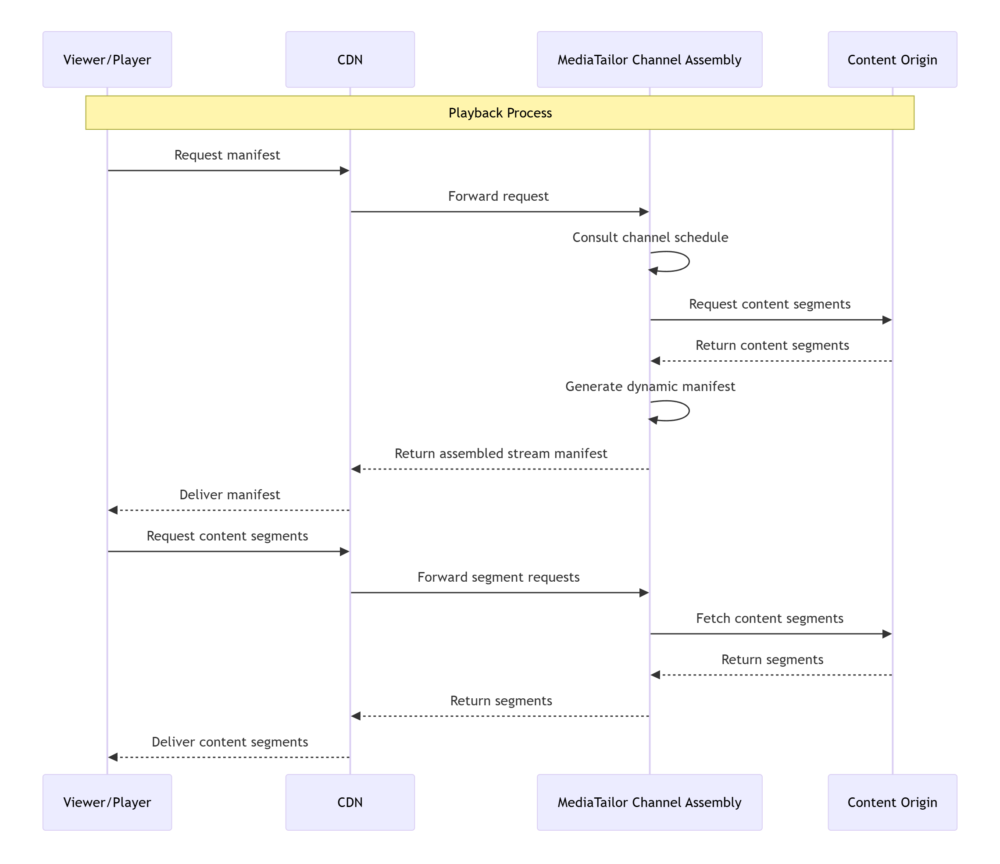

# Understand MediaTailor channel assembly

CDN architecture

AWS Elemental MediaTailor channel assembly integrates with content delivery networks (CDNs) to deliver
linear streaming channels with improved performance and global reach. The recommended
architecture positions the CDN between viewers and channel assembly, with channel
assembly accessing content directly from your origin. This topic explains the core
architecture components and how they work together to deliver your content.

1. Viewers request manifests from the CDN
2. CDN forwards requests to channel assembly
3. Channel assembly assembles the manifests from VOD sources
4. Channel assembly returns the manifests to the CDN, which forwards them to
   viewers
5. Viewers request segments through the CDN
6. CDN routes segment requests to the appropriate origin
   This architecture ensures optimal performance while maintaining the security and
   flexibility benefits of using a CDN.

## CDN terminology for channel assembly

Understanding these key terms will help you implement and troubleshoot your
channel assembly CDN integration:

Origin CDN and edge CDN

**Origin CDN**: A CDN positioned between
MediaTailor and your content origin. It caches content segments to reduce load
on your origin servers. In a multi-CDN architecture, this is the first
CDN layer that interfaces directly with the origin.

**Edge CDN**: A CDN positioned between
viewers and MediaTailor. It delivers personalized manifests and content to
viewers. In a multi-CDN architecture, this is the outermost CDN layer
that interfaces directly with viewers.

CDN configuration terms

**Cache behavior**: Rules that determine
how a CDN handles different types of requests, including caching
duration and origin routing.

**TTL (Time To Live)**: The duration for
which content remains valid in a CDN cache before it needs to be
refreshed from the origin. For detailed TTL recommendations, see [Caching optimization for CDN and MediaTailor
integrations](cdn-optimize-caching.md "cdn-optimize-caching.md").

**Cache key**: The unique identifier used
by a CDN to store and retrieve cached content, often including URL path,
query parameters, and headers.

**Origin shield**: An intermediate
caching layer between CDN edge locations and your origin server that
reduces the number of requests to your origin.

**Request collapsing**: A CDN feature
that combines multiple simultaneous requests for the same content into a
single origin request.

MediaTailor-specific CDN terms

**CDN content segment prefix**: The CDN
domain name that MediaTailor uses when generating URLs for content segments in
manifests.

**CDN ad segment prefix**: The CDN domain
name that MediaTailor uses when generating URLs for ad segments in
manifests.

For more information about CDN configuration with MediaTailor, see [Set up CDN integration](cdn-configuration.md "cdn-configuration.md").
