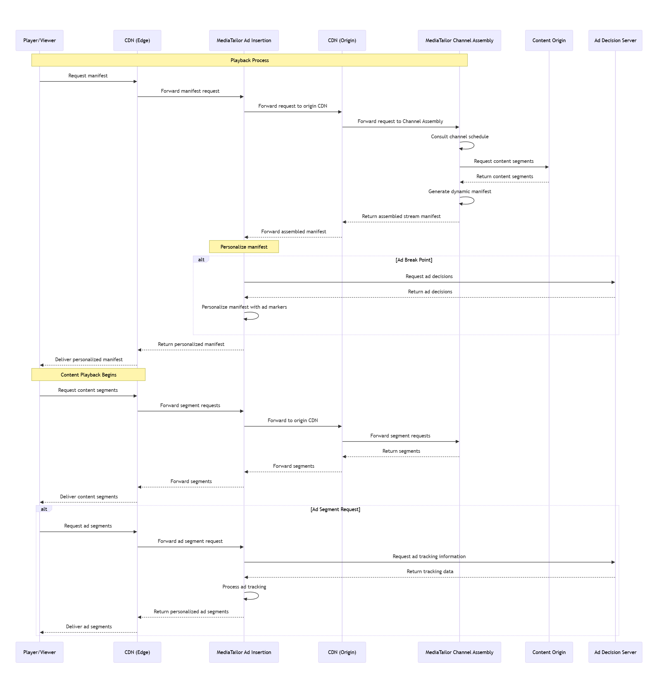

# Integrate MediaTailor SSAI with channel assembly for

monetized linear channels

This topic explains how to combine AWS Elemental MediaTailor server-side ad insertion with channel
assembly and content delivery network (CDN) integration. This integration enables you
to:

- Create monetized linear channels with personalized advertising
- Deliver targeted ads to different viewers watching the same content
- Maintain broadcast-quality viewing experiences

## Benefits of combining SSAI with channel

assembly

Integrating SSAI with channel assembly provides several key benefits:

Monetization of linear channels

Insert personalized ads into your linear channels to generate revenue from
your content library. You can monetize both live and VOD content within a
single linear stream.

Personalized advertising

Deliver different ads to different viewers watching the same channel
content. This targeted approach increases ad relevance and potential revenue
compared to traditional broadcast advertising.

Simplified ad break management

Define ad break points in your channel assembly programs without needing
to condition the content with SCTE-35 markers. This makes it easier to
insert ads at natural break points in your content.

Broadcast-quality experience

MediaTailor maintains a high-quality viewing experience with seamless
transitions between content and ads. Server-side ad insertion eliminates
many common issues such as:

- Buffering during ad transitions
- Ad blockers preventing monetization
- Inconsistent playback quality

Scalable delivery

When combined with a CDN, this integration can scale to millions of
concurrent viewers without degradation in performance or personalization
capabilities.

## Architecture overview

The architecture for combining SSAI with channel assembly typically involves these
components:

- Channel assembly: Creates linear channels from VOD and live content, and inserts slate content that creates ad markers in the generated manifest
- Ad insertion: Recognizes ad break points and inserts URLs pointing to personalized ad segments in the manifest
- Ad decision server (ADS): Determines which ads to insert for each
  viewer
- Content delivery network (CDN): Delivers the assembled content and ad segments to
  viewers
- Origin server: Stores the VOD and live content segments

In this architecture:

1. Channel assembly creates a linear channel from your VOD and live content, and inserts slate content that creates the ad markers in the generated manifest
2. When a viewer requests the channel, ad insertion recognizes the ad breaks that were inserted into the linear channel
3. Ad insertion makes the call to the ADS to receive the list of ads, transcodes them, and inserts URLs pointing to the transcoded ad segments into the personalized manifest
4. The CDN delivers the personalized stream to the viewer

The following diagram illustrates this workflow:

## Setting up the integration

To set up SSAI with channel assembly:

1. Configure your edge CDN to accept manifest requests from viewers and forward
   them to AWS Elemental MediaTailor ad insertion.
2. Set up MediaTailor ad insertion to forward requests to your origin CDN.
3. Configure your origin CDN to forward requests to MediaTailor channel
   assembly.
4. Set up MediaTailor channel assembly to generate dynamic manifests based on the
   current schedule.
5. Configure your origin CDN to forward the assembled manifests to MediaTailor ad
   insertion.
6. Set up MediaTailor ad insertion to request ad decisions from your ad decision server
   at ad break points.
7. Configure MediaTailor ad insertion to personalize manifests by replacing the ad
   markers (from channel assembly) with URLs pointing to targeted ad segments (from
   the ADS).
8. Set up your edge CDN to deliver personalized manifests to viewers.
9. Configure your CDN architecture to handle both content and ad segment requests
   efficiently.

## Defining ad breaks in channel

assembly

When creating programs in channel assembly, you can define ad breaks in several
ways:

Program transitions

Insert ads between programs in your channel schedule. This is the simplest
approach and ensures ads don't interrupt program content.

SCTE-35 markers

If your VOD content contains SCTE-35 markers, channel assembly can
preserve these markers, and ad insertion can use them as ad break
points.

Time-based insertion

Define ad breaks at specific time points within programs. This allows you
to insert ads at natural break points in your content.

For detailed information on creating programs with ad breaks, see [Working with programs](channel-assembly-programs.md "channel-assembly-programs.md").

## CDN caching considerations

For optimal performance when combining channel assembly and SSAI with a CDN:

- Configure cache behaviors that distinguish between channel assembly and SSAI
  requests
- Set appropriate TTL values for manifests and segments as recommended in [Step 1: Configure CDN caching for optimal ad
  delivery](configuring-ssai-cdn.md#configure-cdn-caching "configuring-ssai-cdn.md#configure-cdn-caching")
- Ensure proper routing between channel assembly, ad insertion, and your CDN
  origins
- Monitor the performance metrics for both channel assembly and ad insertion
  components

| Recommended caching settings for combined implementation | Content type | TTL                             | Cache key elements                                                                                                                                                                                                                                                                                                                                                                                                                                                                                                                                                                                                                                                                                                                                                                                                                                                                                                                                                                                                                                                                                                                                                                                                                                                                                                                                                                                                                                                                                                                                                                                                                                                                                                                                                                                                                                                                                                                                                                                                                                                                                                                                                                                                                                                                                                                                                                                                                                                                                                                                                                                                                                                                                                                                                                                                                                                                                                                                                                                                                                                                                                                                                                                                                                                                                                                                                                                                                                                                                                                                                                                                                                                                                                                                                                                                                                                                                                                                                                                                                                                                               |
| -------------------------------------------------------- | ------------ | ------------------------------- | ------------------------------------------------------------------------------------------------------------------------------------------------------------------------------------------------------------------------------------------------------------------------------------------------------------------------------------------------------------------------------------------------------------------------------------------------------------------------------------------------------------------------------------------------------------------------------------------------------------------------------------------------------------------------------------------------------------------------------------------------------------------------------------------------------------------------------------------------------------------------------------------------------------------------------------------------------------------------------------------------------------------------------------------------------------------------------------------------------------------------------------------------------------------------------------------------------------------------------------------------------------------------------------------------------------------------------------------------------------------------------------------------------------------------------------------------------------------------------------------------------------------------------------------------------------------------------------------------------------------------------------------------------------------------------------------------------------------------------------------------------------------------------------------------------------------------------------------------------------------------------------------------------------------------------------------------------------------------------------------------------------------------------------------------------------------------------------------------------------------------------------------------------------------------------------------------------------------------------------------------------------------------------------------------------------------------------------------------------------------------------------------------------------------------------------------------------------------------------------------------------------------------------------------------------------------------------------------------------------------------------------------------------------------------------------------------------------------------------------------------------------------------------------------------------------------------------------------------------------------------------------------------------------------------------------------------------------------------------------------------------------------------------------------------------------------------------------------------------------------------------------------------------------------------------------------------------------------------------------------------------------------------------------------------------------------------------------------------------------------------------------------------------------------------------------------------------------------------------------------------------------------------------------------------------------------------------------------------------------------------------------------------------------------------------------------------------------------------------------------------------------------------------------------------------------------------------------------------------------------------------------------------------------------------------------------------------------------------------------------------------------------------------------------------------------------------------------------------ |
| Channel assembly manifests                               | 0 seconds    | URL path + query parameters     |
| SSAI personalized manifests                              | 0 seconds    | URL path + all query parameters |
| Content segments                                         | 24+ hours    | URL path only                   |
| Ad segments                                              | 24+ hours    | URL path only                   | ## Monitoring the integrated solution To ensure your integrated solution is performing optimally, monitor these key metrics: Channel assembly metrics Monitor manifest generation time, program transitions, and any errors in the channel assembly process. Ad insertion metrics Track ad fill rate, ad decision server response times, and ad insertion errors. CDN metrics Monitor cache hit rates, origin request volume, and response latency for both content and ad segments. Viewer experience metrics Track rebuffering events, startup times, and viewer engagement, especially during ad transitions. For detailed information on monitoring, see [Monitor operations for CDN and MediaTailor integrations](ssai-cdn-monitor.md "ssai-cdn-monitor.md") and [Monitor MediaTailor channel assembly CDN operations](ca-cdn-monitor.md "ca-cdn-monitor.md"). ## Troubleshooting common issues When troubleshooting issues with the integrated solution, consider these common problems: Ad break synchronization issues If ads are not appearing at the expected break points, verify that the ad break definitions in your channel assembly programs are correctly configured and that ad insertion is properly identifying these break points. Manifest delivery errors If viewers are experiencing playback issues, check that the CDN is correctly forwarding manifest requests between channel assembly and ad insertion, and that the cache settings are appropriate for the dynamic nature of these manifests. Segment routing problems If content or ad segments are not loading, verify that the CDN is correctly routing segment requests to the appropriate origins and that the segment URLs in the manifests are correctly formatted. Performance degradation If viewers are experiencing buffering or high latency, check the CDN cache hit rates and origin request volumes to identify potential bottlenecks in the delivery pipeline. For more troubleshooting guidance, see [Troubleshoot MediaTailor SSAI with CDNs for uninterrupted ad delivery](troubleshooting-ssai-cdn.md "troubleshooting-ssai-cdn.md"). ## Best practices Follow these best practices for a successful integration of SSAI with channel assembly:  • **Test thoroughly**: Test the integrated solution with various content types, ad scenarios, and viewer conditions before deploying to production.  • **Monitor continuously**: Set up comprehensive monitoring and alerting to quickly identify and address any issues that arise.  • **Optimize caching**: Regularly review and adjust your CDN caching settings based on actual usage patterns and performance metrics.  • **Plan for scale**: Design your architecture to handle peak traffic loads, especially for popular channels or events.  • **Consider redundancy**: Implement redundancy in critical components to ensure high availability of your linear channels.  • **Optimize ad transitions**: Ensure smooth transitions between content and ads by using consistent encoding profiles and segment durations. ## Related information For more information about integrating SSAI with channel assembly, see: Channel assembly documentation [Using AWS Elemental MediaTailor to create linear assembled streams](channel-assembly.md "channel-assembly.md") - Learn about channel assembly concepts [Channel assembly with CDN](ca-cdn-wflw.md "ca-cdn-wflw.md") - Set up channel assembly with a CDN SSAI documentation [Ad insertion with CDN](ssai-cdn-workflow.md "ssai-cdn-workflow.md") - Set up ad insertion with a CDN [Understand ad insertion architecture for CDN and MediaTailor integrations](ssai-cdn-architecture-overview.md "ssai-cdn-architecture-overview.md") - Understand ad insertion CDN architecture CDN configuration [Set up CDN integration](cdn-configuration.md "cdn-configuration.md") - General CDN configuration guidance [CloudFront integration](cloudfront-specific-recommendations.md "cloudfront-specific-recommendations.md") - CloudFront specific configuration |
