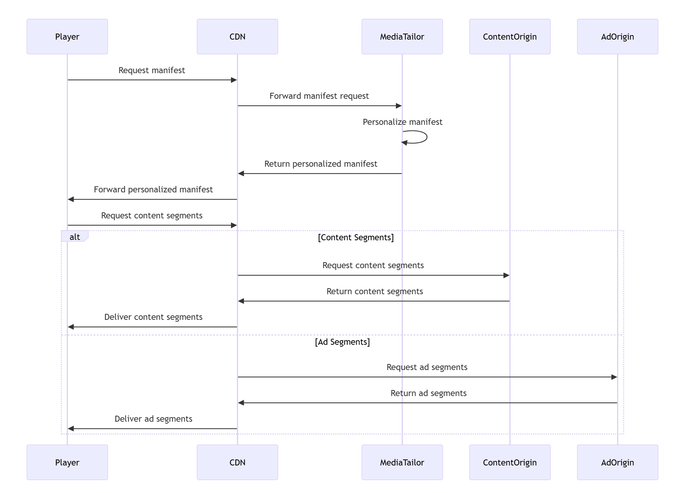
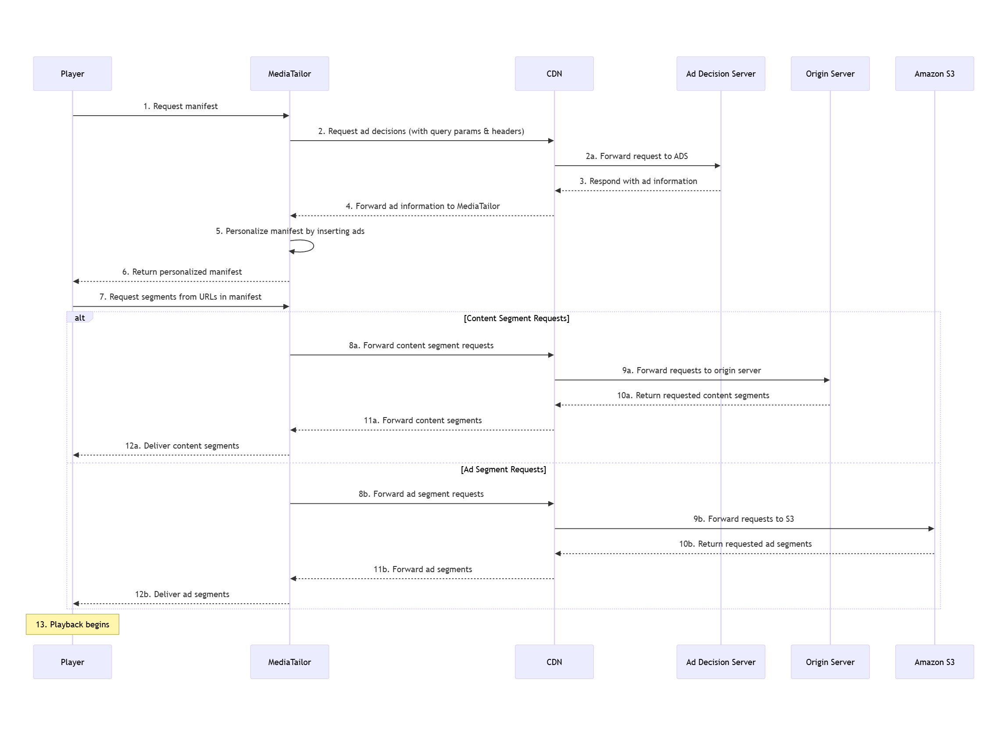

# Understand ad insertion architecture for CDN and MediaTailor integrations

This section explains the concepts and architecture of server-side ad insertion (SSAI)
with content delivery networks (CDNs) for AWS Elemental MediaTailor. You'll learn how dynamic ad
insertion and manifest manipulation work together to enable effective video
monetization.

Server-side ad insertion (SSAI) with MediaTailor allows you to:

- Insert personalized advertising into your video streams at defined ad break
  points
- Target ads precisely based on viewer data
- Eliminate the need for client-side ad insertion technology
  When combined with a CDN, you can deliver these personalized streams to viewers with
  improved performance and scalability, enhancing your video monetization strategy.

The recommended architecture for ad insertion with a CDN positions the CDN between
viewers and ad insertion, with ad insertion accessing content directly from your origin.
This architecture provides the following benefits for both content delivery and video
monetization:

- Effective caching of content and ad segments
- Reduced request load on MediaTailor
- Improved delivery speed to viewers
- Simplified URL management
- Consistent delivery of personalized advertising across devices
  In this recommended architecture:

1.  Viewers request manifests from the CDN
2.  CDN forwards requests to ad insertion
3.  Ad insertion requests content manifests from the origin
4.  Ad insertion requests ads from the ad decision server (ADS)
5.  Ad insertion personalizes manifests by replacing the ad markers (from the
    origin manifest) with URLs that point to targeted ad segments for the specific
    viewer (from the ADS)
6.  Ad insertion returns the personalized manifests containing ad segment URLs to
    the CDN, which forwards them to viewers
7.  Viewers request segments through the CDN
8.  CDN routes segment requests based on the segment type:

        * Content segment requests go to the content origin
        * Ad segment requests go to MediaTailor

    This architecture ensures optimal performance while maintaining the security and
    flexibility benefits of using a CDN.

###### Note

This flow varies slightly between VOD and live content. For VOD, manifests can be
cached longer, while live content requires more frequent manifest updates to
maintain stream continuity.

The key difference between VOD and live content caching:

VOD content

Set longer TTL values (minutes to hours) for manifests because they don't
change frequently

Live content

Set shorter TTL values (seconds) for manifests to ensure viewers receive
the most current stream segments

We don't recommend that you position a CDN between your content origin and AWS Elemental MediaTailor.
Doing so can introduce several technical challenges:

Cache-key collisions

Configure your CDN to properly handle query parameters. This prevents
MediaTailor from receiving incorrect manifests when requesting the same manifest
with different query parameters.

Gzip compression issues

If you experience manifest parsing errors, ensure your CDN delivers properly formatted manifests to MediaTailor. Some CDNs may deliver corrupt gzip payloads that can cause parsing failures. If this occurs, you may need to disable compression between your CDN and MediaTailor while maintaining compression for cost savings elsewhere in your workflow.

Manifest freshness

For live streams, configure your CDN to deliver current manifests to
MediaTailor. This prevents synchronization issues between content and ads.

Performance optimization

Minimize network hops and potential cache misses to reduce playback
start-up times.

Cache management

Implement simplified cache invalidation strategies, especially for live
content where manifests update frequently.

In this sub-optimal architecture:

1. Viewers request multivariant playlists, media playlists, or MPDs directly from
   AWS Elemental MediaTailor.
2. MediaTailor requests content manifests (multivariant playlists, media playlists, or
   MPDs) through the CDN.
3. The CDN forwards requests to the origin server.
4. The origin server returns multivariant playlists, media playlists, or MPDs to
   the CDN.
5. The CDN forwards multivariant playlists, media playlists, or MPDs to
   MediaTailor.
6. MediaTailor requests ads from the ad decision server (ADS).
7. MediaTailor personalizes manifests by inserting ads into multivariant playlists,
   media playlists, or MPDs and delivers them directly to viewers.
8. This architecture introduces additional latency, potential caching issues, and
   complicates troubleshooting.

## Request and response flow

When implementing dynamic ad insertion with a CDN, configure your system to
support this request and response flow:

1. Configure your player to request multivariant playlists (HLS) or MPDs
   (DASH) from your CDN with MediaTailor as the manifest origin.
2. Set up your CDN to forward all multivariant playlist, media playlist, and
   MPD requests to MediaTailor, including all query parameters and headers.
3. Ensure MediaTailor can communicate with your ad decision server (ADS), passing
   along query parameters and headers.
4. Configure your ADS to use query parameters to determine which ads to
   insert.
5. Set up the CDN prefix on the MediaTailor playback configuration so MediaTailor can
   substitute CDN domain names for content and ad segment URL prefixes.
6. Configure your CDN to forward personalized multivariant playlists, media
   playlists, and MPDs from MediaTailor to the requesting player.
7. Set up your CDN to translate segment URLs, forwarding content segment
   requests to the origin server and ad requests to the Amazon S3 bucket where MediaTailor
   stores transcoded ads.

### CDN terminology for ad insertion

Understanding these key terms will help you implement and troubleshoot your ad
insertion CDN integration:

Origin CDN and edge CDN

**Origin CDN**: A CDN positioned
between MediaTailor and your content origin. It caches content segments to
reduce load on your origin servers. In a multi-CDN architecture,
this is the first CDN layer that interfaces directly with the
origin.

**Edge CDN**: A CDN positioned
between viewers and MediaTailor. It delivers personalized manifests and
content to viewers. In a multi-CDN architecture, this is the
outermost CDN layer that interfaces directly with viewers.

CDN configuration terms

**Cache behavior**: Rules that
determine how a CDN handles different types of requests. These rules
include:

- Caching duration settings
- Origin routing configurations
- Request handling parameters

**TTL (Time To Live)**: The duration
for which content remains valid in a CDN cache before it needs to be
refreshed from the origin.

**Cache key**: The unique identifier
used by a CDN to store and retrieve cached content. It typically
includes:

- URL path
- Query parameters
- Selected headers

**Origin shield**: An intermediate
caching layer between CDN edge locations and your origin server. It
reduces the number of requests to your origin.

**Request collapsing**: A CDN feature
that combines multiple simultaneous requests for the same content
into a single origin request.

MediaTailor-specific CDN terms

**CDN content segment prefix**: The
CDN domain name that AWS Elemental MediaTailor uses when generating URLs for content
segments in manifests.

**CDN ad segment prefix**: The CDN
domain name that MediaTailor uses when generating URLs for ad segments in
manifests.

For more information about CDN configuration with MediaTailor, see [Set up CDN integration](cdn-configuration.md "cdn-configuration.md").

###### Note

These terms are consistent with those used in channel assembly
documentation. For channel assembly terminology, see [CDN terminology for channel assembly](channel-assembly-cdn-architecture.md#cdn-terminology "channel-assembly-cdn-architecture.md#cdn-terminology").
