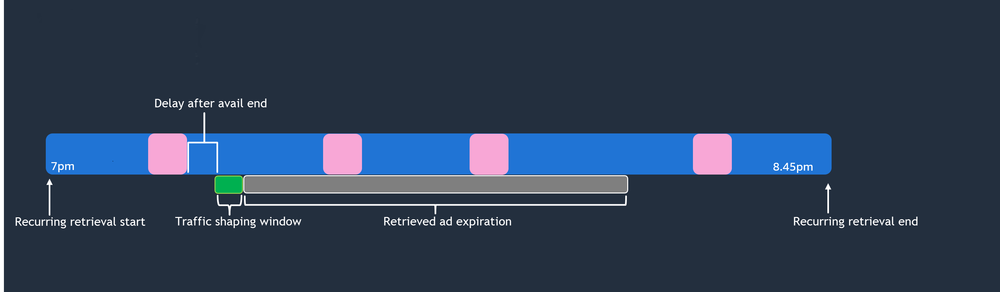

# How prefetching works

When your client makes a manifest request to MediaTailor, the service evaluates all of the
prefetch schedules that are associated with the playback configuration. If MediaTailor doesn't find a
matching prefetch schedule, the service reverts to normal ad insertion and doesn't prefetch
ads.

If MediaTailor finds a matching prefetch schedule, the service evaluates the schedule based on two
components: retrieval and consumption. The configuration of each component varies between single
prefetch schedules and recurring prefetch schedules, as described in the following
sections.

## Single prefetch schedule flow

**Retrieval**

This defines the _retrieval window_, which is the time
range when MediaTailor prefetches ads from the ADS. Be sure to schedule this window for a time
that's before the ad break. The following provides an overview of how MediaTailor processes a
single prefetch schedule.

For steps to create a single prefetch schedule in the console, see [Creating prefetch schedules](creating-prefetch-schedules.md "creating-prefetch-schedules.md"). For API
instruction, see [PrefetchSchedules](../apireference/API_PrefetchSchedule.md "../apireference/API_PrefetchSchedule.md") in
the _AWS Elemental MediaTailor API Reference_.

During the specified _retrieval window_, MediaTailor sends
requests to the ADS to retrieve and prepare ads for later insertion in playback
sessions.

- MediaTailor optionally uses traffic shaping to limit the number of requests to the ADS at
  one time. You can choose between two approaches:

_Time-window traffic shaping_ - MediaTailor spreads requests across the
specified number of seconds instead of sending requests for all sessions at one time. This
dispersed traffic distribution helps to prevent the ADS from becoming overwhelmed,
resulting in time outs and low ad fill rates.

_TPS-based traffic shaping_ - MediaTailor limits requests based on
transactions per second (TPS) and concurrent users. This approach provides more intuitive
configuration based on your ADS capacity limits. For more information, see [TPS-based traffic shaping](tps-traffic-shaping.md "tps-traffic-shaping.md").

- If you set up _dynamic variables_, MediaTailor includes
  these variables in the requests to the ADS. MediaTailor uses these variables to match ad avails
  to prefetch schedules during the consumption window. See the following _Consumption_ section for more information.

###### Example

A live event lasts from 7:45AM to 10AM, with an ad break at 8:15AM. You configure MediaTailor
to retrieve ads from 7:45AM to 8AM, with a traffic shaping window of 60 seconds. With
500,000 concurrent users, MediaTailor distributes the ADS requests to achieve an average rate of
approximately 8,333 transactions per second for 60 seconds (500,000 users/60 seconds=8,333
requests per second), instead of sending all requests simultaneously.

The retrieval configuration includes the dynamic variable key `scte.event`
and value `1234`. MediaTailor includes this variable in the requests to the ADS, which
then can be used to target specific advertisers to the event ID 1234.

**Consumption**

When MediaTailor encounters SCTE-35 ad break markers during the consumption window, it places
the prefetched ads in an ad break.

- If you didn’t set avail matching criteria, MediaTailor inserts ads in the first break in the
  consumption window.
- If you did set a _dynamic variable key_ for _avail_
  _matching_
  _criteria_, MediaTailor evaluates these criteria against the
  dynamic variables that you set in the retrieval window. An ad break is eligible for
  prefetched ad insertion only if the avail matching criteria are met. MediaTailor inserts ads in
  the first break that meets the criteria.

For a list of supported avail-matching criteria, see the _Available for ad
prefetch_ column in the table on [MediaTailor session variables for ADS requests](variables-session.md "variables-session.md").

###### Example continued

You set the start time for consumption as 8:15AM, and the end time as 8:17AM. You
include `scte.event_id` for the key in the avail matching criteria.

For each ad break that MediaTailor encounters from 8:15AM to 8:17AM, it evaluates the
SCTE event ID for each ad break. In each playback session, MediaTailor inserts the
prefetched ads in the first ad break that has an event ID of 1234 (as defined in the
retrieval dynamic variables). For ad breaks that don’t contain the correct event ID, MediaTailor
performs standard ad insertion.

## Recurring prefetch schedule flow

**Retrieval**

This defines the _recurring retrieval window_, which is
the time range when MediaTailor prefetches and inserts ads for a live event (up to 24 hours). The
following provides an overview of how MediaTailor processes recurring prefetch schedules.

For steps to create a recurring prefetch schedule in the console, see [Creating prefetch schedules](creating-prefetch-schedules.md "creating-prefetch-schedules.md"). For API
instruction, see [PrefetchSchedules](../apireference/API_PrefetchSchedule.md "../apireference/API_PrefetchSchedule.md") in
the _AWS Elemental MediaTailor API Reference_.

During the specified recurring prefetch window, MediaTailor retrieves and inserts ads for a
live event that’s up to 24 hours. After each ad break in the window, MediaTailor automatically
retrieves ads for the next ad break.

- If you set the _delay after avail end_, MediaTailor waits
  the specified time before retrieving the next set of ads for the next ad break.
- MediaTailor optionally uses traffic shaping to limit the number of requests to the ADS at
  one time. You can choose between two approaches:

_Time-window traffic shaping_ - MediaTailor spreads requests across the
specified number of seconds instead of sending requests for all sessions at one time. This
dispersed traffic distribution helps to prevent the ADS from becoming overwhelmed,
resulting in time outs and low ad fill rates.

_TPS-based traffic shaping_ - MediaTailor limits requests based on
transactions per second (TPS) and concurrent users. This approach provides more intuitive
configuration based on your ADS capacity limits. For more information, see [TPS-based traffic shaping](tps-traffic-shaping.md "tps-traffic-shaping.md").

- If you set up _dynamic variables_, MediaTailor includes
  these variables in the requests to the ADS. MediaTailor uses these variables to match ad avails
  to prefetch schedules during the consumption window. See the following _Consumption_ section for more information.

###### Example

A live event lasts from 7PM to 8:45PM, with four ad breaks over that time. The ad
breaks aren’t on a predictable schedule. You configure the recurring prefetch from 7PM to
8:45PM, with a 10 minute delay and traffic shaping window of 60 seconds. After each avail,
MediaTailor retrieves ads for the next ad break. Ten minutes after the avail ends, MediaTailor starts to
send retrieval requests to the ADS. With a 60-second traffic-shaping window and 500,000
concurrent users, MediaTailor distributes the ADS requests to achieve an average rate of
approximately 8,333 transactions per second for 60 seconds (500,000 users/60 seconds=8,333
requests per second), instead of sending all requests simultaneously.

The retrieval configuration includes the dynamic variable key `scte.event`
and value `1234`. MediaTailor includes this variable in the requests to the ADS, which
then can be used to target specific advertisers to the event ID 1234.

**Consumption**

When MediaTailor encounters SCTE-35 ad break markers, it places the prefetched ads in an ad
break.

- If you set the _retrieved ad expiration_, prefetched
  ads are available for insertion until the specified expiration.
- If you didn’t set avail matching criteria, MediaTailor inserts ads in the first break in the
  consumption window.
- If you did set a _dynamic variable key_ for _avail_
  _matching_
  _criteria_, MediaTailor evaluates these criteria against the
  dynamic variables that you set in the retrieval window. An ad break is eligible for
  prefetched ad insertion only if the avail matching criteria are met. MediaTailor inserts ads in
  the first break that meets the criteria.

For a list of supported avail-matching criteria, see the _Available for ad
prefetch_ column in the table on [MediaTailor session variables for ADS requests](variables-session.md "variables-session.md").

###### Example continued

In the consumption, you include `scte.event_id` for the key in the avail
matching criteria.

For each ad break that MediaTailor encounters, it evaluates the SCTE event ID
for each ad break. In each playback session, MediaTailor inserts the prefetched ads in each ad
break that has an event ID of 1234 (as defined in the retrieval dynamic variables). For ad
breaks that don’t contain the correct event ID, MediaTailor performs standard ad insertion.

You set the ad expiration to 2700 seconds so retrieved ads are available for insertion
for 45 minutes.

The following graphic illustrates the example, with the small squares representing ad
breaks. The recurring prefetch schedule settings are illustrated along the event
timeline.

## Understanding prefetching costs

There are no costs for making ad retrieval requests. However, for prefetch ad retrieval,
you'll be charged at the standard transcoding rate for the prefetched ads that MediaTailor transcodes.
For prefetch ad consumption, you'll be charged at the standard rate for ad insertion for the
prefetched ads that MediaTailor places in ad breaks. For information about transcoding and ad
insertion costs, see [AWS Elemental MediaTailor
Pricing](https://aws.amazon.com/mediatailor/pricing/ "https://aws.amazon.com/mediatailor/pricing/").
