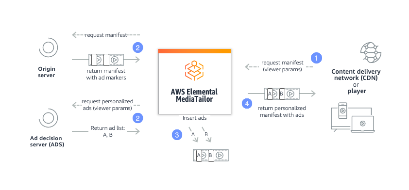

# How MediaTailor ad insertion works

AWS Elemental MediaTailor interacts between your content delivery network (CDN), origin
server, and ad decision server (ADS) to stitch personalized ads into ad breaks within
live and video on demand content.

Here's an overview of how MediaTailor ad insertion works:

1. A player or CDN such as Amazon CloudFront sends a request to MediaTailor for HLS or
   DASH content. The request contains parameters from the player with information
   about the viewer, which is used for ad personalization.
2. MediaTailor sends a request to the ADS that contains the viewer information.
   The ADS chooses ads based on the viewer information and current ad campaigns. It
   returns the URLs to the ad creatives in a VAST or VMAP response to MediaTailor.

If you pre-conditioned the ads, the URLs point to the pre-transcoded ads. For
information about ad stitching with pre-transcoded ads, see [Preconditioned ads](precondition-ads.md "precondition-ads.md"). 3. MediaTailor manipulates the manifest to include the ad URLs returned from
the ADS, transcoded to match the encoding characteristics of the origin content.
If you're using preconditioned ads, it's your responsibility to ensure that the
ad matches the template manifest.

If an ad hasn't yet been transcoded to match the content, MediaTailor will skip
inserting it and use MediaConvert to prepare the ad so that it's ready for the next
request. 4. MediaTailor returns the fully personalized manifest to the requesting CDN or
player.
The ADS tracks the ads viewed based on viewing milestones such as start of ad, middle
of ad, and end of ad. As playback progresses, the player or MediaTailor sends ad
tracking beacons to the ADS ad tracking URL, to record how much of an ad has been
viewed. In the session initialization with MediaTailor, the player indicates whether
it or MediaTailor is to send these beacons for the session.

For information about how to get started with ad insertion, see [Getting started with MediaTailor](getting-started.md "getting-started.md").
