# Using MemoryDB Multi-Region with the console

Here are ways to use MemoryDB Multi-Region with the console.

###### Topics

- [Create a new cluster in MemoryDB Multi-Region](#multi-Region.console.create "#multi-Region.console.create")
- [Restore a snapshot to a new or existing cluster within a Multi-Region cluster](#multi-Region.console.restore "#multi-Region.console.restore")
- [Modify clusters in MemoryDB Multi-Region](#multi-Region.console.modify "#multi-Region.console.modify")
- [Delete clusters in MemoryDB Multi-Region](#multi-Region.console.delete "#multi-Region.console.delete")

## Create a new cluster in MemoryDB Multi-Region

1. Navigate to the create cluster section from the cluster list or dashboard.

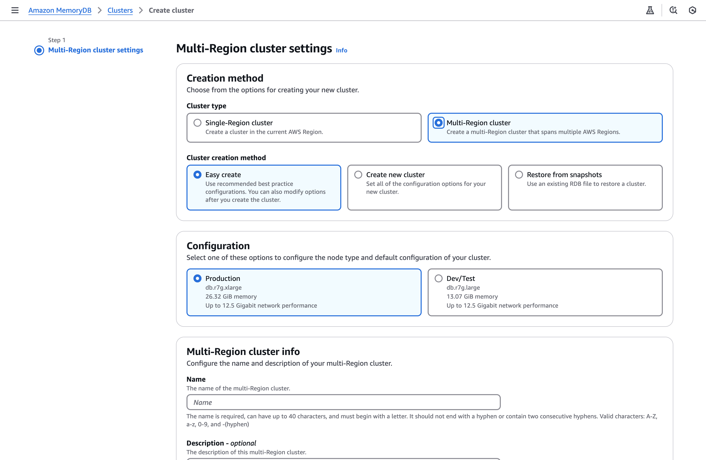 2. In the **Cluster type** field, select **Multi-Region cluster**. 3. In the **Cluster creation method** field, select **Easy create**. 4. Fill in the **Name** and **Description**, verify the default values and select **Create**.

###### Create and configure a cluster

1. Navigate to the create cluster section from the cluster list or dashboard.

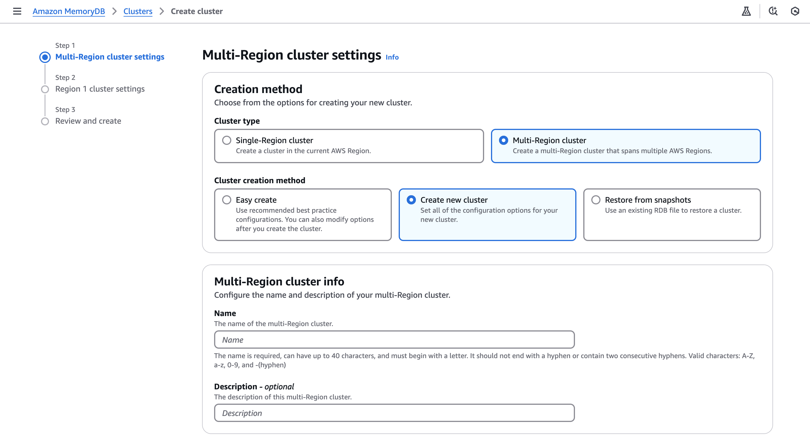 2. In the **Cluster type** field, select **Multi-Region cluster**. 3. In the **Cluster creation method** field, select **Create new cluster**. 4. Fill in the **Name** and **Description**, verify the values and select **Create**.

## Restore a snapshot to a new or existing cluster within a Multi-Region cluster

1. Navigate to the create cluster section from the cluster list or dashboard.

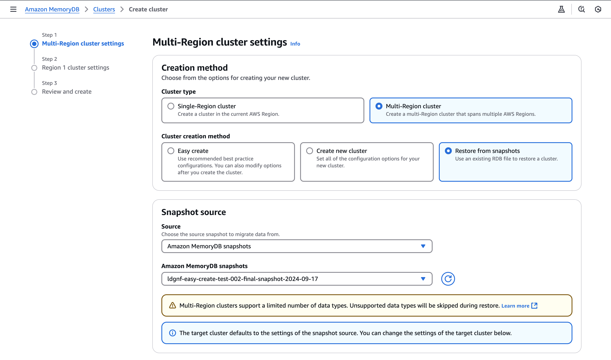 2. In the **Cluster type** field, select **Multi-Region cluster**. 3. In the **Cluster creation method** field, select **Restore from snapshot**. 4. Select the source snapshot, then fill in the required fields. Review your selection, and then select **Restore**.

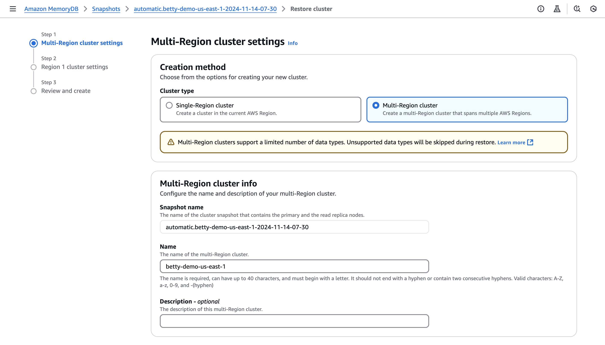 5. To see your Multi-Region clusters, navigate to the cluster section:

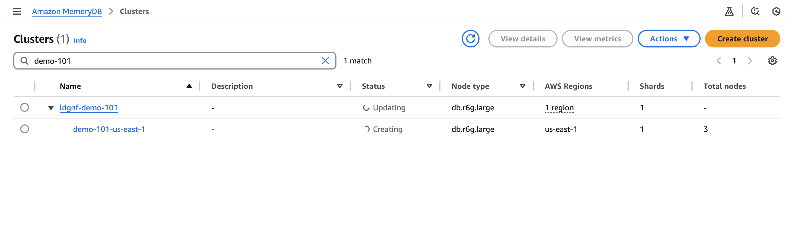 6. Now select the target multi regional cluster name.

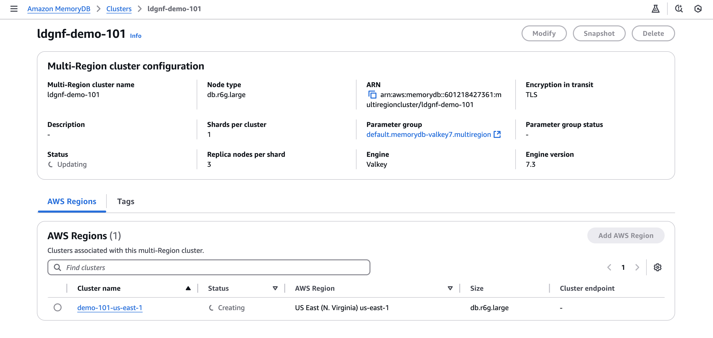 7. Now select the target regional cluster name.

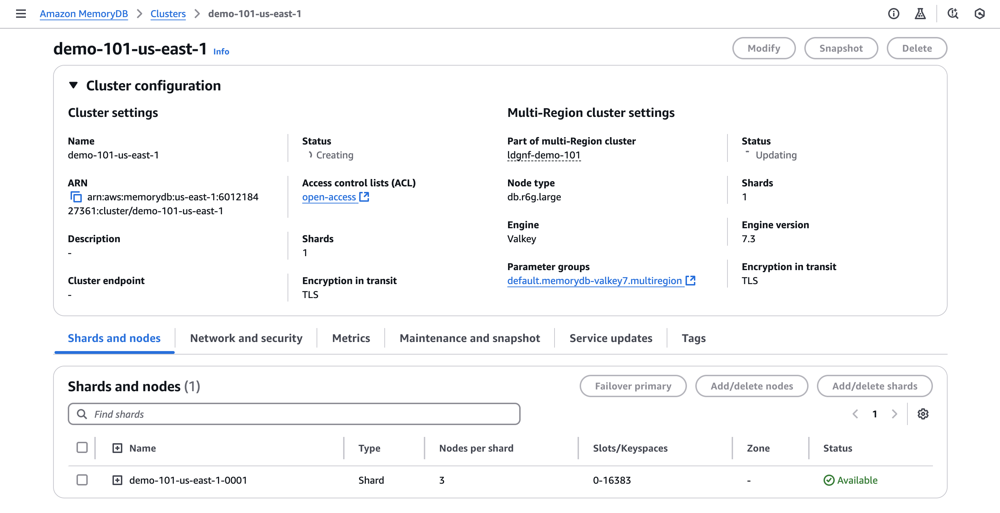

## Modify clusters in MemoryDB Multi-Region

1. Navigate to the cluster section. You should see all your current clusters.

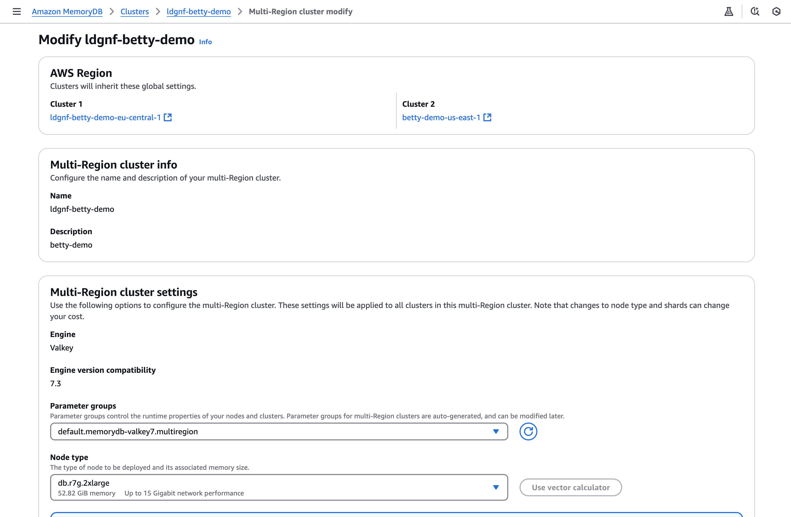

Then depending on the type of cluster you want to modify, select from the following steps. 2. To modify a single cluster with a Muti-Region cluster, first select the Multi-Region it beloongs to. Then select the edit button on the actions (Top right). Then select the target single cluster. You can also modify this cluster from the **Details** page.

###### Modify a regional cluster

1. To modify a multi regional cluster, select the target Multi-Region cluster name.

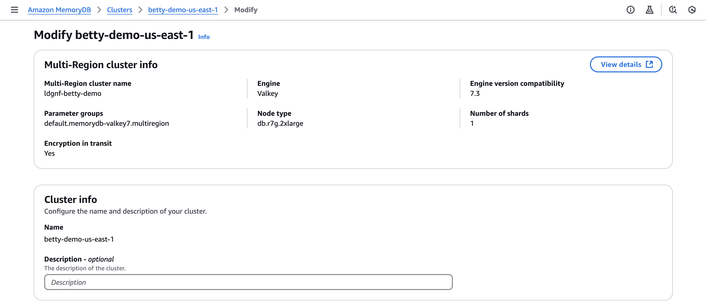

Then select the cluster, and select the **Edit** button on the actions (Top right) or from the details page. 2. To add a regional cluster, select the target Multi Region cluster selected, then go to the **Actions** dropdown and select **Add AWS Region**. You can also go to the details page for AWS Regions, select the target Multi Region cluster, and add from there.

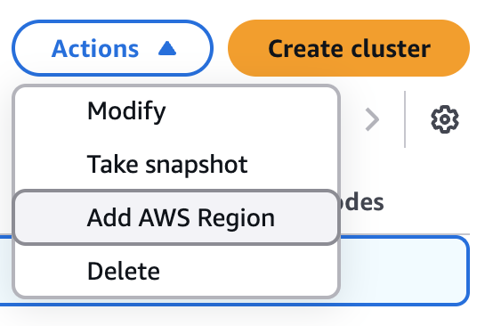 3. To add a Region, select the target Region. Then fill in the required information and select **Add AWS Region**.

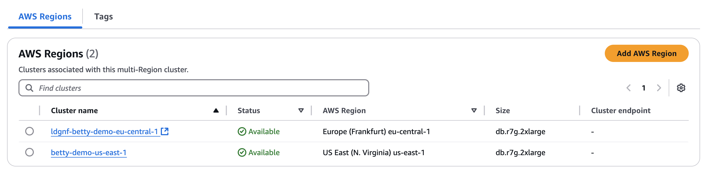 4. To add a new regional cluster to an empty Multi Region cluster, you will see the same options as in create Multi Region cluster. The only difference is that the multi regional cluster information is already present.

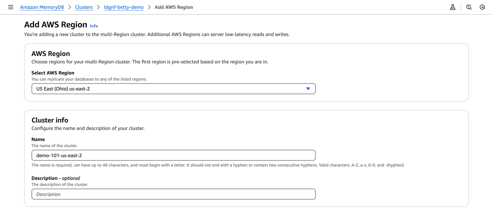

## Delete clusters in MemoryDB Multi-Region

1. To delete a single cluster in a Region, select the target regional cluster. Then go to the action menu dropdown, select the individual cluster, and select **Delete**.

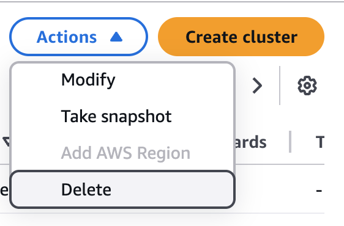

You will be presented with a confirmation window, including the option to create a snapshot before deleting. If you still want to delete, enter "delete" into the text field and then select **Delete**.

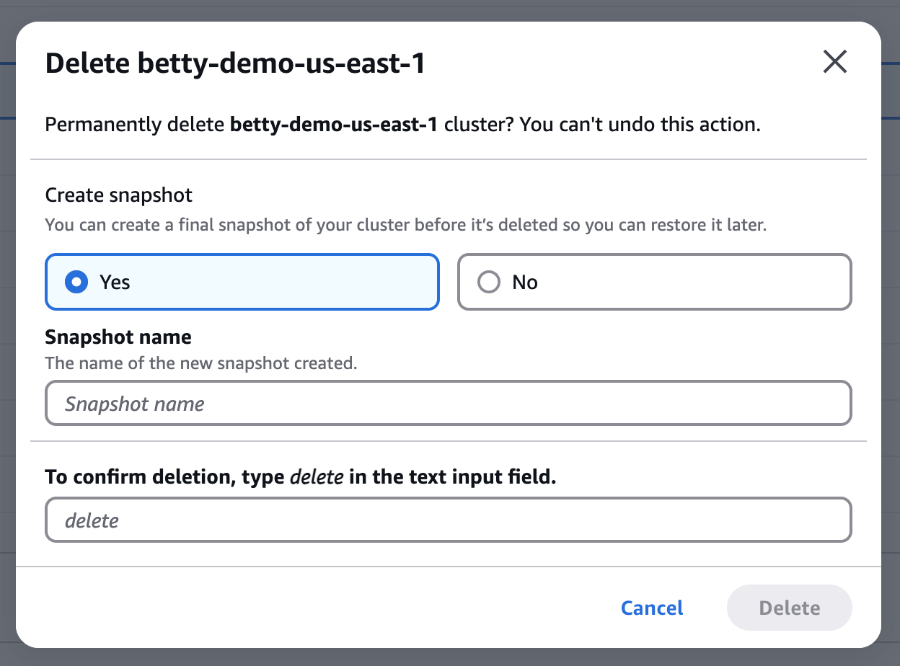 2. To delete all associated regional clusters with a Multi Region cluster, select the target multi regional cluster with one or more clusters in it. Then with the target multi regional cluster selected, go to the action menu dropdown and select **Delete**.

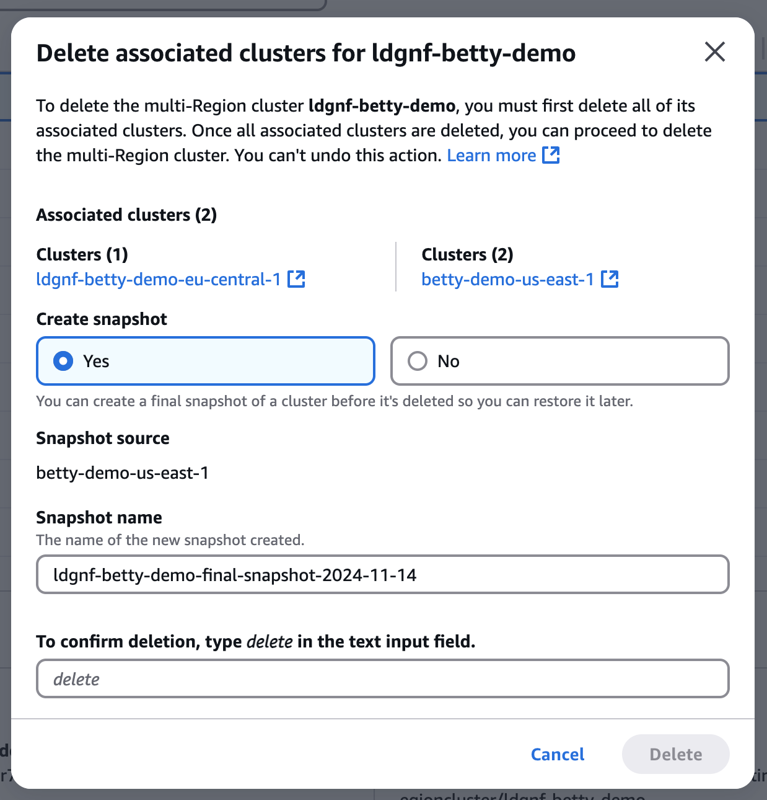 3. To delete an entire multi regional cluster, select the target empty multi regional cluster. Then go to the action menu dropdown and select **Delete**.

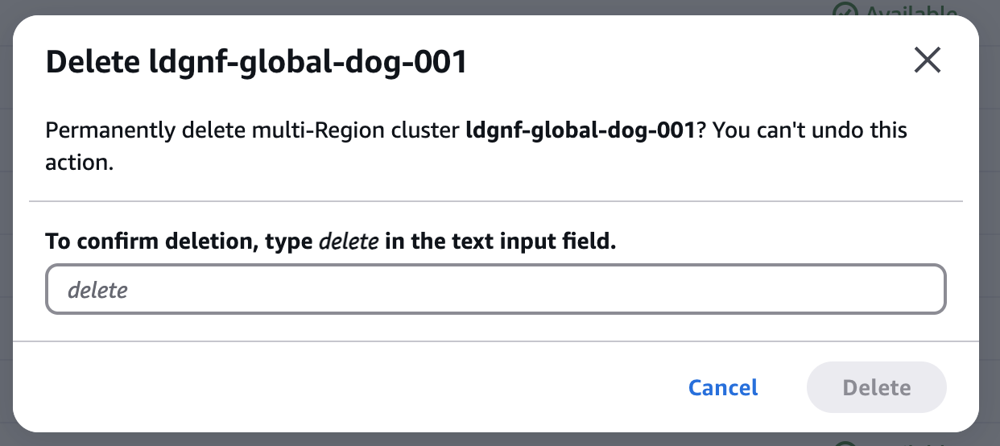
