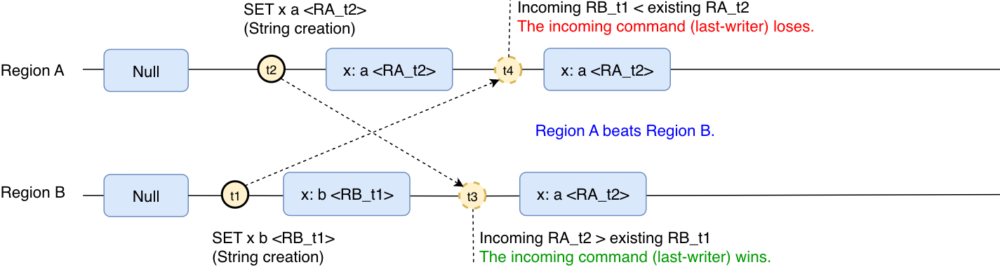
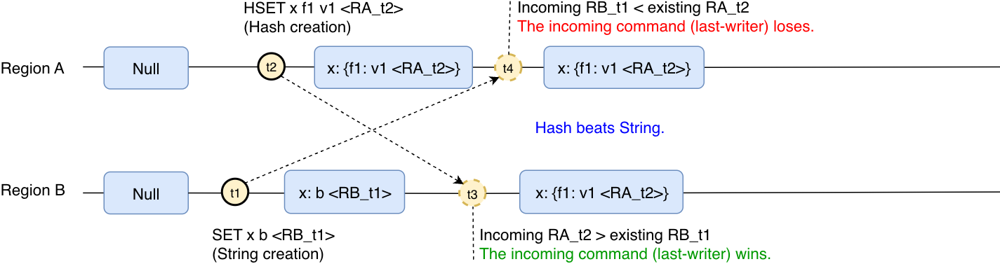
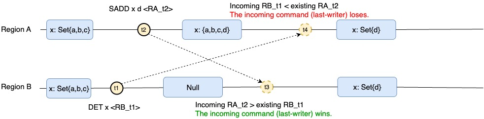
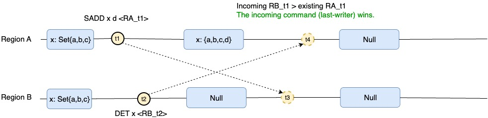
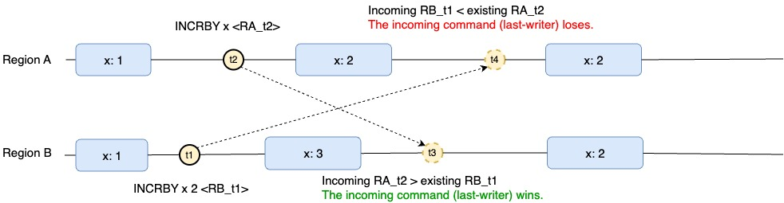
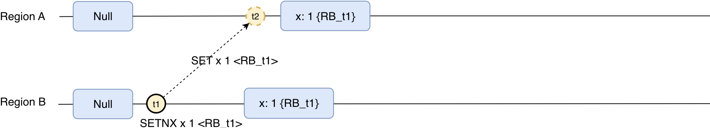

# MemoryDB Multi-Region

MemoryDB Multi-Region is a fully managed, active-active, multi-Region database that enables you to build multi-Region applications with up to 99.999% availability and microsecond read and single-digit millisecond write latencies. You can improve both availability and resiliency from regional degradation, while also benefiting from low latency local reads and writes for multi-Region applications.

With MemoryDB Multi-Region, you can build highly available multi-Region applications for increased resiliency. It offers active-active replication so you can serve reads and writes locally from the Regions closest to your customers with microsecond read and single-digit millisecond write latency. MemoryDB Multi-Region asynchronously replicates data between Regions, and data is typically propagated within a second. It automatically resolves update conflicts and corrects data divergence issues, enabling you to focus on your application.

MemoryDB Multi-Region is currently supported in the following AWS Regions: US East (N. Virginia and Ohio), US West (Oregon, N. California), Europe (Ireland, Frankfurt, and London), and Asia Pacific (Tokyo, Sydney, Mumbai, Seoul and Singapore).

You can easily get started with MemoryDB Multi-Region with just a few clicks from the AWS Management Console or using the latest AWS SDK, or AWS CLI.

###### Topics

- [Prerequisites and limitations](multi-region.md "multi-region.md")
- [How it works](multi-region.md "multi-region.md")
- [Consistency and conflict resolution](#multi-region.conflict "#multi-region.conflict")
- [Using MemoryDB Multi-Region with the console](multi-Region.md "multi-Region.md")
- [Using MemoryDB Multi-Region with the CLI](multi-Region.md "multi-Region.md")
- [Monitoring MemoryDB Multi-Region](multi-Region.md "multi-Region.md")
- [Scaling with MemoryDB Multi-Region](multi-Region.md "multi-Region.md")
- [Supported and unsupported commands](multi-Region.md "multi-Region.md")

## Consistency and conflict resolution

Any updates made to a key in one of the regional clusters is propagated to other regional clusters asynchronously in the Multi-Region cluster, normally in under a second. If a Region becomes isolated or degraded, MemoryDB Multi-Region keeps track of any writes that have been performed but have not yet been propagated to all of the member clusters. When the Region comes back online, MemoryDB Multi-Region resumes propagating any pending writes from that Region to the member clusters in other Regions. It also resumes propagating writes from other member clusters to the Region that is now back online. All previously successful writes will be propagated eventually no matter how long the Region is isolated.

Conflicts can arise if your application updates the same key in different Regions at about the same time. MemoryDB Multi-Region uses the Conflict-free Replicated Data Type (CRDT) to reconcile between conflicting concurrent writes. CRDT is a data structure that can be updated independently and concurrently without coordination. This means that the write-write conflict is merged independently on each replica with eventual consistency.

In specifics, MemoryDB uses 2 levels of Last Writer Wins (LWW) to resolve conflicts. For the String data type, LWW resolves conflicts at a key level. For other data types, LWW resolves conflicts at a sub-key level. Conflict resolution is fully managed and happens in the background without any impact to application’s availability. Below is an example for Hash data type:

Region A executes “HSET K F1 V1” at timestamp T1; Region B executes “HSET K F2 V2” at timestamp T2; After replication, both Regions A and B will have key K with both fields. When different Regions are concurrently updating different sub-keys in the same collection, because MemoryDB resolves conflict at sub-key level for Hash data type, the two updates do not conflict with each other. Therefore, the final data would contain the effect of both updates.

| Time | Region A          | Region B          |
| ---- | ----------------- | ----------------- |
| T1   | HSET K F1 V1      |                   |
| T2   |                   | HSET K F2 V2      |
| T3   | sync              | sync              |
| T4   | K: {F1:V1, F2:V2} | K: {F1:V1, F2:V2} |

### CRDT and examples

MemoryDB Multi-Region implements Conflict-free Replicated Data Types (CRDT) to resolve concurrent write conflict issued from multiple regions. CRDT allows different regions to independently achieve eventual consistency once they have eventually received the same set of operations regardless of ordering.

When a single key has is concurrently updated in multiple regions a write-write conflict needs to be resolved to achieve data consistency. MemoryDB Multi-Region uses Last Writer Wins (LWW) strategy to determine the winning operation and only the effects of the operation that “happens after“ are going to be eventually observed. We say an operation op1 “happened before” an operation op2 if the effects of op1 had been applied in the Regionit was original executed when op2 is executed.

For collections (Hash, Set and SortedSet) MemoryDB Multi-Region resolve conflict at element level. This allows MemoryDB Multi-Region to use LWW to resolve write/write conflict on each element. E.g. concurrently adding different elements to the same collection from multiple regions will result in the collection containing all the elements.

**Concurrent execution: Last writer wins**

In MemoryDB Multi-Region, when there is a concurrent creation of a key, the last operation that was executed on any Region will determine the result of the key. For example:

The key x was created on Region B with value "b" but after that the same key was created in Region A with the value "a". Eventually the key will converge to have the value "a", since the operation in Region A was the last performed operation.

**Concurrent execution with conflicting data types: Last writer wins**

In the previous example the key was created with the same type in both regions. Similar behavior will also be observed if the key is created with different data types:

The key x was created as String on Region B with value "b". But after that, and before that operation was replicated to Region A, the same key is created in Region A as a Hash. Eventually the key will converge to have the Hash created on Region A, since the operation in Region A was the last performed operation.

**Concurrent create-deletion: Last writer wins**

In the scenario where there is a concurrent deletion and “creation” (meaning the replacement/addition of value), the last performed operation will win. The end result will be determined by the order of the deletion operation. If the deletion happens before:

The key x of type Set was deleted on Region B. After that a new member was added to that key on Region A. Eventually the key will converge to have the Set with the sole element added on Region A, since the operation on Region A was the last performed operation.

If the deletion happens after:

A new member was added to key x of type Set on Region A. Aafter that the key was deleted on Region B. Eventually it will converge to have the key deleted, since the operation on Region B was the last performed operation.

**Counters, concurrent operations: Full value replication with last writer wins**

Counters in MemoryDB Multi-Region behave similarly as non-counter types by doing full value replication and applying last-writer-strategy. Concurrent operation will not combine but the last operation will win instead. For example:

In this scenario the key x has the starting value 1. Then Region B increases the counter x by 2, then shortly afterwards Region A increased the counter by 1. Since region A was the last performed operation, the key x will eventually converge to the value 2 as increasing by 1 was the last operation performed.

**Non-deterministic commands are replicated as deterministic**

In order to guarantee consistency of the values across the different regions, in MemoryDB Multi-Region non-deterministic commands are replicated as deterministic. Non-deterministic commands are those that depend on external factors, such as SETNX. SETNX depends on the key being present or not, and the key may be present on a remote Region but not in the local Region receiving the command. For this reason, otherwise non-deterministic commands are replicated as full value replication. In the case of a string, it will be replicated as a SET command.

In summary, all operations over String type are replicated as SET or DEL, all operations over Hash type are replicated as HSET or HDEL, all operations over Set type are replicated as SADD or SREM, and all operations over Sorted Sets are replicated as ZADD or ZREM.
