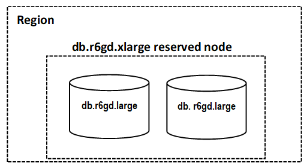
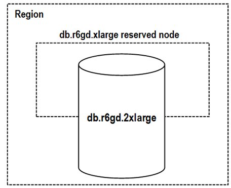

# Size flexible reserved nodes

When you purchase a reserved node, one thing that you specify is the node type,
for example db.r6g.xlarge. For more information, about node types, see [MemoryDB
Pricing](https://aws.amazon.com/memorydb/pricing/ "https://aws.amazon.com/memorydb/pricing/ ").

If you have a node, and you need to scale it to larger capacity, your reserved
node is automatically applied to your scaled node. That is, your reserved nodes are
automatically applied to usage of any size in the same node family. Size-flexible
reserved nodes are available for nodes with the same AWS Region. Size-flexible
reserved nodes can only scale in their node families. For example, a reserved node
for a db.r6g.xlarge can apply to a db.r6g.2xlarge, but not to a db.r6gd.large,
because db.r6g and db.r6gd are different node families.

Size flexibility means that you can move freely between configurations within the
same node family. For example, you can move from a r6g.xlarge reserved node (8
normalized units) to two r6g.large reserved nodes (8 normalized units) (2\*4 = 8
normalized units) in the same AWS Region at no extra cost.

You can compare usage for different reserved node sizes by using normalized units.
For example, one hour of usage on two db.r6g.4xlarge nodes is equivalent to 16
hours of usage on one db.r6g.large. The following table shows the number
of normalized units for each node size:

| Node size | Normalized units (Redis OSS) | Normalized units (Valkey) |
| --------- | ---------------------------- | ------------------------- |
| small     | 1                            | .7                        |
| medium    | 2                            | 1.4                       |
| large     | 4                            | 2.8                       |
| xlarge    | 8                            | 5.6                       |
| 2xlarge   | 16                           | 11.2                      |
| 4xlarge   | 32                           | 22.4                      |
| 6xlarge   | 48                           | 33.6                      |
| 8xlarge   | 64                           | 44.8                      |
| 10xlarge  | 80                           | 56                        |
| 12xlarge  | 96                           | 67.2                      |
| 16xlarge  | 128                          | 89.6                      |
| 24xlarge  | 192                          | 134.4                     |

For example, you purchase a db.r6gd.xlarge reserved node, and you have two running
db.r6gd.large reserved nodes in your account in the same AWS Region. In this case,
the billing benefit is applied in full to both nodes.

Alternatively, if you have one db.r6gd.2xlarge instance running in your account in
the same AWS Region, the billing benefit is applied to 50 percent of the usage of
the reserved node.

