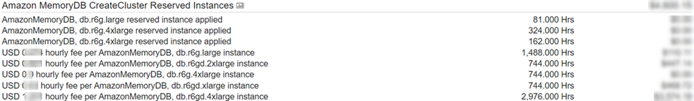

# Working with reserved nodes

You can use the AWS Management Console, the AWS Command Line Interface, and MemoryDB API to work with reserved
nodes.

## Console

###### To get pricing and information about available reserved node

offerings

1. Sign in to the AWS Management Console and open the MemoryDB console at [https://console.aws.amazon.com/memorydb/](https://console.aws.amazon.com/memorydb/ "https://console.aws.amazon.com/memorydb/").
2. In the navigation pane, choose **Reserved
   nodes**.
3. Choose **Purchase reserved nodes**.
4. For **Node type**, choose the type of node you want
   to be deployed.
5. For **Quantity**, choose the number of nodes you want
   to deploy.
6. For **Term**, choose the length of time you want the
   database node reserved.
7. For **Offering type**, choose the offering
   type.

After you make these selections, you can see the pricing information under
**Reservation summary**.

###### Important

Choose **Cancel** to avoid purchasing these reserved
nodes and incurring any charges.

After you have information about the available reserved node offerings, you
can use the information to purchase an offering as shown in the following
procedure:

###### To purchase a reserved node

1. Sign in to the AWS Management Console and open the MemoryDB console at [https://console.aws.amazon.com/memorydb/](https://console.aws.amazon.com/memorydb/ "https://console.aws.amazon.com/memorydb/").
2. In the navigation pane, choose **Reserved
   nodes**.
3. Choose **Purchase reserved nodes**.
4. For **Node type**, choose the type of node you want
   to be deployed.
5. For **Quantity**, choose the number of nodes you want
   to deploy.
6. For **Term**, choose the length of time you want the
   database node reserved.
7. For **Offering type**, choose the offering
   type.
8. (Optional) You can assign your own identifier to the reserved nodes
   that you purchase to help you track them. For **Reservation
   ID**, type an identifier for your reserved node.

After you make these selections, you can see the pricing information
under **Reservation summary**. 9. Choose **Purchase reserved nodes**. 10. Your reserved nodes are purchased, then displayed in the
**Reserved nodes** list.

###### To get information about reserved nodes for your AWS account

1. Sign in to the AWS Management Console and open the MemoryDB console at [https://console.aws.amazon.com/memorydb/](https://console.aws.amazon.com/memorydb/ "https://console.aws.amazon.com/memorydb/").
2. In the navigation pane, choose **Reserved
   nodes**.
3. The reserved nodes for your account appear. To see detailed
   information about a particular reserved node, choose that node in the
   list. You can then see detailed information about that node in the
   detail.

## AWS Command Line Interface

The following `describe-reserved-nodes-offerings` example returns
details of reserved-node offerings.

```
aws memorydb describe-reserved-nodes-offerings

```

This produces output similar to the following:

```
{
    "ReservedNodesOfferings": [
        {
            "ReservedNodesOfferingId": "0193cc9d-7037-4d49-b332-xxxxxxxxxxxx",
            "NodeType": "db.xxx.large",
            "Duration": 94608000,
            "FixedPrice": $xxx.xx,
            "OfferingType": "Partial Upfront",
            "RecurringCharges": [
                {
                    "RecurringChargeAmount": $xx.xx,
                    "RecurringChargeFrequency": "Hourly"
                }
            ]
        }
    ]
}
```

You can also pass the following parameters to limit the scope of what is
returned:

- `--reserved-nodes-offering-id` – The ID of the
  offering that you want to purchase.
- `--node-type` – The node type filter value. Use this
  parameter to show only those reservations matching the specified node
  type.
- `--duration` – The duration filter value, specified
  in years or seconds. Use this parameter to show only reservations for
  this duration.
- `--offering-type` – Use this parameter to show only
  the available offerings matching the specified offering type.

After you have information about the available reserved node offerings, you
can use the information to purchase an offering.

The following `purchase-reserved-nodes-offering` example purchases
new reserved nodes

For Linux, macOS, or Unix:

```
aws memorydb purchase-reserved-nodes-offering \
    --reserved-nodes-offering-id 0193cc9d-7037-4d49-b332-d5e984f1d8ca \
    --reservation-id reservation \
    --node-count 2
```

For Windows:

```
aws memorydb purchase-reserved-nodes-offering ^
    --reserved-nodes-offering-id 0193cc9d-7037-4d49-b332-d5e984f1d8ca ^
    --reservation-id MyReservation
```

- `--reserved-nodes-offering-id` represents the name of
  reserved nodes offering to purchase.
- `--reservation-id` is a customer-specified identifier to
  track this reservation.

###### Note

The Reservation ID is a unique customer-specified identifier to
track this reservation. If this parameter is not specified, MemoryDB
automatically generates an identifier for the reservation.

- `--node-count` is the number of nodes to reserve. It
  defaults to 1.

This produces output similar to the following:

```
{
    "ReservedNode": {
        "ReservationId": "reservation",
        "ReservedNodesOfferingId": "0193cc9d-7037-4d49-b332-xxxxxxxxxxxx",
        "NodeType": "db.xxx.large",
        "StartTime": 1671173133.982,
        "Duration": 94608000,
        "FixedPrice": $xxx.xx,
        "NodeCount": 2,
        "OfferingType": "Partial Upfront",
        "State": "payment-pending",
        "RecurringCharges": [
            {
                "RecurringChargeAmount": $xx.xx,
                "RecurringChargeFrequency": "Hourly"
            }
        ],
        "ARN": "arn:aws:memorydb:us-east-1:xxxxxxxx:reservednode/reservation"
    }
}
```

After you have purchased reserved nodes, you can get information about your
reserved nodes.

The following `describe-reserved-nodes` example returns information
about reserved nodes for this account.

```
aws memorydb describe-reserved-nodes

```

This produces output similar to the following:

```
{
    "ReservedNodes": [
        {
            "ReservationId": "ri-2022-12-16-00-28-40-600",
            "ReservedNodesOfferingId": "0193cc9d-7037-4d49-b332-xxxxxxxxxxxx",
            "NodeType": "db.xxx.large",
            "StartTime": 1671150737.969,
            "Duration": 94608000,
            "FixedPrice": $xxx.xx,
            "NodeCount": 1,
            "OfferingType": "Partial Upfront",
            "State": "active",
            "RecurringCharges": [
                {
                    "RecurringChargeAmount": $xx.xx,
                    "RecurringChargeFrequency": "Hourly"
                }
            ],
            "ARN": "arn:aws:memorydb:us-east-1:xxxxxxxx:reservednode/ri-2022-12-16-00-28-40-600"
        }
    ]
}
```

You can also pass the following parameters to limit the scope of what is
returned:

- `--reservation-id` – You can assign your own
  identifier to the reserved nodes that you purchase to help track
  them.
- `--reserved-nodes-offering-id` – The offering
  identifier filter value. Use this parameter to show only purchased
  reservations matching the specified offering identifier.
- `--node-type` – The node type filter value. Use this
  parameter to show only those reservations matching the specified node
  type.
- `--duration` – The duration filter value, specified
  in years or seconds. Use this parameter to show only reservations for
  this duration.
- `--offering-type` – Use this parameter to show only
  the available offerings matching the specified offering type.

## MemoryDB API

The following examples demonstrate how to use the [MemoryDB Query
API](programmingguide.md "programmingguide.md") for reserved nodes:

**DescribeReservedNodesOfferings**

Returns details of reserved-node offerings.

```
https://memorydb.us-west-2.amazonaws.com/
    ?Action=DescribeReservedNodesOfferings
    &ReservedNodesOfferingId=`649fd0c8-xxxx-xxxx-xxxx-06xxxx75e95f`
	&"Duration": 94608000,
    &NodeType="db.r6g.large"
    &OfferingType="Partial Upfront"
    &Version=2021-01-01
    &SignatureVersion=4
    &SignatureMethod=HmacSHA256
    &Timestamp=20141201T220302Z
    &X-Amz-Algorithm
    &X-Amz-SignedHeaders=Host
    &X-Amz-Expires=20141201T220302Z
    &X-Amz-Credential=<credential>
    &X-Amz-Signature=<signature>

```

The following parameters limit the scope of what is returned:

- `ReservedNodesOfferingId` represents the name of reserved
  nodes offering to purchase.
- `Duration` – The duration filter value, specified in
  years or seconds. Use this parameter to show only reservations for this
  duration.
- `NodeType` – The node type filter value. Use this
  parameter to show only those offerings matching the specified node
  type.
- `OfferingType` – Use this parameter to show only the
  available offerings matching the specified offering type.

After you have information about the available reserved node offerings, you
can use the information to purchase an offering.

**PurchaseReservedNodesOffering**

Allows you to purchase a reserved node offering.

```
https://memorydb.us-west-2.amazonaws.com/
    ?Action=PurchasedReservedNodesOffering
    &ReservedNodesOfferingId=`649fd0c8-xxxx-xxxx-xxxx-06xxxx75e95f`
    &ReservationID=`myreservationID`
    &NodeCount=1
    &Version=2021-01-01
    &SignatureVersion=4
    &SignatureMethod=HmacSHA256
    &Timestamp=20141201T220302Z
    &X-Amz-Algorithm
    &X-Amz-SignedHeaders=Host
    &X-Amz-Expires=20141201T220302Z
    &X-Amz-Credential=<credential>
    &X-Amz-Signature=<signature>

```

- `ReservedNodesOfferingId` represents the name of reserved
  nodes offering to purchase.
- `ReservationID` is a customer-specified identifier to track
  this reservation.

###### Note

The Reservation ID is a unique customer-specified identifier to
track this reservation. If this parameter is not specified, MemoryDB
automatically generates an identifier for the reservation.

- `NodeCount` is the number of nodes to reserve. It defaults
  to 1.

After you have purchased reserved nodes, you can get information about your
reserved nodes.

**DescribeReservedNodes**

Returns information about reserved nodes for this account.

```
https://memorydb.us-west-2.amazonaws.com/
	?Action=DescribeReservedNodes
	&ReservedNodesOfferingId=`649fd0c8-xxxx-xxxx-xxxx-06xxxx75e95f`
	&ReservationID=`myreservationID`
	&NodeType="db.r6g.large"
	&Duration=94608000
	&OfferingType="Partial Upfront"
	&Version=2021-01-01
	&SignatureVersion=4
	&SignatureMethod=HmacSHA256
	&Timestamp=20141201T220302Z
	&X-Amz-Algorithm
	&X-Amz-SignedHeaders=Host
	&X-Amz-Expires=20141201T220302Z
	&X-Amz-Credential=<credential>
	&X-Amz-Signature=<signature>

```

The following parameters limit the scope of what is returned:

- `ReservedNodesOfferingId` represents the name of reserved
  node.
- `ReservationID` – You can assign your own identifier
  to the reserved nodes that you purchase to help track them.
- `NodeType` – The node type filter value. Use this
  parameter to show only those reservations matching the specified node
  type.
- `Duration` – The duration filter value, specified in
  years or seconds. Use this parameter to show only reservations for this
  duration.
- `OfferingType` – Use this parameter to show only the
  available offerings matching the specified offering type.

## Viewing the billing for your

reserved nodes

You can view the billing for your reserved nodes in the Billing Dashboard in
the AWS Management Console.

###### To view reserved node billing

1. Sign in to the AWS Management Console and open the MemoryDB console at [https://console.aws.amazon.com/memorydb/](https://console.aws.amazon.com/memorydb/ "https://console.aws.amazon.com/memorydb/").
2. From the Search button on the top of the console, choose
   **Billing**.
3. Choose **Bills** from the left hand side of the
   dashboard.
4. Under **AWS Service Charges**, expand
   **MemoryDB**.
5. Expand the AWS Region where your reserved nodes are, for example
   **US East (N. Virginia)**.

Your reserved nodes and their hourly charges for the current month are shown
under **Amazon MemoryDB CreateCluster Reserved
Instances**.


