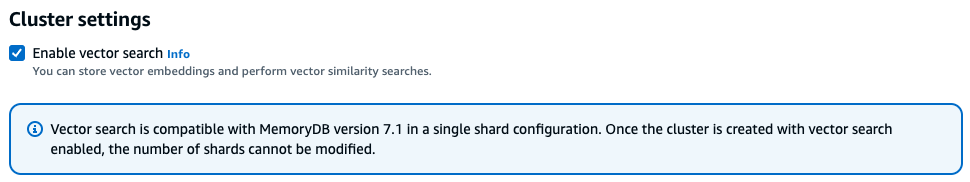

# Create a cluster enabled for vector search

You can create a cluster that is enabled for vector search by using the AWS Management Console, or the AWS Command Line Interface. Depending on the approach, considerations to enable vector search must be enabled.

## Using the AWS Management Console

To create a cluster enabled for vector search within the console, you need to enable vector search under the **Cluster** settings.
Vector search is available for MemoryDB version 7.1 in a single shard configuration.



For more information on using vector search with the AWS Management Console, see [Creating a cluster (Console)](getting-started.md#clusters.createclusters.viewdetails.cluster "getting-started.md#clusters.createclusters.viewdetails.cluster").

## Using the AWS Command Line Interface

To create a vector search enabled MemoryDB cluster, you can use the MemoryDB [create-cluster](../../../cli/latest/reference/memorydb/create-cluster.md "../../../cli/latest/reference/memorydb/create-cluster.md")
command by passing an immutable parameter group `default.memorydb-redis7.search` to enable the vector search capabilities.

```
aws memorydb create-cluster \
  --cluster-name `<value>` \
  --node-type `<value>` \
  --engine redis \
  --engine-version 7.1 \
  --num-shards 1 \
  --acl-name `<value>` \
  --parameter-group-name default.memorydb-redis7.search

```

Optionally, you can also create a new parameter group to enable vector search as shown in the following example. You can learn more about parameter groups [here](parametergroups.md "parametergroups.md").

```
aws memorydb create-parameter-group \
  --parameter-group-name my-search-parameter-group \
  --family memorydb_redis7
```

Next, update the parameter search-enabled to yes in the newly created parameter group.

```
aws memorydb update-parameter-group \
  --parameter-group-name my-search-parameter-group \
  --parameter-name-values "ParameterName=search-enabled,ParameterValue=yes"
```

You can now use this custom parameter group instead the of the default parameter group to enable vector search on your MemoryDB clusters.
