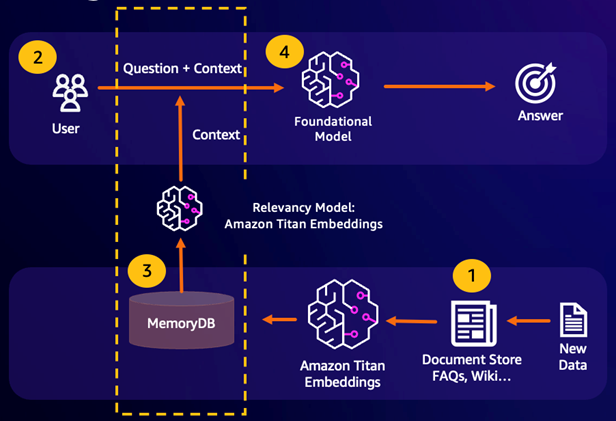
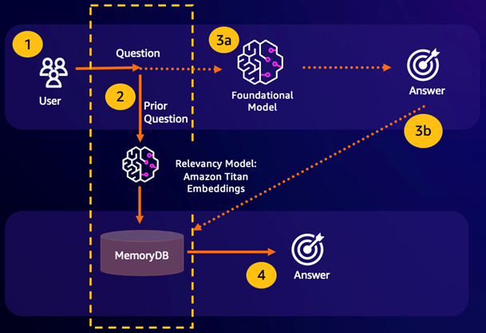
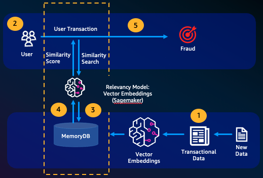

# Use cases

Following are use cases of vector search.

## Retrieval Augmented Generation (RAG)

Retrieval Augmented Generation (RAG) leverages vector search to retrieve relevant passages from a large corpus of data to augment a
large language model (LLM). Specifically, an encoder embeds the input context and search query into vectors, then uses approximate nearest
neighbor search to find semantically similar passages. These retrieved passages are concatenated with the original
context to provide additional relevant information to the LLM to return a more accurate response to the user.

## Durable Semantic Cache

Semantic Caching is a process to reduce computational costs by storing previous results from the FM. By reusing previous results from prior inferences instead of recomputing them, semantic caching reduces the amount of computation required during inference through the FMs. MemoryDB enables durable semantic caching, which avoids data loss of your past inferences. This allows your generative AI applications to respond within single-digit milliseconds with answers from prior semantically similar questions, while reducing cost by avoiding unnecessary LLM inferences.

- **Semantic search hit** – If a customer’s query is semantically similar based on a defined similarity score to a prior question, the FM buffer memory (MemoryDB) will return the answer to the prior question in step 4 and will not call the FM through steps 3. This will avoid the foundation model (FM) latency and costs incurred, providing for a faster experience for the customer.
- **Semantic search miss** – If a customer’s query is not semantically similar based on a defined
  similarity score to a prior query, a customer will call the FM to deliver a response to
  customer in step 3a. The response generated from the FM will then be stored as a vector into MemoryDB for future queries (step 3b) to minimize FM costs on semantically similar questions. In this flow, step 4 would not be invoked as there was no semantically similar question for the original query.

## Fraud detection

Fraud detection, a form of anomaly detection, represents valid transactions as vectors while comparing the vector representations of net new transactions. Fraud is detected when these net new transactions have a low similarity to the vectors representing the valid transactional data. This allows fraud to be detected by modeling normal behavior, rather than trying to predict every possible instance of fraud. MemoryDB allows for organizations to do this in periods of high throughput, with minimal false positives and single-digit millisecond latency.

## Other use cases

- **Recommendation engines** can find users similar products or content by representing items as vectors. The vectors are created by analyzing attributes and patterns. Based on user patterns and attributes, new unseen items can be recommended to users by finding the most similar vectors already rated positively aligned to the user.
- **Document search engines** represent text documents as dense vectors of numbers, capturing semantic meaning. At search time, the engine converts a search query to a vector and finds documents with the most similar vectors to the query using approximate nearest neighbor search. This vector similarity approach allows matching documents based on meaning rather than just matching keywords.
