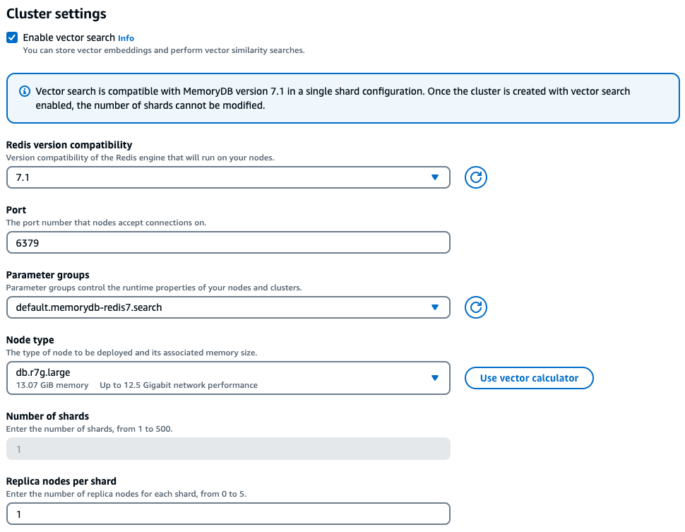
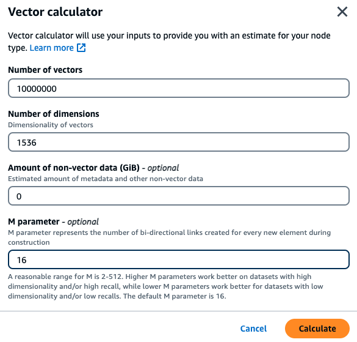
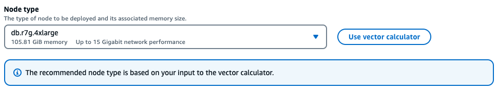

# Vector search features and limits

## Vector search availability

Vector search-enabled MemoryDB configuration is supported on R6g, R7g, and T4g node types and is available in all AWS Regions where MemoryDB is available.

Existing clusters can not be modified to enable search. However, search-enabled clusters can be created from snapshots of clusters with search disabled.

## Parametric restrictions

The following table shows limits for various vector search items:

| Item                                                     | Maximum value |
| -------------------------------------------------------- | ------------- | --------------------------------------------------------------------------------------------------------------------------------------------------------------------------------------------------------------------------------------------------------------------------------------------------------------------------------------------------------------------------------------------------------------------------------------------------------------------------------------------------------------------------------------------------------------------------------------------------------------------------------------------------------------------------------------------------------------------------------------------------------------------------------------------------------------------------------------------------------------------------------------------------------------------------------------------------------------------------------------------------------------------------------------------------------------------------------------------------------------------------------------------------------------------------------------------------------------------------------------------------------------------------------------------------------------------------------------------------------------------------------------------------------------------------------------------------------------------------------------------------------------------------------------------------------------------------------------------------------------------------------------------------------------------------------------------------------------------------------------------------------------------------------------------------------------------------------------------------------------------------------------------------------------------------------------------------------------------------------------------------------------------------------------------------------------------------------------------------------------------------------------------------------------------------------------------------------------------------------------------------------------------------------------------------------------------------------------------------------------------------------------------------------------------------------------------------------------------------------------------------------------------------------------------------------------------------------------------------------------------------------------------------------------------------------------------------------------------------------------------------------------------------------------------------------------------------------------------------------------------------------------------------------------------------------------------------------------------------------------------------------------------------------------------------------------------------------------------------------------------------------------------------------------------------------------------------------------------------------------------------------------------------------------------------------------------------------------------------------------------------------------------------------------------------------------------------------------------------------------------------------------------------------------------------------------------------------------------------------------------------------------------------------------------------------------------------------------------------------------------------------------------------------------------------------------------------------------------------------------------------------------------------------------------------------------------------------------------------------------------------------------------------------------------------------------------------------------------------------------------------------------------------------------------------------------------------------------------------------------------------------------------------------------------------------------------------------------------------------------------------------------------------------------------------------------------------------------------------------------------------------------------------------------------------------------------------------------------------------------------------------------------------------------------------------------------------------------------------------------------------------------------------------------------------------------------------------------------------------------------------------------------------------------------------------------------------------------------------------------------------------------------------------------------------------------------------------------------------------------------------------------------------------------------------------------------------------------------------------------------------------------------------------------------------------------------------------------------------------------------------------------------------------------------------------------------------------------------------------------------------------------------------------------------------------------------------------------------------------------------------------------------------------------------------------------------------------------------------------------------------------------------------------------------------------------------------------------------------------------------------------------------------------------------------------------------------------------------------------------------------------------------------------------------------------------------------------------------------------------------------------------------------------------------------------------------------------------------------------------------------------------------------------------------------------------------------------------------------------------------------------------------------------------------------------------------------------------------------------------------------------------------------------------------------------------------------------------------------------------------------------------------------------------------------------------------------------------------------------------------------------------------------------------------------------------------------------------------------------------------------------------------------------------------------------------------------------------------------------------------------------------------------------------------------------------------------------------------------------------------------------------------------------------------------------------------------------------------------------------------------------------------------------------------------------------------------------- |
| Number of dimensions in a vector                         | 32768         |
| Number of indexes that can be created                    | 10            |
| Number of fields in an index                             | 50            |
| FT.SEARCH and FT.AGGREGATE TIMEOUT clause (milliseconds) | 10000         |
| Number of pipeline stages in FT.AGGREGATE command        | 32            |
| Number of fields in FT.AGGREGATE LOAD clause             | 1024          |
| Number of fields in FT.AGGREGATE GROUPBY clause          | 16            |
| Number of fields in FT.AGGREGATE SORTBY clause           | 16            |
| Number of parameters in FT.AGGREGATE PARAM clause        | 32            |
| HNSW M parameter                                         | 512           |
| HNSW EF_CONSTRUCTION parameter                           | 4096          |
| HNSW EF_RUNTIME parameter                                | 4096          | ## Scaling limits Vector search for MemoryDB is currently limited to a single shard and horizontal scaling is not supported. Vector search supports vertical and replica scaling. ## Operational restrictions **Index Persistence and Backfilling** The vector search feature persists the definition of indexes, and the content of the index. This means that during any operational request or event that causes a node to start or restart, the index definition and content are restored from the latest snapshot and any pending transactions are replayed from the Journal. No user action is required to initiate this. The rebuild is performed as a backfill operation as soon as data is restored. This is functionally equivalent to the system automatically executing an [FT.CREATE](vector-search-commands-ft.md "vector-search-commands-ft.md") command for each defined index. Note that the node becomes available for application operations as soon as the data is restored but likely before index backfill has completed, meaning that backfill(s) will again become visible to applications, for example, search commands using backfilling indexes may be rejected. For more information on backfilling, see [Vector search overview](vector-search-overview.md#vector-search-indexes-keyspaces "vector-search-overview.md#vector-search-indexes-keyspaces"). The completion of index backfill is not synchronized between a primary and a replica. This lack of synchronization can unexpectedly become visible to applications and thus it is recommended that applications verify backfill completion on primaries and all replicas before initiating search operations. ## Snapshot import/export and Live Migration The presence of search indexes in an RDB file limits the compatible transportability of that data. The format of the vector indexes defined by the MemoryDB vector search functionality is only understood by another MemoryDB vector enabled cluster. Also, the RDB files from the preview clusters can be imported by the GA version of the MemoryDB clusters, which will rebuild the index content on loading the RDB file. However, RDB files that do not contain indexes are not restricted in this fashion. Thus data within a preview cluster can be exported to non-preview clusters by deleting the indexes prior to the export. ## Memory consumption Memory consumption is based on the number of vectors, the number of dimensions, the M-value, and the amount of non-vector data, such as metadata associated to the vector or other data stored within the instance. The total memory required is a combination of the space needed for the actual vector data, and the space required for the vector indices. The space required for Vector data is calculated by measuring the actual capacity required for storing vectors within HASH or JSON data structures and the overhead to the nearest memory slabs, for optimal memory allocations. Each of the vector indexes uses references to the vector data stored in these data structures, and uses efficient memory optimizations to remove any duplicate copies of the vector data in the index. The number of vectors depend on how you decide to represent your data as vectors. For instance, you can choose to represent a single document into several chunks, where each chunk represents a vector. Alternatively, you could choose to represent the whole document as a single vector. The number of dimensions of your vectors is dependent on the embedding model you choose. For instance, if you choose to use the [AWS Titan](https://aws.amazon.com/bedrock/titan/ "https://aws.amazon.com/bedrock/titan/") embedding model then the number of dimensions would be 1536. The M parameter represents the number of bi-directional links created for every new element during index construction. MemoryDB defaults this value to 16; however, you can override this. A higher M parameter works better for high dimensionality and/or high recall requirements while low M parameters work better for low dimensionality and/or low recall requirements. The M value increases the consumption of memory as the index becomes larger, increasing memory consumption. Within the console experience, MemoryDB offers an easy way to choose the right instance type based on the characteristics of your vector workload after checking Enable vector search under the cluster settings.  **Sample workload** A customer wants to build a semantic search engine built on top of their internal financial documents. They currently hold 1M financial documents that are chunked into 10 vectors per document using the titan embedding model with 1536 dimensions and have no non-vector data. The customer decides to use the default of 16 as the M parameter.  • Vectors: 1 M \* 10 chunks = 10M vectors  • Dimensions: 1536  • Non-Vector Data (GB): 0 GB  • M parameter: 16 With this data, the customer can click the Use vector calculator button within the console to get a recommended instance type based on their parameters:   In this example, the vector calculator will look for the smallest [MemoryDB r7g node type](https://aws.amazon.com/memorydb/pricing/ "https://aws.amazon.com/memorydb/pricing/") that can hold the memory required to store the vectors based on the parameters provided. Note that this is an approximation, and you should test the instance type to make sure it fits your requirements. Based on the above calculation method and the parameters in the sample workload, this vector data would require 104.9 GB to store the data and a single index. In this case, the `db.r7g.4xlarge` instance type would be recommended as it has 105.81 GB of usable memory. The next smallest node type would be too small to hold the vector workload. As each of the vector indexes use references to the vector data stored and do not create additional copies of the vector data in the vector index, the indexes will also consume relatively less space. This is very useful in creating multiple indexes, and also in situations where portions of the vector data have been deleted and reconstructing the HNSW graph would help create optimal node connections for high quality vector search results. ## Out of Memory during backfill Similar to Valkey and Redis OSS write operations, an index backfill is subjected to out-of-memory limitations. If engine memory is filled up while a backfill is in progress, all backfills are paused. If memory becomes available, the backfill process is resumed. It is also possible to delete and index when backfill is paused due to out of memory. ## Transactions The commands `FT.CREATE`, `FT.DROPINDEX`, `FT.ALIASADD`, `FT.ALIASDEL`, and `FT.ALIASUPDATE` cannot be executed in a transactional context, i.e., not within a MULTI/EXEC block or within a LUA or FUNCTION script. |
