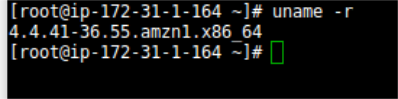
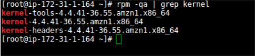
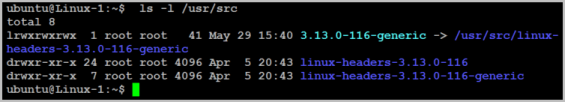
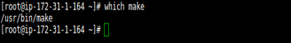

NEW - You can now accelerate your migration and modernization with AWS Transform. Read [Getting Started](../../../transform/latest/userguide/getting-started.md "../../../transform/latest/userguide/getting-started.md") in the _AWS Transform User Guide_.

# Troubleshooting agent issues

Use the information in this section to troubleshoot issues with installing the replication agent.

###### Topics

- [Error: Installation failed](#Error-Installation-Failed "#Error-Installation-Failed")
- [Where can I find the AWS MGN Agent logs?](#MGN-Agent-Log "#MGN-Agent-Log")

## Error: Installation failed

This type of error means that the agent was not installed on the source server, and
therefore the server will not appear on the AWS Application Migration Service console. After you fix
the issue that caused the installation to fail, you need to rerun the Agent Installer file to
install the agent.

### This app can't run on your PC error - Windows

If you encounter the following error "This app can't run on your PC", when trying to
install the AWS Replication Agent on your Windows 10 source Server, try the following.

This error is indicative that your particular version of Windows 10 is likely the 32-bit
version. To verify this, you can

1.  Use the Windows key + I keyboard shortcut to open the Settings app.

2.  Click System.

3.  Click About.

4.  Under System type, you will see two pieces of information: if it says 32-bit operating
    system, x64-based processor, then it means that your PC is running a 32-bit version of Windows
    10 on a 64-bit processor.

If it says 32-bit operating system, x86-based processor, then your computer doesn't
support Windows 10 (64-bit).

If your OS is indeed 64-bit, then there may be other elements blocking the installation of
your agent. The block is actually coming from the Windows Operating System itself. You would need to identify what the cause is. One of the way is running [sfc scan](https://support.microsoft.com/en-au/topic/use-the-system-file-checker-tool-to-repair-missing-or-corrupted-system-files-79aa86cb-ca52-166a-92a3-966e85d4094e "https://support.microsoft.com/en-au/topic/use-the-system-file-checker-tool-to-repair-missing-or-corrupted-system-files-79aa86cb-ca52-166a-92a3-966e85d4094e").

### Is having a mounted '/tmp' directory a requirement for the

agent?

The simple requirement is just to have enough free space. There is no need for this to be
a separate mount. The need for the '/tmp' requirement is actually only if '/tmp' is a separate
mount. If '/tmp' is not a separate mount, then it would fall under '/', for which we have the 2
GiB free requirement. This allows for the '/tmp' to fall into this requirement.

### Installation failed - old agent

Installation may fail due to an old AWS Replication Agent. Ensure that you are attempting
to install the latest version of the AWS Replication Agent. You can learn how to download the
Agent [here](adding-servers.md "adding-servers.md").

### Installation cannot be completed -

CloudEndure Agent

Agent installation will fail if the source server already has the CloudEndure User Agent
installed on it. You will need to [uninstall the CloudEndure Agent](https://docs.cloudendure.com/#Installing_the_CloudEndure_Agents/Uninstalling_the_Agents/Uninstalling_the_Agents.htm#Uninstalling_the_Agents%3FTocPath%3DNavigation%7CInstalling%2520the%2520CloudEndure%2520Agents%7CUninstalling%2520the%2520Agents%7C_____0 "https://docs.cloudendure.com/#Installing_the_CloudEndure_Agents/Uninstalling_the_Agents/Uninstalling_the_Agents.htm#Uninstalling_the_Agents%3FTocPath%3DNavigation%7CInstalling%2520the%2520CloudEndure%2520Agents%7CUninstalling%2520the%2520Agents%7C_____0") and then install the AWS Replication Agent in order
to proceed.

At times, uninstalling the CloudEndure Agent alone is not enough, as the Agent driver may
remain. If that is the case, you will need to delete the agent driver manually.

**Linux**

Run the following command to identify the CloudEndure driver:

`lsmod | grep CE_AgentDriver`

Then, run the following command to delete the driver if it exists:

`rmmod CE_AgentDriver`

**Windows**

Run the following command in cmd to identify the CloudEndure driver:

`sc query ce_driver`

`sc query ce_filter_driver`

Then, run the following command to delete the driver if it exists:

`sc delete ce_driver`

`sc delete ce_filter_driver`

### Installation failed on Linux Server

If the installation failed on a Linux Source server, check the following:

1. **Free Disk Space**

Free disk space on the root directory – verify that you have at least 3 GB of free disk
on the root directory (/) of your Source Server. To check the available disk space on the
root directory, run the following command: df -h /

Free disk space on the /tmp directory – for the duration of the installation process
only, verify that you have at least 500 MB of free disk on the /tmp directory. To check the
available disk space on the /tmp directory run the following command: df -h /tmp

After you have entered the above commands for checking the available disk space, the
results will be displayed as follows:

 2. **The format of the list of disks to replicate**

During the installation, when you are asked to enter the disks you want to replicate, do
NOT use apostrophes, brackets, or disk paths that do not exist. Type only existing disk
paths, and separate them with a comma, as follows:

`/dev/xvda,/dev/xvdb`. 3. **Version of the Kernel headers package**

Verify that you have kernel-devel/linux-headers installed that are exactly of the same
version as the kernel you are running.

The version number of the kernel headers should be completely identical to the version
number of the kernel.To handle this issue, follow these steps:

    1. **Identify the version of your running kernel.**


    To identify the version of your running kernel, run the following command:


    uname -r


    

    The 'uname -r' output version should match the version of one of the installed kernel
     headers packages (kernel-devel-<version number> / linux-headers-<version number>).
    2. **Identify the version of your
     kernel-devel/linux-headers.**


    To identify the version of your running kernel, run the following command:


    On RHEL/CENTOS/Oracle/SUSE:


    rpm -qa | grep kernel


    

    **Note**: This command looks for kernel-devel.


    On Debian/Ubuntu: apt-cache search linux-headers


    
    3. **Verifying that the folder that contains the
     kernel-devel/linux-headers is not a symbolic link.**


    Sometimes, the content of the kernel-devel/linux-headers, which match the version of
     the kernel, is actually a symbolic link. In this case, you will need to remove the link
     before installing the required package.


    To verify that the folder that contains the kernel-devel/linux-headers is not a
     symbolic link, run the following command:


    On RHEL/CENTOS/Oracle/SUSE:


    ls -l /usr/src/kernels


    On Debian/Ubuntu:


    ls -l /usr/src


    

    In the above example, the results show that the linux-headers are not a symbolic
     link.
    4. **[If a symbolic link exists] Delete the symbolic
     link.**


    If you found that the content of the kernel-devel/linux-headers, which match the
     version of the kernel, is actually a symbolic link, you need to delete the link. Run the
     following command:


     rm /usr/src/<LINK NAME>


    For example: rm /usr/src/linux-headers-4.4.1
    5. **Install the correct kernel-devel/linux-headers from the
     repositories.**


    If none of the already installed kernel-devel/linux-headers packages match your
     running kernel version, you need to install the matching package.


    **Note**: You can have several kernel headers versions
     simultaneously on your OS, and you can therefore safely install new kernel headers packages
     in addition to your existing ones (without uninstalling the other versions of the package.)
     A new kernel headers package does not impact the kernel, and does not overwrite older
     versions of the kernel headers.


    **Note**: For everything to work, you need to install a
     kernel headers package with the exact same version number of the running kernel.


    To install the correct kernel-devel/linux-headers, run the following command:


    On RHEL/CENTOS/Oracle/SUSE:


    sudo yum install kernel-devel-`uname -r`


    On Oracle with Unbreakable Enterprise Kernel:


    sudo yum install kernel-uek-devel-`uname -r`


    On Debian/Ubuntu:


    sudo apt-get install linux-headers-`uname -r`
    6. **[If no matching package was found] Download the matching
     kernel-devel/linux-headers package.**


    If no matching package was found on the repositories configured on your server, you
     can download it manually from the Internet and then install it.


    To download the matching *kernel-devel/linux-headers* package,
     navigate to these sites:


    	* [RHEL and Centos](https://access.redhat.com/ "https://access.redhat.com/")
    	* [Oracle](https://access.redhat.com/ "https://access.redhat.com/")
    	* [SUSE](https://scc.suse.com/packages?name=SUSE "https://scc.suse.com/packages?name=SUSE")
    	* [Debian](https://www.debian.org/distrib/packages/ "https://www.debian.org/distrib/packages/")
    	* [Ubuntu](https://packages.ubuntu.com/ "https://packages.ubuntu.com/")

4. **The make, openssl, wget, curl, gcc and build-essential
   packages.**

**Note**: Usually, the existence of these packages is not
required for Agent installation. However, in some cases where the installation fails,
installing these packages will solve the problem.

If the installation failed, the make, openssl, wget, curl, gcc, and build-essential
packages should be installed and stored in your current path.

To verify the existence and location of the required packages, run the following
command:

which <package>

For Example, to locate the make package:

which make

 5. **Error: urlopen error [Errno 10060] Connection times
out.**

This error occurs when outbound traffic is not allowed over TCP Port 443. Port 443 needs
to be open outbound to the AWS MGN Service endpoint. 6. **Powerpath support**

Contact AWS Support for instructions on how to install the AWS Application Migration Service Agent on such machines. 7. **Error: You need to have root privileges to run this
script.**

Make sure you run the installer either as root or by adding sudo at the
beginning:

`sudo ./aws-replication-installer-init` 8. Error: _version `GLIBC_2.7' not found (required by ./aws-replication-installer-64bit)_

You receive this error when you try to install the agent on an unsupported Linux operating system. See [Supported Linux operating systems](Supported-Operating-Systems.md#Supported-Operating-Systems-Linux "Supported-Operating-Systems.md#Supported-Operating-Systems-Linux") .

### Installation failed on Windows machine

If the installation failed on a Windows Source server, check the following:

1. **.NET Framework**

Verify that .NET Framework version 3.5 or above is installed on your Windows Source
servers. 2. **Free disk space**

Verify that there is at least 1 GB of free disk space on the root directory (C:\) of
your Source servers for the installation. 3. **net.exe and sc.exe location**

Verify that the net.exe and/or sc.exe files, located by default in the
C:\Windows\System32 folder, are included in the **PATH Environment
Variable**.

    1. Navigate to **Control Panel >System and Security >System >Advanced
     system settings.**
    2. On the **System Properties** dialog box **Advanced** tab, click the **Environment Variables** button.
    3. On the **System Variables** section of the **Environment Variables** pane, select the **Path** variable. Then, click the **Edit** button to
     view its contents.
    4. On the **Edit System Variable** pane, review the defined
     paths in the **Variable value** field. If the path of the
     net.exe and/or sc.exe files does not appear there, manually add it to the **Variable value** field, and click **OK**.

### Windows - Installation Failed - Request

Signature

If the AWS Replication Agent installation fails on Windows with the following error:

```
botocore.exceptions.ClientError: An error occurred (InvalidSignatureException) when calling the GetAgentInstallationAssetsForMgn operation: {"message":"The request signature we calculated does not match the signature you provided. Check your AWS Secret Access Key and signing method. Consult the service documentation  for details.
```

Attempt to rerun the installer with PowerShell instead of CMD. At times, when the
installer is ran in CMD, the AWS Secret Key does not get pasted properly into the installer and
causes installation to fail.

### Error – certificate verify failed

This error (CERTIFICATE_VERIFY_FAILED) may indicate that the OS does not trust
the certification authority used by our endpoints. To resolve this issue, try
the following steps:

1. Open Microsoft Edge or Internet Explorer to update the operating
   system trusted root certificates. This will work if the operating system
   does not have restrictions to download the certificates.
2. If the first step does not resolve the issue, [download and install
   the Amazon Root Certificates manually](https://www.amazontrust.com/repository/ "https://www.amazontrust.com/repository/").

## Where can I find the AWS MGN Agent logs?

The AWS MGN Agent logs are stored in agent.log.0:

- **Linux:** /var/lib/aws-replication-agent/agent.log.0
- **Windows 64 bit:** Windows 64 bit: C:\Program Files (x86)\AWS Replication Agent\agent.log.0
- **Windows 32 bit:** C:\Program Files\AWS Replication Agent\agent.log.0

In addition, you can review the installation log located in:
<install_path>\aws_replication_agent_installer.log
