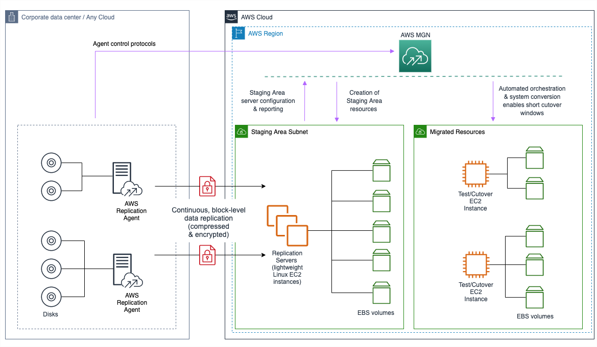

NEW - You can now accelerate your migration and modernization with AWS Transform. Read [Getting Started](../../../transform/latest/userguide/getting-started.md "../../../transform/latest/userguide/getting-started.md") in the _AWS Transform User Guide_.

# Adding source servers

Add source servers to AWS Application Migration Service by installing the AWS Replication Agent (the Agent) on them. The Agent can be installed on both Linux and Windows servers. [Learn more about adding source servers.](adding-servers.md "adding-servers.md")

###### Note

If you are using the agentless replication for vCenter feature, then you will need to add
your source servers by installing the AWS MGN vCenter Client. [Learn more about agentless replication.](agentless-mgn.md "agentless-mgn.md")

Prior to adding your source servers, ensure that you meet all of the [network requirements](preparing-environments.md "preparing-environments.md").

The following is the AWS MGN agent network architecture diagram:

## Migration lifecycle

After the source server has been added to AWS Application Migration Service, it will undergo the migration
lifecycle steps.

The migration lifecycle shows the current state of each source server within the migration
process. Lifecycle states include:

- **Not ready** – The server is undergoing the initial sync
  process and is not yet ready for testing. Data replication can only commence once all of the
  initial sync steps have been completed.
- **Ready for testing** – The server has been successfully
  added to AWS Application Migration Service and data replication has started. test or cutover instances can now be
  launched for this server.
- **Test in progress** – A Test instance is currently being
  launched for this server.
- **Ready for cutover** – This server has been tested and is
  now ready for a cutover instance to be launched.
- **Cutover in progress** – A cutover instance is currently
  being launched for this server.
- **Cutover complete** – This server has been cutover. All of
  the data on this server has been migrated to the AWS cutover instance.
- **Disconnected** – This server has been disconnected from
  AWS Application Migration Service.

[Learn more about the migration lifecycle states.](migration-dashboard.md#lifecycle "migration-dashboard.md#lifecycle")

Once the initial async process has completed successfully, data replication will start
automatically.
