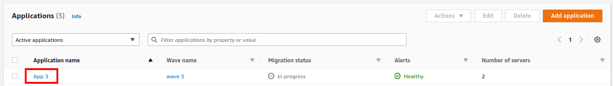
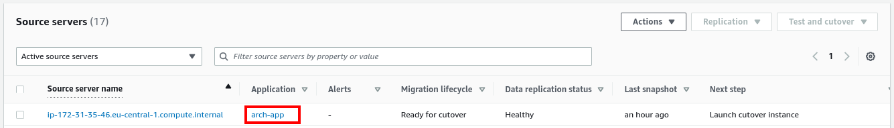
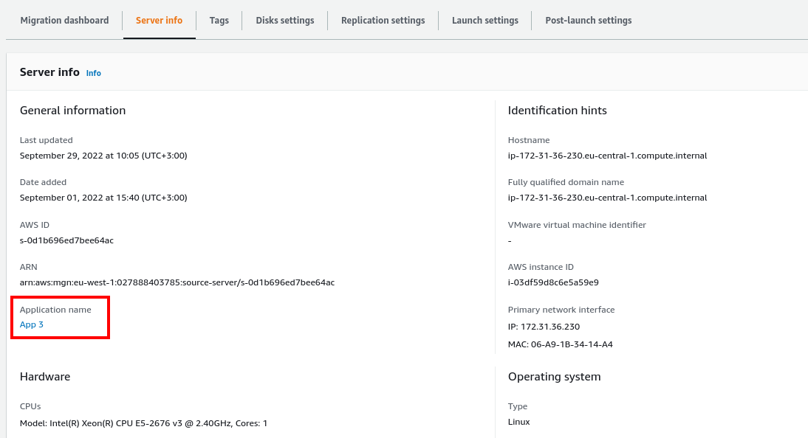
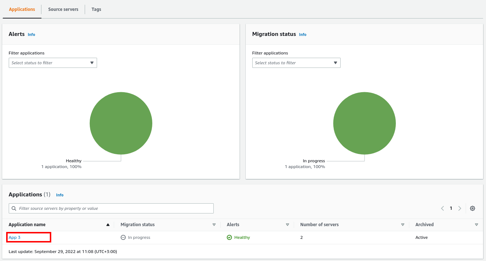
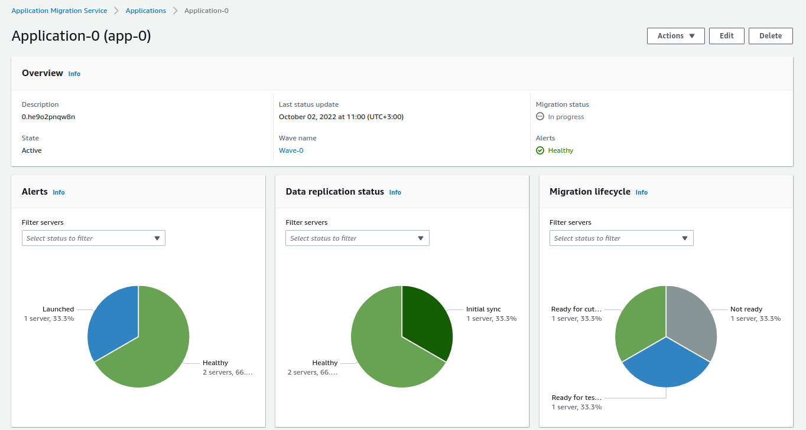

NEW - You can now accelerate your migration and modernization with AWS Transform. Read [Getting Started](../../../transform/latest/userguide/getting-started.md "../../../transform/latest/userguide/getting-started.md") in the _AWS Transform User Guide_.

# Access details for an application

There are several ways you can access the **Application
details** view.

Click on the **Application name** of any application on
the **Applications** page.

Click on the **Application** of any server on the
**Source servers** page.

Click on the **Application name** in the **Server info** tab.

Click on the **Application name** of any application in
the **Applications** table inside **Wave details** -> **Applications** tab.

The **Application details** view shows information and
options for an individual application. Here, you can control and monitor the individual
application.

You can also perform a variety of actions on the application, and perform batch
operations such as launch Test and Cutover instances for the servers associated with the
application.

The **Application details** view is divided into several
dashboards:

###### Topics

- [Review overall application status](application-overview-dashboard.md "application-overview-dashboard.md")
- [Source server
  migration metrics](application-source-server-migration-metrics.md "application-source-server-migration-metrics.md")
- [Review application source servers](application-source-servers-table.md "application-source-servers-table.md")
- [Review application tags](application-cirrus_tags.md "application-cirrus_tags.md")
