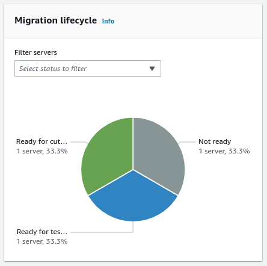

NEW - You can now accelerate your migration and modernization with AWS Transform. Read [Getting Started](../../../transform/latest/userguide/getting-started.md "../../../transform/latest/userguide/getting-started.md") in the _AWS Transform User Guide_.

# Review the application source server migration lifecycle

The source server **Migration lifecycle** metric
shows an aggregated overview of the application associated servers migration
lifecycle. You can look up an individual source server **Migration lifecycle** status at the **Source
servers** table at the bottom of the page.

Source server **Migration lifecycle** can have
one of the following values:

- **Stopped**
- **Not ready**
- **Ready for testing**
- **Test in progress**
- **Ready for cutover**
- **Cutover in progress**
- **Cutover complete**
- **Disconnected**
- **Discovered**
