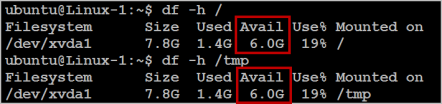
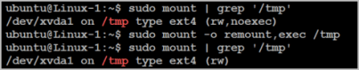
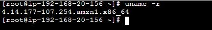
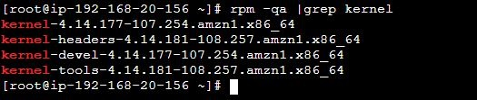

NEW - You can now accelerate your migration and modernization with AWS Transform. Read [Getting Started](../../../transform/latest/userguide/getting-started.md "../../../transform/latest/userguide/getting-started.md") in the _AWS Transform User Guide_.

# Installation requirements

Before installing the AWS Replication Agent on your source servers, ensure that they meet
these requirements:

## General requirements

- Ensure that the source server operating system is supported by AWS.

  - [Supported Windows operating systems.](Supported-Operating-Systems.md#Supported-Operating-Systems-Windows "Supported-Operating-Systems.md#Supported-Operating-Systems-Windows")
  - [Supported Linux operating systems.](Supported-Operating-Systems.md#Supported-Operating-Systems-Linux "Supported-Operating-Systems.md#Supported-Operating-Systems-Linux")

- Ensure that your setup meets all networking requirements. [Learn more about network requirements.](preparing-environments.md "preparing-environments.md")
- Ensure MAC address stability – ensure that the MAC addresses of the source servers do
  not change upon a reboot or any other common changes in your network environment. AWS Transform MGN
  calculates the unique ID of the source server from the MAC address. When a MAC address
  changes, MGN is no longer able to correctly identify the source server. Consequently,
  replication stops. If this happens, you need to reinstall the AWS Replication
  Agent and start replication from the beginning.
- AWS Transform MGN does not support fully paravirtualized source servers. Source servers with
  partial paravirtualization, such as VMWare's paravirtualization of I/O devices, are supported.
- The AWS Replication Agent installer supports multipath.

### Source server requirements

These are universal requirements for both Linux and Windows source servers:

- Root directory – Verify that your source server has at least 2 GB of free disk space on
  the root directory (/) .
- Verify that your source server has at least 300 MB of free RAM to run the AWS
  Replication Agent.
- MGN only supports operating systems built for the x86 system architecture.
- MGN supports replication of volumes up to a maximum size of 16 TB.
  MGN does not currently support migration of servers that have larger volume sizes.
  Agent installation will fail with an appropriate error message if the installer detects
  a volume that is larger than this limit.

## Linux installation requirements

Ensure that your Linux source server meets these installation requirements prior
to installing the AWS Replication Agent:

- Python is installed on the server – Python 2 (2.4 or above) or Python 3 (3.0 or above).
- These tools are required for agent installation only. The installer attempts
  to install them if they are not present already:

```
make gcc perl tar gawk rpm
```

- Verify that you meet these disk space requirements:

  - At least 2 GB of free disk space on the
    root directory (/) of your source server for the installation. To check the available
    disk space on the root directory, run the `df -h /` command.
  - At least 1 GB of free disk space on the _/tmp_ directory for the
    duration of the installation process. To check the available disk
    space on the /tmp directory run the `df -h
   /tmp` command.
  - If `/boot` is a separate partition, ensure that it has a minimum of 50 MB free space needed for the installation. To check the available disk
    space on the /boot directory run the `df -h
   /boot` command.

  After you have entered the commands for checking the available disk space, the
  results are displayed as:

  

- Ensure that you have Python installed on the source server (version
  2.4+, version 3.0+) for Agent installation.
- Only servers using the GRUB bootloader (GRUB 1 or 2) are supported.
- Machines that boot off a disk configured with GPT partitioning must have the
  package 'grub2-pc-modules' installed
- Secure Boot is not supported in Linux.
- Boot disks that span multiple physical disks are not supported.
- Ensure that _/tmp_ is mounted as read+write.
- Ensure that _/tmp_ is mounted with the _exec_
  option. Verify that the _/tmp_ directory is mounted in a way that allows
  you to run scripts and applications from it.

To verify that the _/tmp_ directory is mounted without the noexec
option, run this command: `sudo mount | grep '/tmp'`

If the result is similar to this example, it means that the issue exists in
your OS:

```
$ sudo mount | grep '/tmp'
/dev/xvda1 on /tmp type ext4 (rw,noexec)
```

To fix and remove the _noexec_ option from the mounted
_/tmp_ directory, run this command: `sudo mount -o
 remount,exec /tmp`

This example illustrates the troubleshooting procedure:



- The AWS Transform MGN user needs to be either a root user or a user in the sudoers list.
- Ensure that the dhclient package is installed. If not, install the package
  using:

For Redhat/CentOS/Fedora/AmazonLinux:

```
sudo yum install dhclient
```

OR

```
sudo yum install dhcp-client
```

For Ubuntu/Debian:

```
sudo apt install isc-dhcp-client
```

For SUSE, check the [link](https://software.opensuse.org/download/package?package=dhcp-client&project=network%3Adhcp "https://software.opensuse.org/download/package?package=dhcp-client&project=network%3Adhcp") for the instructions to install "`dhcp-client`" package

- Verify that you have _kernel-devel/linux-headers_ installed that are
  exactly the same version as the kernel you are running.

The version number of the kernel headers should be completely identical to the version
number of the kernel. To handle this issue, follow these steps:

    1. Identify the version of your running kernel.


    `uname -r`


    

    The *uname -r* output version should match the version of one of
     the installed kernel headers packages (kernel-devel-<version number> /
     linux-headers-<version number>).
    2. Identify the version of your *kernel-devel/linux-headers*.


    To identify the version of your installed kernel-devel/linux-headers packages, run this command:


    On RHEL/CENTOS/Oracle/SUSE:


    `rpm -qa | grep kernel`


    

    ###### Note

    This command looks for kernel related packages. The kernel-devel package is
     the specific package to look for.


    On Debian/Ubuntu: `apt-cache search linux-headers`


    
    3. Verify that the folder that contains the
     *kernel-devel/linux-headers* is not a symbolic link.


    Sometimes, the content of the *kernel-devel/linux-headers*, which
     match the version of the kernel, is actually a symbolic link. In this case, you need
     to remove the link before installing the required package.


    To verify that the folder that contains the
     *kernel-devel/linux-headers* is not a symbolic link, run this
     command:


    On RHEL/CENTOS/Oracle:


    ```
    ls -l /usr/src/kernels
    ```

    On Debian/Ubuntu/SUSE:


    ```
    ls -l /usr/src
    ```


    

    In the above example, the results show that the actual **linux-headers-\*** folders are not symbolic links.
    4. [If a symbolic link exists] Delete the symbolic link.


    If you found that the content of the *kernel-devel/linux-headers*,
     which match the version of the kernel, is a symbolic link, you need to delete the link. Run
     this command: `rm /usr/src/<LINK NAME>`


    For example: `rm /usr/src/linux-headers-4.4.1`
    5. Install the correct *kernel-devel/linux-headers* from the
     repositories.


    If none of the already installed *kernel-devel/linux-headers*
     packages match your running kernel version, you need to install the matching
     package.


    ###### Note

    You can have several kernel headers versions simultaneously on your OS, and you can
     therefore safely install new kernel headers packages in addition to your existing ones
     (without uninstalling the other versions of the package.) A new kernel headers package
     does not impact the kernel, and does not overwrite older versions of the kernel
     headers.


    ###### Note

    For everything to work, you need to install a kernel headers package with the exact
     same version number of the running kernel.

    To install the correct *kernel-devel/linux-headers*, run this command:

    On RHEL/CENTOS/Oracle:

    `sudo yum install kernel-devel-`uname -r``

    On Oracle with Unbreakable Enterprise Kernel:

    `sudo yum install kernel-uek-devel-`uname -r``

    On Debian/Ubuntu:

    `sudo apt-get install linux-headers-`uname -r``

    On SUSE:

    `sudo zypper install kernel-default-devel-`uname -r``
    6. [If no matching package was found] Download the matching
     *kernel-devel/linux-headers* package.


    If no matching package was found on the repositories configured on your server, you
     can download it manually from the Internet and then install it.


    To download the matching *kernel-devel/linux-headers* package,
     navigate to these sites:


    	+ [RHELand Centos](https://access.redhat.com/ "https://access.redhat.com/")
    	+ [Oracle](https://access.redhat.com/ "https://access.redhat.com/")
    	+ [SUSE](https://scc.suse.com/packages?name=SUSE "https://scc.suse.com/packages?name=SUSE")
    	+ [Debian](https://www.debian.org/distrib/packages/ "https://www.debian.org/distrib/packages/")
    	+ [Ubuntu](https://packages.ubuntu.com/ "https://packages.ubuntu.com/")
    If the kernel-devel/linux-headers packages are not available for the current running
     kernel version, consider upgrading the kernel to a version that has corresponding
     kernel-devel packages available. System administrators should validate that the appropriate
     kernel-devel packages are available before upgrading the kernel.

## Windows installation requirements

Ensure that your source server operating system is supported. See [Supported Windows operating systems.](Supported-Operating-Systems.md#Supported-Operating-Systems-Windows "Supported-Operating-Systems.md#Supported-Operating-Systems-Windows").

Ensure that your source server meets the agent installation hardware requirements,
including:

- At least 2 GB of free disk space on the disk containing the "Program Files(x86)"
  directory
- Install all available Windows updates on the server.
- A graceful reboot from the OS menu or Windows CLI of a Windows source server does not trigger
  a rescan in MGN once the source server is restarted. Hard reboots, disk changes,
  and crashes trigger a rescan.
- Mount points must be assigned a drive letter to be recognized by AWS Transform MGN. A folder path is not recognized.
