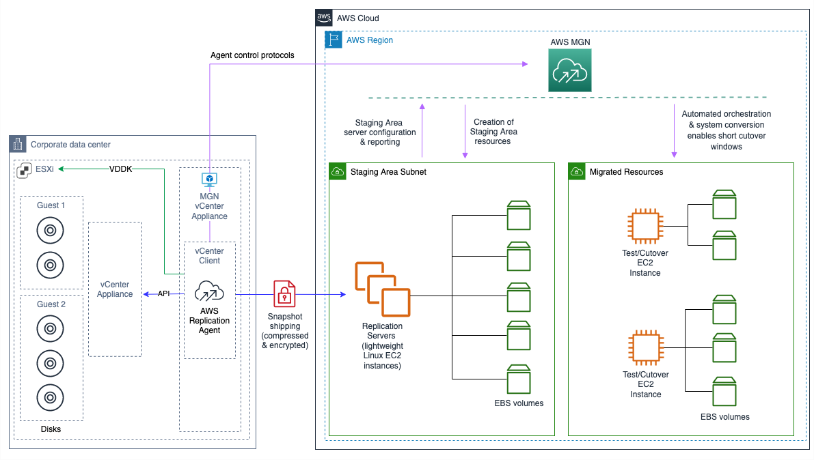

NEW - You can now accelerate your migration and modernization with AWS Transform. Read [Getting Started](../../../transform/latest/userguide/getting-started.md "../../../transform/latest/userguide/getting-started.md") in the _AWS Transform User Guide_.

# Agentless replication overview

Agentless snapshot-based replication allows you to replicate source servers on your vCenter
environment into AWS without installing the AWS Replication Agent.

In order to use agentless replication, you must dedicate at least one VM in your vCenter
environment to host the Application Migration Service vCenter Client. The Application Migration Service vCenter Client is a software bundle
distributed by Application Migration Service and is available for installation as a binary installer. The
installation process installs services on the client VM which allow Application Migration Service to remotely
discover your VMs that are suitable for agentless replication, and to perform data
replication between your vCenter environment and AWS through the use of periodic snapshot
shipping.

Agentless snapshot based replication is divided into two main operations: discovery and
replication:

The discovery process involves periodically scanning your vCenter environment to detect
source server VMs that are suitable for agentless replication, and adding these VMs to the Application Migration Service console. Once a source server has been added, you may choose to initiate agentless
replication on the source VM using the Application Migration Service API or console. The discovery process also collects
all of the necessary information from vCenter in order to perform an agentless conversion
process once a migration job is launched.

The replication process involves continuously starting and monitoring the “snapshot
shipping processes” on the source server VM being replicated. A “snapshot shipping process” is a
long running logical operation which consists of taking a VMware snapshot on the replicated VM,
and launching an ephemeral replication agent process which uses VMware’s Changed Block Tracking
(CBT) feature to identify changed volume data location, using Virtual Disk Development Kit
(VDDK) to read the modified data, and sending the data from the source environment to the
customer’s target AWS account. The first snapshot shipping process performs an “initial sync”
which sends the entire disk contents of the replicating VM into AWS. Following snapshot shipping
processes leverage CBT only to sync disk changes to the customer’s target AWS
account. Each successful snapshot shipping process completes the replication operation by
creating a group of consistent Amazon EBS snapshots in the customer’s AWS account, which can then be
used by the customer to launch test and cutover instances through the regular Application Migration Service mechanisms.

These are the main system components of agentless replication:

- Application Migration Service vCenter Client – A software bundle that is installed on a dedicated VM in your
  vCenter environment in order to facilitate agentless replication.
- vCenter Replication Agent – A java agent that is based on the AWS Replication Agent,
  which replicates a single VM using VDDK and CBT as the data source instead of the Application Migration Service
  driver (that is used by the AWS Replication Agent)
- Application Migration Service Service
- Application Migration Service console
  This diagram illustrates the high level interaction between the different
  agentless replication system components:

