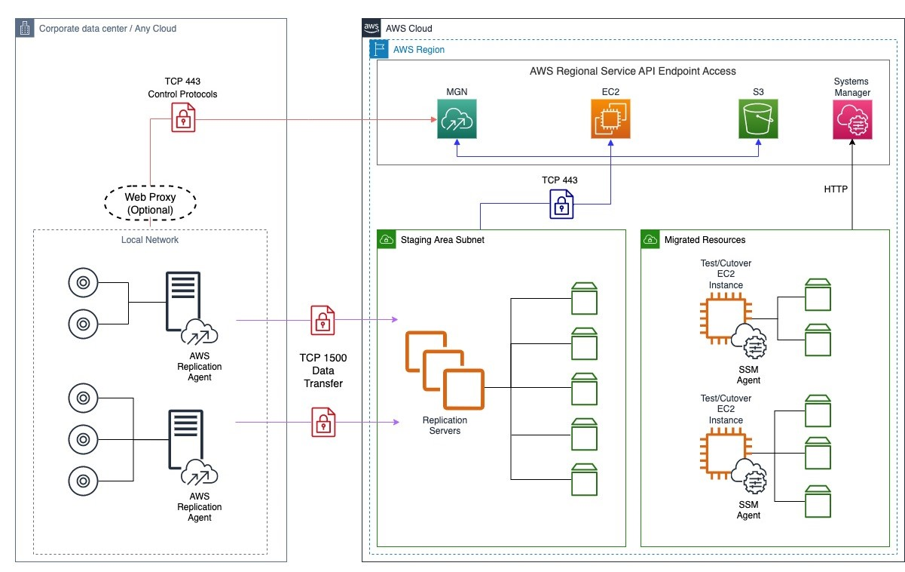
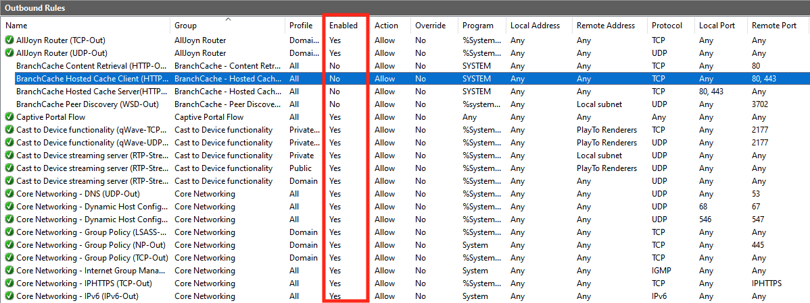

NEW - You can now accelerate your migration and modernization with AWS Transform. Read [Getting Started](../../../transform/latest/userguide/getting-started.md "../../../transform/latest/userguide/getting-started.md") in the _AWS Transform User Guide_.

# Network requirements for Application Migration Service

Before you use Application Migration Service, make sure to prepare your environments. Preparation includes setting correct network settings, defining network requirements, and opening the correct ports.

###### Topics

- [Service and network architecture overview](#Network-Settings-Video "#Network-Settings-Video")
- [Network setting preparations](#Network-Settings-Preparations "#Network-Settings-Preparations")
- [Required connectivity settings](#Network-Requirements "#Network-Requirements")

## Service and network architecture overview

Watch the [AWS Application Migration Service -
Service architecture and network architecture video](https://youtu.be/ao8geVzmmRo "https://youtu.be/ao8geVzmmRo") for an in-depth overview of the Application Migration Service architecture.

This is the Application Migration Service network diagram:



## Network setting preparations

As part of network setting preparations, set up a staging area and operational subnets.

###### Topics

- [Staging area subnet](#Staging-Area "#Staging-Area")
- [Staging area subnet network requirements](#Setting-Up-Network "#Setting-Up-Network")
- [Operational subnets](#Operational-Subnet "#Operational-Subnet")

### Staging area subnet

Before setting up Application Migration Service you should create a subnet which will be used by the
service as a staging area for data replicated from your source servers to AWS.

- You must specify this subnet in the replication settings template. While you can use an existing subnet in your AWS account, the best practice is to create a new dedicated subnet for this purpose. [Learn more about replication settings.](replication-settings-template.md "replication-settings-template.md")
- You can override this subnet for specific source servers in the [replication settings](replication-server-settings.md "replication-server-settings.md").

###### Note

When planning to migrate to an AWS Local Zone, we recommend setting the staging area subnet within the AWS Region, and not the Local Zone. This ensures optimal launch conditions for the replication servers and conversion servers involved in the migration process.
However, if you have specific requirements to use the Local Zone for the staging area subnet, we recommend performing thorough testing and validation to ensure you can successfully replicate and cut over your workloads without any issues.

### Staging area subnet network requirements

- The replication servers launched by Application Migration Service in your staging area subnet need to be able to
  send data over TCP port 443 to either the
  - IPv4 compatible Application Migration Service API endpoint at
    `https://mgn.`aws-region`.amazonaws.com/`. Replace `aws-region` with the
    AWS Region code you are replicating to, for example “us-east-1”
  - Dual-stack compatible Application Migration Service API endpoint at
    `https://mgn.dualstack.`aws-region`.amazonaws.com`. Replace `aws-region` with the
    AWS Region code you are replicating to, for example “us-east-1”

- The source servers on which the AWS Replication Agent is installed need be able to send
  data over TCP port 1500 to the replication servers in the staging area subnet. They also need to
  be able to send data to the Application Migration Service API endpoint at `https://mgn.{region}.amazonaws.com/`. Replace
  “{region}” with the AWS Region code you are replicating to, for example “us-east-1” .

###### Note

SSL interception should not be applied for communication between replication servers and the Application Migration Service API endpoint, as well as between source servers and the MGN; API endpoint.

### Operational subnets

Test and cutover instances are launched in a subnet you specify in the Amazon EC2 launch
template associated with each source server. The Amazon EC2 launch template is created automatically
when you add a source server to AWS Application Migration Service.

[Learn more about launching test and cutover
instances](launching-test-gs.md "launching-test-gs.md").

[Learn more about how Amazon EC2 launch templates are
used](ec2-launch.md "ec2-launch.md").

## Required connectivity settings

To prepare your network for running AWS Application Migration Service, set these connectivity settings:

###### Note

All communication is encrypted with TLS.

###### Topics

- [Communication over TCP port 443](#TCP-443 "#TCP-443")
- [Communication between the source servers and
  AWS Application Migration Service over TCP port 443](#Source-Manager-TCP-443 "#Source-Manager-TCP-443")
- [Communication between the staging area subnet and
  AWS Application Migration Service over TCP port 443](#Communication-TCP-443-Staging "#Communication-TCP-443-Staging")
- [Communication between the source servers and the
  staging area subnet over TCP port 1500](#Communication-TCP-1500 "#Communication-TCP-1500")

### Communication over TCP port 443

Add these IP addresses and URLs to your firewall:

The AWS Application Migration Service AWS Region-specific console address:

- (mgn.<region>.amazonaws.com _example:
  mgn.eu-west-1.amazonaws.com_)

Amazon S3 service URLs (required for downloading AWS Application Migration Service software)

- The AWS Replication Agent installer should have access to the Amazon S3 bucket URL of the AWS Region you are using with AWS Application Migration Service.
- The staging area subnet should have access to Amazon S3.
- Allowlist these Amazon S3 buckets:

```

https://aws-mgn-clients-<REGION>.s3.<REGION>.amazonaws.com/
https://aws-mgn-clients-hashes-<REGION>.s3.<REGION>.amazonaws.com/
https://aws-mgn-internal-<REGION>.s3.<REGION>.amazonaws.com/
https://aws-mgn-internal-hashes-<REGION>.s3.<REGION>.amazonaws.com/
https://aws-application-migration-service-<REGION>.s3.<REGION>.amazonaws.com/
https://aws-application-migration-service-hashes-<REGION>.s3.<REGION>.amazonaws.com/
https://amazon-ssm-<REGION>.s3.<REGION>.amazonaws.com/

```

###### Note

Agent installation and replication server components require Amazon S3 bucket for service functionality.

If you use an Amazon S3 VPC Endpoint, you must provide sufficient permissions for service
functionality, as shown in this example policy for replicating to us-east-1:

JSON

```
`{
 "Version":"2012-10-17",
 "Statement": [
 {
 "Effect": "Allow",
 "Principal": {
 "AWS": "*"
 },
 "Action": "s3:GetObject",
 "Resource": [
 "arn:aws:s3:::aws-mgn-clients-us-east-1/*",
 "arn:aws:s3:::aws-mgn-clients-hashes-us-east-1/*",
 "arn:aws:s3:::aws-mgn-clients-us-east-1/*",
 "arn:aws:s3:::aws-mgn-clients-us-east-1/*",
 "arn:aws:s3:::aws-mgn-clients-hashes-us-east-1/*",
 "arn:aws:s3:::aws-mgn-internal-us-east-1/*",
 "arn:aws:s3:::aws-mgn-internal-hashes-us-east-1/*",
 "arn:aws:s3:::aws-application-migration-service-us-east-1/*",
 "arn:aws:s3:::aws-application-migration-service-hashes-us-east-1/*",
 "arn:aws:s3:::amazon-ssm-us-east-1/*"
 ]
 }
 ]
}`

```

**AWS specific**

The staging area subnet requires outbound access to the [Amazon EC2 endpoint of its AWS Region.](../../../general/latest/gr/rande.md "../../../general/latest/gr/rande.md")

TCP port 443 is used for two communication routes:

1. Between the source servers and AWS Application Migration Service.

2. Between the staging area subnet and AWS Application Migration Service.

### Communication between the source servers and

AWS Application Migration Service over TCP port 443

Each source server that is added to Application Migration Service must continuously communicate with
Application Migration Service (mgn.<region>.amazonaws.com) over TCP port 443.

These are the main operations performed through TCP port 443:

- Downloading the AWS Replication Agent on the source servers.
- Upgrading installed agents.
- Connecting the source servers to the Application Migration Service console and displaying
  their replication status.
- Monitoring the source servers for internal troubleshooting and the use of resource
  consumption metrics (such as CPU, RAM).
- Reporting source server-related events (for example, a removal of disk, or resizing of a
  disk).
- Transmit source server-related information to the Application Migration Service console
  (including hardware information, running services, and installed applications and
  packages).
- Preparing the source servers for test or cutover.

###### Important

Make sure that your corporate firewall allows connections over TCP port 443.

#### Solving communication problems over TCP port 443

between the source servers and AWS Application Migration Service

If there is no connection between your source servers and Application Migration Service, make sure
that your corporate firewall enables connectivity from the source servers to Application Migration Service over TCP
Port 443. If the connectivity is blocked, enable it.

##### Enabling Windows Firewall for TCP port 443

connectivity

###### Important

The information provided in this section is for general security and firewall guidance only.
The information is provided on "AS IS" basis, with no guarantee of completeness, accuracy or
timeliness, and without warranty or representations of any kind, expressed or implied. In no
event will AWS and/or its subsidiaries and/or their employees or service providers be
liable to you or anyone else for any decision made or action taken in reliance on the
information provided here or for any direct, indirect, consequential, special or similar
damages (including any kind of loss), even if advised of the possibility of such damages.
AWS is not responsible for the update, validation, or support of
security and firewall information.

###### Note

Enabling Windows Firewall for TCP port 443 connectivity allows your servers to
achieve outbound connectivity. You may still need to adjust other external components, such
as firewall blocking or incorrect routes, in order to achieve full connectivity.

###### Note

These instructions are intended for the default OS firewall. Consult
the documentation of any third-party local firewall you use to learn how to enable TCP port
443 connectivity.

1. On the source server, open the **Windows Firewall**
   console.
2. On the console, select the **Outbound Rules** option from
   the tree.

 3. On the **Outbound Rules** table, select the rule that
relates to the connectivity to Remote Port - 443. Check if the **Enabled** status is **Yes**.

 4. If the Enabled status of the rule is **No**, right-click
it and select **Enable Rule** from the pop-up menu.


##### Enabling Linux Firewall for TCP port 443

connectivity

1. Enter this command to add the required Firewall rule:

_sudo iptables -A OUTPUT -p tcp --dport 443 -j
ACCEPT_ 2. To verify the creation of the Firewall rule, enter these commands:

sudo iptables -L

_Chain INPUT (policy ACCEPT)_

_target prot opt source destination_

_Chain FORWARD (policy ACCEPT)_

_target prot opt source destination_

_Chain OUTPUT (policy ACCEPT)_

_target prot opt source destination_

_ACCEPT tcp -- anywhere anywhere tcp dpt:443_

### Communication between the staging area subnet and

AWS Application Migration Service over TCP port 443

The replication servers in the staging area subnet must continuously communicate with
Application Migration Service over TCP port 443. The main operations that are performed through this route
are:

- Downloading the replication software by the replication servers.

- Connecting the replication servers to Application Migration Service, and displaying their
  replication status.
- Monitoring the replication servers for internal troubleshooting use and resource
  consumption metrics (such as CPU, RAM).
- Reporting replication-related events.

###### Note

The staging area subnet requires Amazon S3 access.

#### Configuring communication over TCP

port 443 between the staging area subnet and AWS Application Migration Service

You can establish communication between the staging area subnet and AWS Application Migration Service over TCP port 443 directly.

There are two ways to establish direct connectivity to the Internet for the VPC of the
staging area, as described in the [VPC
FAQ](https://aws.amazon.com/vpc/faqs/ "https://aws.amazon.com/vpc/faqs/").

1. [Public
   IP address + Internet gateway](../../../AmazonVPC/latest/UserGuide/VPC_Internet_Gateway.md "../../../AmazonVPC/latest/UserGuide/VPC_Internet_Gateway.md")

2. [Private IP
   address + NAT instance](../../../AmazonVPC/latest/UserGuide/vpc-nat-gateway.md "../../../AmazonVPC/latest/UserGuide/vpc-nat-gateway.md")

### Communication between the source servers and the

staging area subnet over TCP port 1500

Each source server with an installed AWS Replication Agent continuously communicates with
the AWS Application Migration Service replication servers in the staging area subnet over TCP port 1500. TCP port 1500 is needed for the transfer of replicated data from the source servers to the
staging area subnet.

The replicated data is encrypted and compressed when transferred over TCP port 1500. Prior
to being moved into the staging area subnet, the data is encrypted on the source infrastructure.
The data is decrypted after it arrives at the staging area subnet and before it is written to
the volumes.

TCP port 1500 is primarily used for the replication server data replication stream.

AWS Application Migration Service uses TLS 1.2 end to end from the agent installed on the
source server to the Replication Server. Each replication server gets assigned a specific TLS
server certificate, which is distributed to the corresponding Agent and validated against on the
agent side.

#### Establishing communication

over TCP port 1500

###### Important

To allow traffic over TCP port 1500, make sure that your corporate firewall enables this
connectivity.
