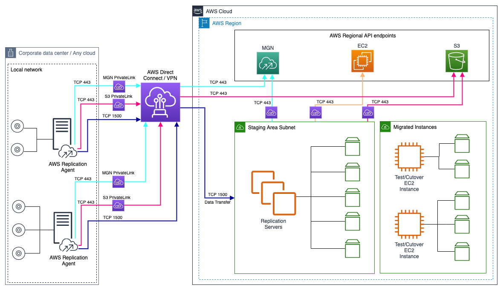

NEW - You can now accelerate your migration and modernization with AWS Transform. Read [Getting Started](../../../transform/latest/userguide/getting-started.md "../../../transform/latest/userguide/getting-started.md") in the _AWS Transform User Guide_.

# Replication server settings

reference

Replication servers are lightweight Amazon EC2 instances that are used to replicate
data between your source servers and AWS. Replication servers are automatically
launched and terminated as needed. You can modify the behavior of the replication
servers by modifying the settings for a single source server or multiple source
servers. Alternatively, you can run AWS Application Migration Service with the default replication server
settings.

The replication server options, include:

- The subnet within which the replication server is launched
- Replication Server instance type
- Amazon EBS volume types
- Amazon EBS encryption
- Security groups

## Staging area subnet

Choose the **Staging area subnet** that you want
to allocate as the staging area subnet for all of your replication servers.

The best practice is to create a single dedicated, separate subnet for all of
your migration waves using your AWS account. Learn more about creating subnets
in [this AWS VPC article](../../../vpc/latest/userguide/working-with-vpcs.md "../../../vpc/latest/userguide/working-with-vpcs.md").

If a default subnet does not exist, select a specific subnet. The drop-down
menu contains a list of all subnets that are available in the console's
AWS Region.

###### Note

Changing the subnet does not significantly interfere with ongoing data
replication, although there may be a minor delay of several minutes while
the servers are moved from one subnet to another.

### Using multiple subnets

The best practice is to use a single staging area subnet for all of your
migration waves within a single AWS account. You may want to use multiple
subnets in certain cases, such as the migration of thousands of servers.

###### Note

Using more than one staging area subnet might result in higher compute
consumption as more replication servers are needed.

### Launching replication servers in Availability

Zones

If you want your replication servers to be launched in a specific
Availability Zone, then select or create a subnet in that specific
Availability Zone. Learn more about using Availability Zones in [this Amazon Elastic Compute Cloud article](../../../AWSEC2/latest/UserGuide/using-regions-availability-zones.md "../../../AWSEC2/latest/UserGuide/using-regions-availability-zones.md").

## Replication server instance type

Choose the **Replication server instance type**.
This determines the instance type and size that is used for the launch
of each replication server.

The best practice is to not change the default replication server instance
type unless there is a business need for doing so. By default, AWS Application Migration Service uses the **t3.small** instance type. This is the most
cost effective instance type and should work well for most common workloads. You
can change the replication server instance type to speed up the initial sync of
data from your source servers to AWS. Changing the instance type will likely
lead to increased compute costs.

You can choose a the **Replication server
instance** type from the drop-down menu
contains all available types. Recommended and commonly used instance
types are displayed first. You can also search for a specific instance type in the search box.

You can change the replication server instance type for servers that are
replicating too slowly or servers that are constantly busy or experience
frequent spikes. These are the most common instance type changes:

- Servers with less than 26 disks – Change the instance type to
  **m5.large**. Increase the instance type to m5.xlarge or higher as needed.
- Servers with more than 26 disks, or servers in AWS Regions that do
  not support m5 instance types – change the instance type to **m4.large**.
  Increase to m4.xlarge or higher, as needed.

###### Note

- Changing the replication server instance type will not affect data
  replication. Data replication will automatically continue from where
  it left off, using the new instance type you selected.
- By default, replication servers are automatically assigned a
  public IP address from Amazon's public IP space.
- Replication Servers are only supported on x86_64 CPU architecture
  instance types.

## Dedicated instance for

replication server

Choose whether you would like to use a **Dedicated
instance for replication server**.

When an external server is very write-intensive, the replication of data from
its disks to a shared Replication Server can interfere with the data replication
of other servers. In these cases you should choose the **Use
dedicated replication server** option (and also consider changing
Replication server instance type).

Otherwise, choose the **Do not use dedicated replication
server** option.

###### Note

Using a dedicated replication server may increase the Amazon EC2 cost you incur
during replication.

## Amazon EBS volume type

Choose the default Amazon **Amazon EBS volume type**
to be used by the replication servers for large disks.

Each disk has minimum and maximum sizes and varying performance metrics and
pricing. Learn more about Amazon EBS volume types in [this Amazon EBS article.](../../../AWSEC2/latest/UserGuide/EBSVolumeTypes.md "../../../AWSEC2/latest/UserGuide/EBSVolumeTypes.md")

The best practice is to not change the default Amazon EBS volume type, unless there
is a business need for doing so.

###### Note

This option only affects disks over 500 GiB (by default, smaller disks
always use Magnetic HDD volumes).

The default **Lower cost, Throughput Optimized HDD
(st1)** option utilizes slower, less expensive disks.

You may want to use this option if:

- You want to keep costs low
- Your large disks do not change frequently
- You are not concerned with how long the initial sync process will
  take

The **Faster, General Purpose SSD (gp3)** option
utilizes faster, but more expensive disks.

You may want to use this option if:

- Your source server has disks with a high write rate or if you want
  faster performance in general
- You want to speed up the initial sync process
- You are willing to pay more for speed

###### Note

You can customize the Amazon EBS volume type used by each disk within each
source server in that source server's settings. [Learn more about changing individual source server volume types.](staging-disk.md "staging-disk.md")

## Amazon EBS encryption

Choose whether to use the default or custom Amazon **EBS
encryption**. This option will encrypt your replicated data at rest
on the Staging Area Subnet disks and the replicated disks.

- Default – The default Amazon EBS encryption Volume Encryption Key will be
  used (which can be an Amazon EBS-managed key or a CMK).
- Custom – You will need to enter a custom customer-managed key (CMK) in
  the regular key ID format.

If you select the **Custom** option, the
**EBS encryption key** box appears. Enter
the ARN or key ID of a customer-managed CMK from your account or another
AWS account. Enter the encryption key (such as a cross-account KMS key) in the
regular key ID format (KMS key example: 123abcd-12ab-34cd-56ef-1234567890ab).

To create a new AWS Key Management Service key, click **Create an AWS KMS
key**. You will be redirected to the Key Management Service (KMS)
Console where you can create a new key to use.

Learn more about Amazon EBS Volume Encryption in [this Amazon EBS article](../../../AWSEC2/latest/UserGuide/EBSEncryption.md "../../../AWSEC2/latest/UserGuide/EBSEncryption.md").

###### Important

Reversing the encryption option after data replication has started will
cause data replication to start from the beginning.

### Using an AWS KMS Customer Managed Key

(CMK) for encryption

If you decide to use a Customer Managed Key (CMK), or if your default
Amazon EBS encryption key is a CMK, you will need to add additional permissions
to the key to allow AWS Application Migration Service to use it.

To modify the existing key policy using the AWS Management Console
_policy view_.

1. Navigate to the AWS KMS Console and select the AWS KMS key you plan to
   use with AWS MGN.
2. Scroll to **Key policy** and click
   **Switch to policy view**.
3. Click **Edit** and add the following
   JSON statements to the **Statement**
   field.

```

    {
      "Sid": "Allow AWS Services permission to describe a customer managed key for encryption purposes",
      "Effect": "Allow",
      "Principal": {
        "AWS": "arn:aws:iam::$ACCOUNT_ID:root"
      },
      "Action": [
        "kms:DescribeKey"
      ],
      "Resource": "*",
      "Condition": {
        "StringEquals": {
          "kms:CallerAccount": [
            "$ACCOUNT_ID"
          ]
        },
        "Bool": {
          "aws:ViaAWSService": "true"
        }
      }
    },
    {
      "Sid": "Allow AWS MGN permissions to use a customer managed key for EBS encryption",
      "Effect": "Allow",
      "Principal": {
        "AWS": "arn:aws:iam::$ACCOUNT_ID:root"
      },
      "Action": [
        "kms:CreateGrant"
      ],
      "Resource": "*",
      "Condition": {
        "StringEquals": {
          "kms:CallerAccount": [
            "$ACCOUNT_ID"
          ],
          "kms:GranteePrincipal": [
            "arn:aws:iam::$ACCOUNT_ID:role/aws-service-role/mgn.amazonaws.com/AWSServiceRoleForApplicationMigrationService"
          ]
        },
        "ForAllValues:StringEquals": {
          "kms:GrantOperations": [
            "CreateGrant",
            "DescribeKey",
            "Encrypt",
            "Decrypt",
            "GenerateDataKey",
            "GenerateDataKeyWithoutPlaintext"
          ]
        },
        "Bool": {
          "aws:ViaAWSService": "true"
        }
      }
    },
    {
      "Sid": "Allow EC2 to use this key on behalf of the current AWS Application Migration Service user, during target launches",
      "Effect": "Allow",
      "Principal": {
        "AWS": [
          "arn:aws:iam::$ACCOUNT_ID:root",
          "arn:aws:iam::$ACCOUNT_ID:role/aws-service-role/mgn.amazonaws.com/AWSServiceRoleForApplicationMigrationService"
        ]
      },
      "Action": [
        "kms:ReEncrypt*",
        "kms:GenerateDataKey*"
      ],
      "Resource": "*",
      "Condition": {
        "StringEquals": {
          "kms:CallerAccount": [
            "$ACCOUNT_ID"
          ],
          "kms:ViaService": "ec2.$REGION.amazonaws.com"
        }
      }
    }


```

###### Important

    * Replace `$ACCOUNT_ID"` with the
     AWS account ID you are migrating into.
    * Replace `$REGION` with the AWS Region you
     are migrating into.
    * The last statement can be made stricter by ensuring
     the principal refers to users who are going to perform
     [StartTest](../APIReference/API_StartTest.md "../APIReference/API_StartTest.md") or [StartCutover](../APIReference/API_StartCutover.md "../APIReference/API_StartCutover.md") API calls

4. Click **Save changes**.

###### Note

If you are using a Customer Managed Key (CMK) from another account,
you need to take an additional step from within that account to allow
the service to leverage the CMK.

From the account in which you want to stage MGN replication servers,
create a grant that delegates the relevant permissions to the
appropriate service-linked role. The Grantee Principal element of the
grant is the ARN of the appropriate service-linked role. The key-id is
the ARN of the key.

The following is an example [create-grant](../../../cli/latest/reference/kms/create-grant.md "../../../cli/latest/reference/kms/create-grant.md") CLI command that gives the service-linked role
named **AWSServiceRoleForApplicationMigrationService** in account
111122223333 permissions to use the customer-managed key in account 444455556666.

aws kms create-grant \

--region us-west-2 \

--key-id
arn:aws:kms:us-west-2:444455556666:key/1a2b3c4d-5e6f-1a2b-3c4d-5e6f1a2b3c4d
\

--grantee-principal
arn:aws:iam::111122223333:role/aws-service-role/mgn.amazonaws.com/AWSServiceRoleForApplicationMigrationService
\

--operations "Encrypt" "Decrypt" "ReEncryptFrom" "ReEncryptTo"
"GenerateDataKey" "GenerateDataKeyWithoutPlaintext" "DescribeKey"
"CreateGrant"

For this command to succeed, the user making the request must have
permissions for the CreateGrant action.

## Always use Application Migration Service

security group

Choose whether you would like to **Always use the
Application Migration Service security group**.

A security group acts as a virtual firewall, which controls the inbound and
outbound traffic of the staging area subnet.

The best practice is to have AWS Application Migration Service automatically attach and monitor the
default Application Migration Service Security Group. This group opens inbound
TCP Port 1500 for receiving the transferred replicated data. When the default
Application Migration Service Security Group is activated, Application Migration Service will constantly
monitor whether the rules within this security group are enforced, in order to
maintain uninterrupted data replication. If these rules are altered, Application Migration Service will
automatically fix the issue.

Select the **Always use Application Migration Service
security group** option to allow data to flow from your source
servers to the replication servers, and that the replication servers can
communicate their state to the AWS Application Migration Service servers.

Otherwise, select the **Do not use Application Migration
Service security group option**. Selecting this option is not
recommended.

Additional security groups can be chosen from the Additional security groups
dropdown. The list of available security groups changes according to the
**Staging area subnet** you selected.

You can search for a specific security group within the search box.

You can add security groups via the AWS Management Console, and they will appear on the
security group drop-down list in the AWS Application Migration Service Console. Learn more about AWS
security groups in [this VPC article](../../../vpc/latest/userguide/VPC_SecurityGroups.md "../../../vpc/latest/userguide/VPC_SecurityGroups.md").

You can use the default Application Migration Service security group, or you
can select another security group. However, take into consideration that any
selected security group that is not the Application Migration Service default,
will be added to the default group, since the default security group is
essential for the operation of Application Migration Service.

## Data routing and throttling

AWS Application Migration Service allows you to control how data is routed from your source servers to
the replication servers on AWS through the **Data routing
and throttling** settings.

By default, data is sent from the source servers to the replication servers
over the public internet, using the public IP that was automatically assigned to
the replication servers. Transferred data is always encrypted in transit.

###### Note

The **Data routing and throttling** view
differs slightly between the replication template view and the individual
source server replication settings view, but the instructions apply to both
views.

### Use private IP for data replication

Choose the **Use private IP** option if you
want to route the replicated data from your source servers to the staging
area subnet through a private network with a VPN,
AWS Direct Connect, VPC peering, or another type of existing
private connection.

Choose **Do not use private IP** if you do
not want to route the replicated data through a private network.

###### Important

Data replication will not work unless you have already set up the VPN,
AWS Direct Connect, or VPC peering in the AWS Console.

###### Note

- If you selected the Default subnet, it is highly unlikely that
  the private IP is used for that subnet. Ensure that Private IP
  (VPN, AWS Direct Connect, or VPC peering) is used for
  your chosen subnet if you wish to use this option.
- You can safely switch between a private connection and a
  public connection for individual server settings choosing the
  **Use private IP** or **Do not use private IP** option, even
  after data replication has begun. This switch will only cause a
  short pause in replication, and will not have any long-term
  effect on the replication.
- Choosing the **Use private IP**
  option will not create a new private connection.

You should use this option if you want to:

- Allocate a dedicated bandwidth for replication
- Use another level of encryption
- Add another layer of security by transferring the replicated data
  from one private IP address (source) to another private IP address
  (on AWS)

#### Network architecture diagram –

private IP

The following diagram illustrates the high-level interaction between
the different replication system components when using private IP or VPC
endpoint.



#### Create public IP

When the **Use private IP** option is
chosen, you will have the option to create a public IP. Public IPs are
used by default. Choose **Create public
IP** if you want to create a public IP. Choose **Do not create a public IP** if you do not want
to create a public IP.

### Throttle bandwidth

You can control the amount of network bandwidth used for data replication
per server. By default, AWS Application Migration Service will use all available network bandwidth
utilizing five concurrent connections.

Choose **Throttle bandwidth** if you want to
control the transfer rate of data sent from your source servers to the
Replication Servers over TCP Port 1500. Otherwise, choose **Do not throttle bandwidth**.

If you chose to throttle bandwidth, the **Throttle
network bandwidth** (per server, in Mbps) box will appear.
Enter your desired bandwidth in Mbps.

## Replication resources tags

Add custom **Replication resources tags** to
resources created by AWS Application Migration Service in your AWS account.

These are resources required to facilitate data replication, testing and
cutover. Each tag consists of a key and an optional value. You can add a custom
tag to all of the AWS resources that are created on your AWS account during
the normal operation of AWS Application Migration Service.

To add a new tag, take the following steps:

1. Click **Add new tag**.
2. Enter a **Custom tag key** and an
   optional tag value.

###### Note

Application Migration Service already adds tags to every resource it creates, including service
tags and user tags.

These resources include:

- Amazon EC2 instances
- Amazon EC2 launch templates
- Amazon EBS volumes
- Snapshots
- Security groups (optional)

Learn more about AWS Tags in [this Amazon EC2 article](../../../AWSEC2/latest/UserGuide/Using_Tags.md "../../../AWSEC2/latest/UserGuide/Using_Tags.md").
