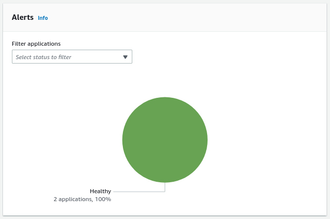

NEW - You can now accelerate your migration and modernization with AWS Transform. Read [Getting Started](../../../transform/latest/userguide/getting-started.md "../../../transform/latest/userguide/getting-started.md") in the _AWS Transform User Guide_.

# Review alerts on applications in a

wave

The application **Alerts** metric provides an aggregated
overview of the alerts related to the wave's associated applications. You can look up an
individual application **Alerts** status at the **Applications** table at the bottom of the page.

- A healthy application will display a **Healthy** status.
- An application that is experiencing a temporary issue such as lag or backlog will
  display a **Lagging** status.
- An application that is experiencing significant issues, such as a stall, will display a
  **Stalled** status.
