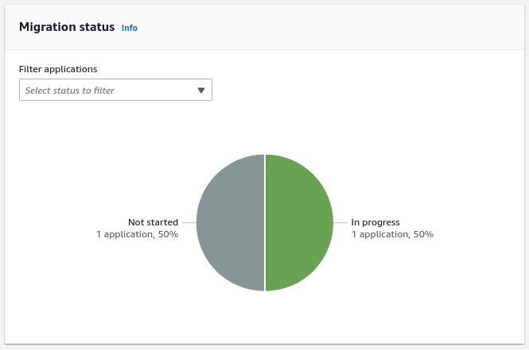

NEW - You can now accelerate your migration and modernization with AWS Transform. Read [Getting Started](../../../transform/latest/userguide/getting-started.md "../../../transform/latest/userguide/getting-started.md") in the _AWS Transform User Guide_.

# Review the migration status of

applications in a wave

The application **Migration status** metric provides an
aggregated overview of the migration status of the wave's associated applications. You can look
up an individual application **Migration status** status at the
**Applications** table at the bottom of the page.

Application **Migration status** can have one of the
following values:

- **Not started**
- **In progress**
- **Completed**
