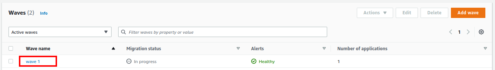
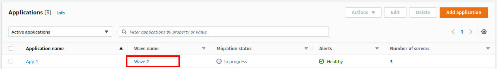
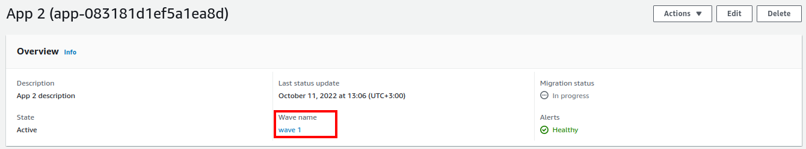
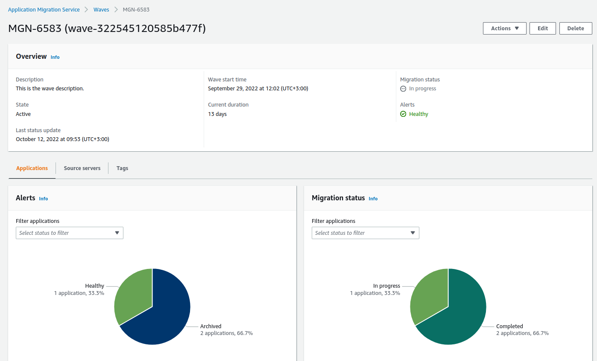

NEW - You can now accelerate your migration and modernization with AWS Transform. Read [Getting Started](../../../transform/latest/userguide/getting-started.md "../../../transform/latest/userguide/getting-started.md") in the _AWS Transform User Guide_.

# Review migration wave details

There are several ways you can access the **Wave details**
view.

Click the **Wave name** of any wave on the **Waves** page.

Click the **Wave** of any application on the **Applications** page.

Click the **Wave name** in the **Overview** dashboard inside **Application details** of an
application.

The **Wave details** view shows information and options for an
individual wave. Here, you can control and monitor the individual wave.

You can also perform a variety of actions on the wave, and perform batch operations such as
launch test and cutover instances for the servers associated with the wave.

The **Wave details** view is divided into several dashboards:

###### Topics

- [Review overall wave status](wave-overview-dashboard.md "wave-overview-dashboard.md")
- [Applications](wave-applications.md "wave-applications.md")
- [Source servers](wave-source-servers.md "wave-source-servers.md")
