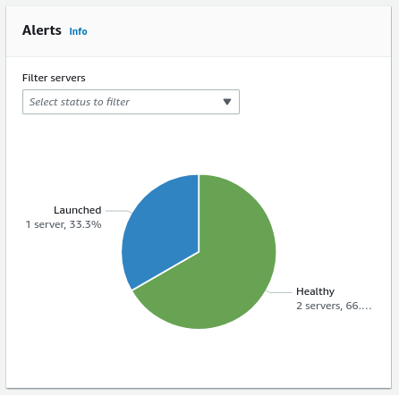

NEW - You can now accelerate your migration and modernization with AWS Transform. Read [Getting Started](../../../transform/latest/userguide/getting-started.md "../../../transform/latest/userguide/getting-started.md") in the _AWS Transform User Guide_.

# Review alerts on source servers

in a wave

The source server **Alerts** metric provides an aggregated
overview of the alerts related to the wave's associated servers. You can look up an individual
source server **Alerts** status at the **Source servers** table at the bottom of the page.

- A healthy server for which a test or cutover instance has not been launched will display
  a **Healthy** status.
- A healthy server for which a test or cutover instance has been launched will display a
  **Healthy** status.
- A server that is experiencing a temporary issue such as a lag or backlog will display a
  **Lagging** status.
- A server that is experiencing significant issues, such as a stall, will display a
  **Stalled** status.
