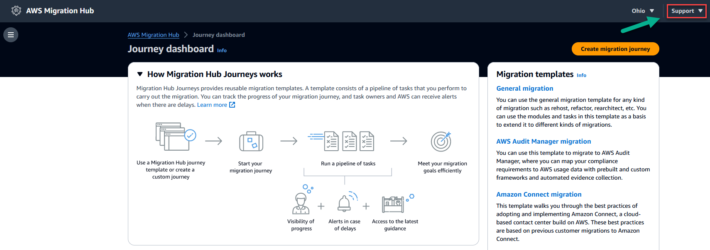

AWS Migration Hub will no longer be open to new customers starting November 7, 2025. To continue using the service, sign up prior to November 7, 2025. For capabilities similar to AWS Migration Hub, explore [AWS Transform](https://aws.amazon.com/transform "https://aws.amazon.com/transform").

# Support for AWS Migration Hub Journeys

To get support for AWS Migration Hub Journeys, if you have an AWS account, [create a support
case](https://support.console.aws.amazon.com/support/home#/ "https://support.console.aws.amazon.com/support/home#/").

You can also look for answers on [AWS re:Post](https://repost.aws/tags "https://repost.aws/tags"), which doesn't require an AWS account. Depending on what you want to
get help with, use one of the following tags: `Migration journeys` or
`Migration templates`.

To send us feedback, choose **Support**, as shown in the following image,
then choose **Feedback**.

