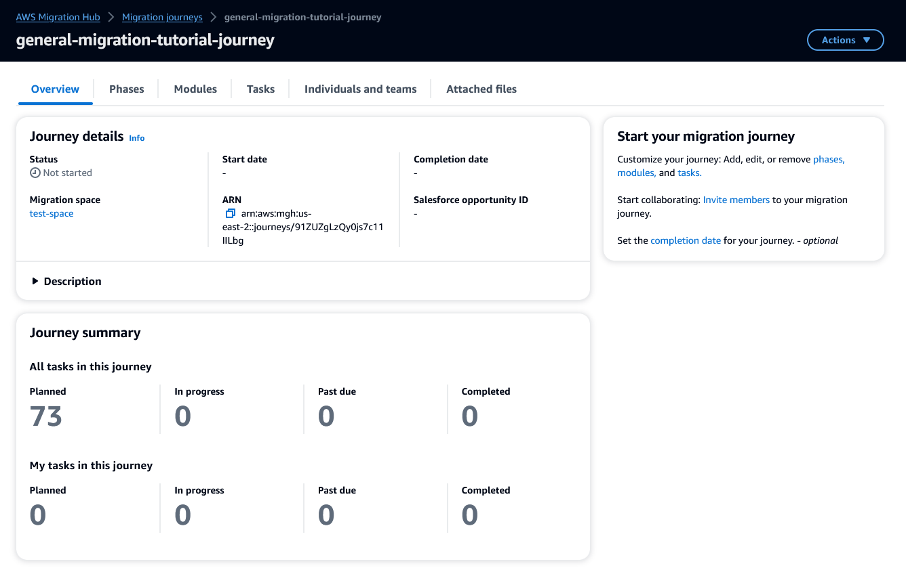
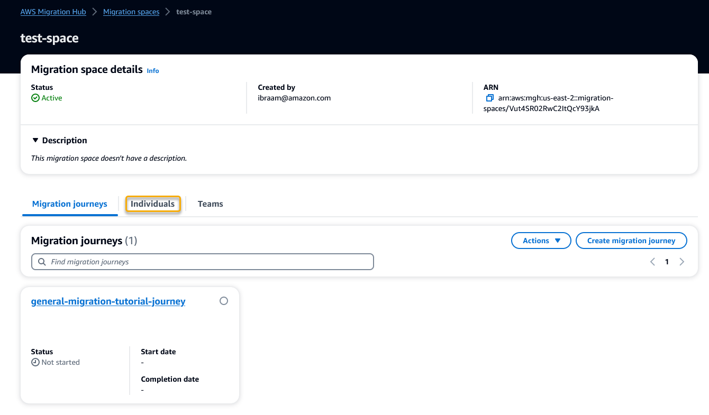
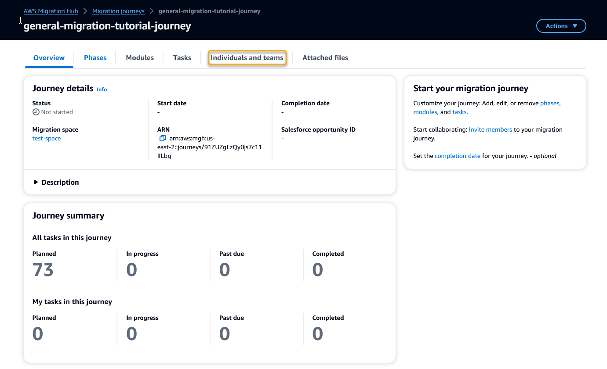
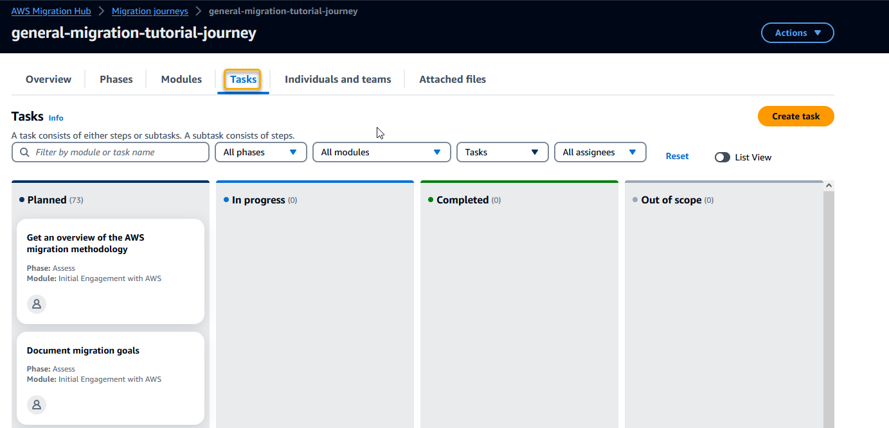
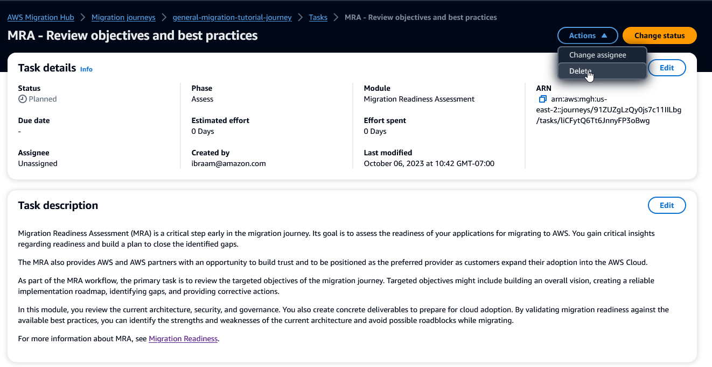
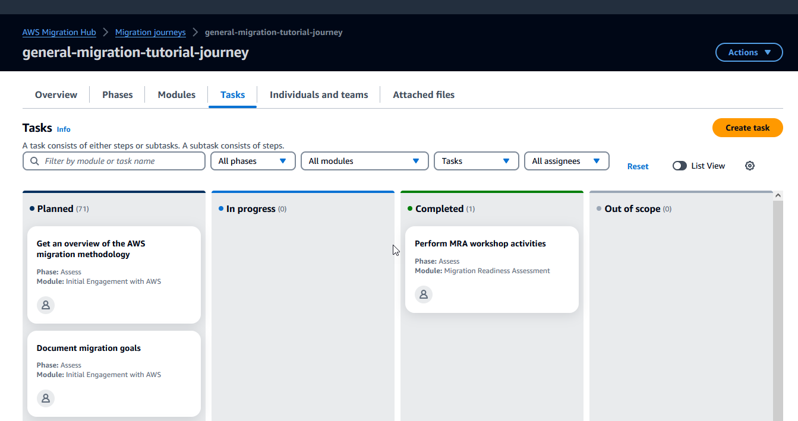

AWS Migration Hub will no longer be open to new customers starting November 7, 2025. To continue using the service, sign up prior to November 7, 2025. For capabilities similar to AWS Migration Hub, explore [AWS Transform](https://aws.amazon.com/transform "https://aws.amazon.com/transform").

# Creating a migration journey from a template

In this tutorial you create a migration journey that uses the general migration
template. After you create the journey, you add and remove tasks to customize the
journey. You also send invitations to teams and individuals so that they can join the
journey as members and work on it. Finally, you set start and finish dates.

###### Create the migration journey

1. Open the Migration Hub Journeys console. For information about how to access the console, see [Accessing AWS Migration Hub Journeys](setup.md "setup.md").
2. In the navigation pane, choose **Migration journeys**.
3. Choose **Create migration journey**.
4. In the **Journey creation method** section, keep the default,
   which is **Use AWS Migration Hub Journeys template**.
5. Under **AWS templates**, choose **General
   migration**.
6. In the **Journey details** section, under **Journey
   name** enter
   `general-migration-tutorial-journey`.
7. Under **Migration space**, choose **Create migration
   space**.
8. In the **Migration space name** field, enter
   `test-space`.
9. Choose **Create migration space**.
10. Choose **Create migration journey**.
    It might take Migration Hub Journeys up to a minute to create the journey for you. The following
    image shows the journey overview that you see when the journey is ready.

To finish setting up the journey, you invite team members to participate in the
journey, then you edit its contents to match your specific migration scenario.

###### Invite members

In this procedure, you invite two people to join the migration space that you
created when you were creating the journey.

1. In the navigation pane, choose **Migration spaces**.
2. To go to the details page of the migration space, choose the name
   `test-space`.
3. On the details page, choose the **Individuals** tab that is
   shown in the following image.

 4. Choose **Invite**. 5. Enter the email address of a person that you want to work with you on
migrations, 6. For **Role**, choose
**MigrationSpaceContributor**. 7. Choose **Invite**. 8. Back on the **Individuals** tab, choose
**Invite** again. 9. Enter another email address to invite a second person to become a contributor
to the migration space. 10. In the navigation pane, choose **Migration journeys**. 11. In the list of journeys, choose the name
**general-migration-tutorial-journey**. 12. On the journey details page, choose the **Individuals and
teams** tab that is shown in the following image.

 13. Choose **Invite**. 14. Under **Individual**, select one of the two individuals that
you invited to the migration space. 15. For **Role**, choose
**JourneyContributor**. 16. Choose **Invite**. 17. Choose **Invite** again and repeat the previous steps to
invite the other individual that you had invited to the migration space. For
this individual, choose the **JourneyAdmin** role.

###### Customize the journey

The general-migration template includes tasks for performing a Migration Readiness
Assessment (MRA). In this tutorial we imagine a scenario where you've already
performed an MRA. Therefore, the MRA tasks aren't needed. In the following
procedure, you delete the MRA tasks, and you attach your MRA report to the
journey.

1. Choose the **Tasks** tab that is shown in the following
   image.

 2. Choose the task **MRA - Review objectives and best
practices**. 3. On the task details page, choose **Actions**, and then
choose **Delete**, as shown in the following image.

 4. In the dialog box, type `delete`, then choose
**Delete**. 5. Choose the task that is titled **Perform MRA pre-workshop
activities**. This task has three subtasks. 6. To delete a task, you must first delete all of its subtasks. Choose the
subtask **Pre-workshop Questionnaire**. On the subtask's
details page, choose the **Actions** menu, and then choose
**Delete**. 7. In the dialog box, type `delete`, then choose
**Delete**. 8. Go back to the **Perform MRA pre-workshop activities** task
and delete its two remaining subtasks. 9. Delete the **Perform MRA pre-workshop activities**
task. 10. On the journey's **Tasks** tab, choose the task
**Perform MRA workshop activities**. 11. On the task's details page, choose the **Attached files**
tab. 12. Choose **Choose file**, and then upload your company's MRA
report. For this tutorial, you can upload any example file, even if it's an
empty file. 13. Go back to the journey's **Tasks** tab, and move the
**Perform MRA workshop activities** task to the
**Completed** column as shown in the following
image.

