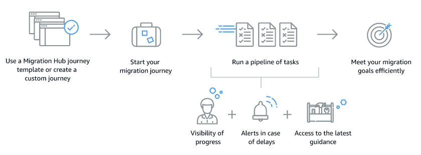

AWS Migration Hub will no longer be open to new customers starting November 7, 2025. To continue using the service, sign up prior to November 7, 2025. For capabilities similar to AWS Migration Hub, explore [AWS Transform](https://aws.amazon.com/transform "https://aws.amazon.com/transform").

# What is AWS Migration Hub Journeys?

AWS Migration Hub Journeys is a service that you can use to plan, perform, and track migrations into
AWS. Migration Hub Journeys combines the tools that are available in AWS Migration Hub with the latest
guidance from [AWS Prescriptive
Guidance](https://aws.amazon.com/prescriptive-guidance "https://aws.amazon.com/prescriptive-guidance"). You don't need an AWS account to use Migration Hub Journeys.

A core concept in Migration Hub Journeys is the migration journey, which is a pipeline of
migration-related tasks that you can assign to different teams or individuals. You can create a
journey from scratch or from one of the templates that Migration Hub Journeys provides. These templates
represent common migration scenarios and follow best practices. If you create your journey from a
template, you can customize the journey to better match your particular scenario. The following
diagram provides an overview of how Migration Hub Journeys journeys work.

## Are you a first-time Migration Hub Journeys user?

If you are a first-time user of Migration Hub Journeys, we recommend that you begin by reading the
following sections:

- [Migration journeys](migration-journeys.md "migration-journeys.md")
- [Migration templates](migration-templates.md "migration-templates.md")
- [Migration spaces](migration-spaces.md "migration-spaces.md")
- [Tutorials](tutorials.md "tutorials.md")
