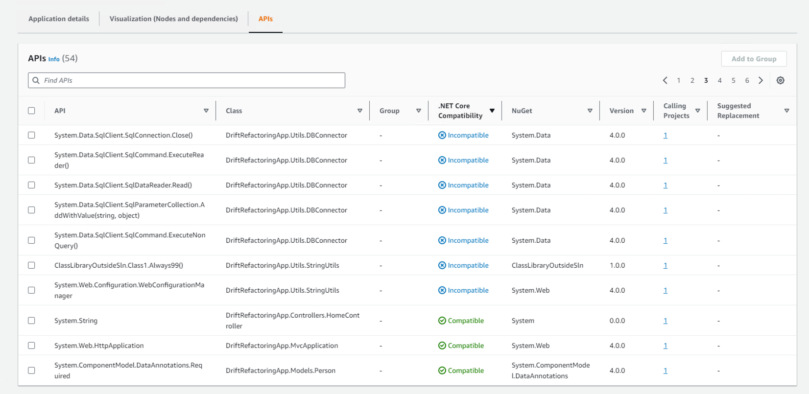

AWS .NET Modernization Tools Porting Assistant (PA) for .NET, AWS App2Container (A2C), AWS Toolkit for .NET Refactoring (TR), and AWS Microservice Extractor (ME) for .NET is no longer open to new customers. If you would like to use the service, sign up prior to November 7, 2025. Alternatively use [AWS Transform](https://aws.amazon.com/transform/ "https://aws.amazon.com/transform/"), which is an agentic AI service developed to accelerate enterprise modernization of .NET.

# APIs Tab

You can view which APIs your application utilizes as well as the classes where
they are referenced by navigating to the **APIs** tab after onboarding
and analyzing an application. From the search bar in the table, you are able to either
include or exclude APIs based on several fields, including their
**compatibility** with .NET Core and corresponding Class. From this
page you can also select any number of APIs and add them to a group by clicking the
**Add to Group** button, just like you would in the Visualization tab.

**Note:** The groups created will be created using the classes that the
corresponding APIs belong to; therefore a class containing multiple APIs will not be able
to have its APIs in separate groups.
