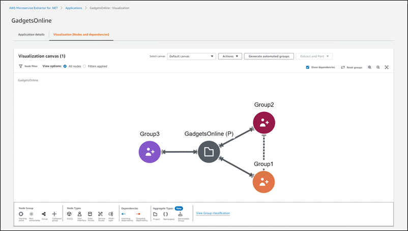
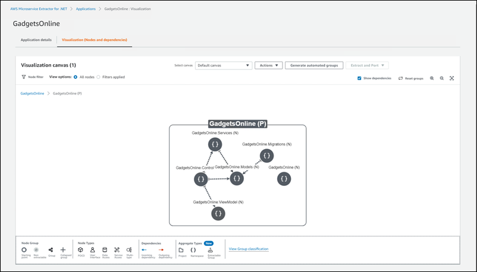
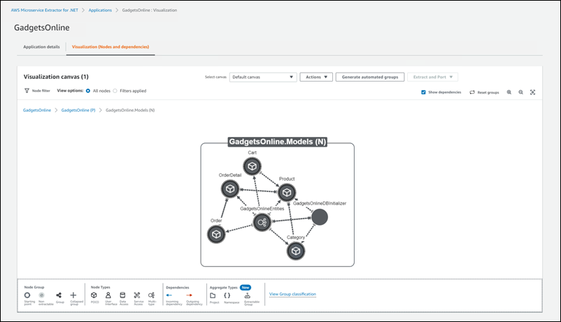

AWS .NET Modernization Tools Porting Assistant (PA) for .NET, AWS App2Container (A2C), AWS Toolkit for .NET Refactoring (TR), and AWS Microservice Extractor (ME) for .NET will no longer be open to new customers starting on November 7, 2025. If you would like to use the service, sign up prior to November 7, 2025. Alternatively use [AWS Transform](https://aws.amazon.com/transform/ "https://aws.amazon.com/transform/"), which is an agentic AI service developed to accelerate enterprise modernization of .NET.

# Visualization

AWS Microservice Extractor for .NET creates a visualization of the monolithic application nodes, the
metrics for each node, and the dependencies between them. Depending on the visualization
level, a node could mean an aggregation of related objects such as projects, namespaces,
logical groups of classes, or individual classes. It provides data on the application
structure required to help you decide what parts of the application you want to extract
as smaller, independent services. You can use the visualization to perform the
following:

- **Isolate dependencies** — Use the
  visualization to help you isolate dependencies and automatically capture
  interdependencies to create groups of closely related nodes. Nodes within each
  group rely on other nodes within the group.
- **Narrow focus** — View all of the
  dependencies for a selected node, and the shared dependencies between
  nodes.
- **Assess call count (class level nodes only)**
  — View the method call count number between nodes. Call count data is
  provided by the runtime metrics that you upload to the tool.
- **Visualize at a high level** — Get a
  high-level understanding of your monolithic application, and investigate
  dependencies and call count metrics to make decisions about parts of the
  application to extract into smaller, independent services.
- **Automated grouping recommendations** —
  Microservice Extractor can generate recommendations for groupings to extract as independent
  services using machine learning.
  The following image shows the **Visualization canvas** displaying
  root level groupings of applications nodes. Application nodes at this level are
  classified as either project or group nodes.

The following image shows the **Visualization canvas** displaying
namespace level aggregations of application nodes. Nodes at this level are aggregated as
namespaces.

The following image shows the **Visualization canvas** displaying a
class level view within the namespace. Nodes at this level are individual
classes.

