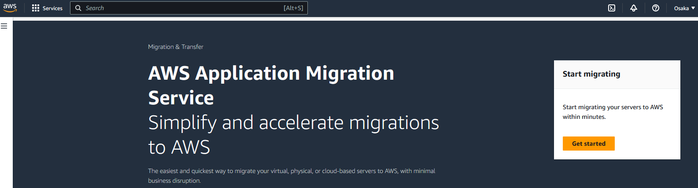
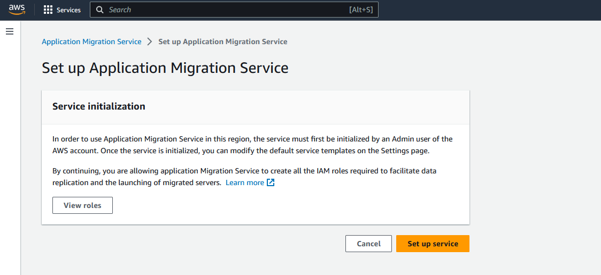
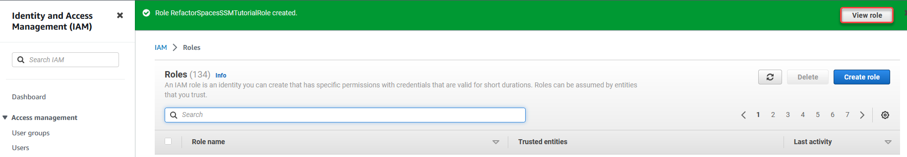
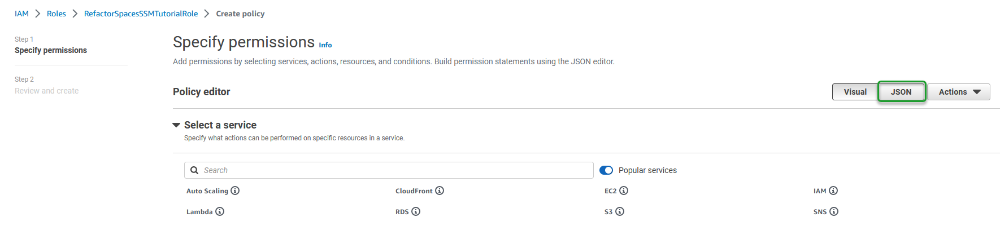
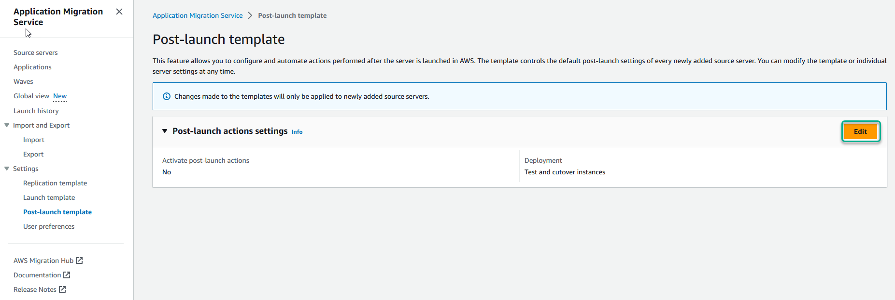
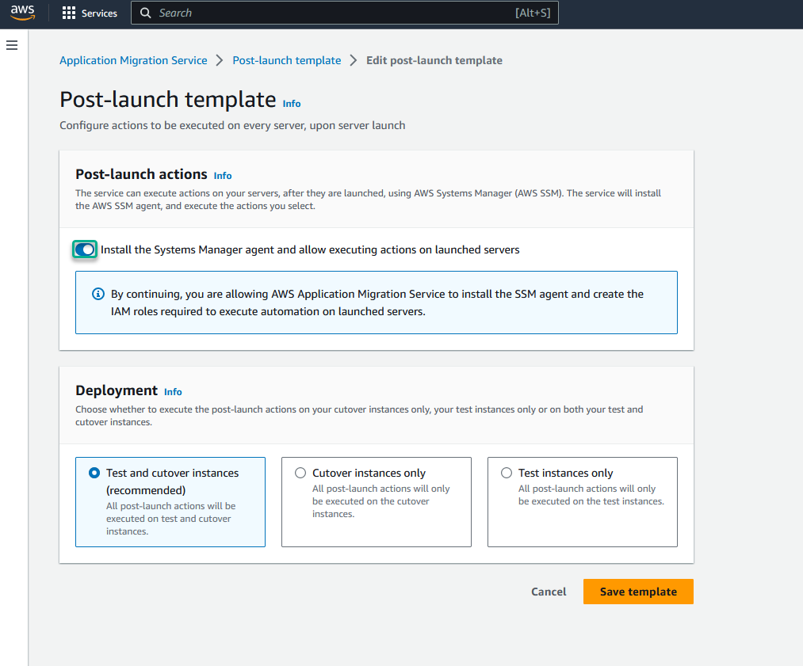
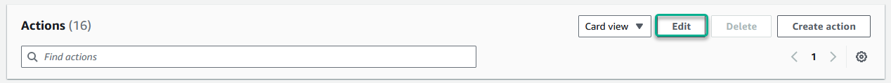

AWS Migration Hub Refactor Spaces is no longer open to new customers as of November 7, 2025. For capabilities similar to AWS Migration Hub Refactor Spaces, explore [AWS Transform](https://aws.amazon.com/transform "https://aws.amazon.com/transform").

# Tutorial: Using Refactor Spaces with AWS Application Migration

Service

This tutorial shows how to automatically create a refactor environment and route traffic
to your application after migrating an application using AWS Application Migration Service
(AWS MGN), so that you can continue modernizing as soon as you've migrated an application.
The AWS Migration Hub Refactor Spaces (Refactor Spaces) post-launch action in AWS MGN creates a Refactor Spaces
environment, an application, a service, and a default route.

You can use a Refactor Spaces environment to quickly launch new features in AWS Lambda (Lambda),
Amazon Elastic Container Service (Amazon ECS), or Amazon Elastic Kubernetes Service (Amazon EKS), or you can safely and incrementally move traffic to
new services without modifying the existing application. For more information, see [What is AWS Migration Hub Refactor Spaces?](what-is-mhub-refactor-spaces.md "what-is-mhub-refactor-spaces.md")
and [Enable Refactor Spaces](../../../mgn/latest/ug/predefined-post-launch-actions.md#predefined-enable-refactor-space "../../../mgn/latest/ug/predefined-post-launch-actions.md#predefined-enable-refactor-space") in the _AWS MGN User
Guide_.

For a quick overview of a complete migration workflow, see [Migration workflow](../../../mgn/latest/ug/migration-workflow-gs.md "../../../mgn/latest/ug/migration-workflow-gs.md") in the
_AWS MGN User Guide_.

## Prerequisites

To do this tutorial, you need the following prerequisites:

- An AWS account. If you don't have an AWS account, see [Getting
  started: Are you a first-time AWS user?](../../../accounts/latest/reference/welcome-first-time-user.md "../../../accounts/latest/reference/welcome-first-time-user.md").
- Familiarity with AWS MGN. For an introduction, see [What Is AWS
  Application Migration Service?](../../../mgn/latest/ug/what-is-application-migration-service.md "../../../mgn/latest/ug/what-is-application-migration-service.md").
- Familiarity with Refactor Spaces. For an introduction, see [What is AWS Migration Hub Refactor Spaces?](what-is-mhub-refactor-spaces.md "what-is-mhub-refactor-spaces.md")

## Step 1: Set up AWS MGN

To use AWS MGN, you must first set it up in the AWS Region in which you plan to
use it.

1. Open the AWS MGN console at [https://console.aws.amazon.com/mgn/home](https://console.aws.amazon.com/mgn/home "https://console.aws.amazon.com/mgn/home").
2. Choose the Region that you want to work in.
3. Choose the **Get started** button that appears in the
   following image.

 4. If this is your first time using AWS MGN in the Region you chose, you will
see the following screen. Choose the **Set up service**
button.

For more information, see [Initializing AWS MGN via the
console](../../../mgn/latest/ug/mandatory-setup.md "../../../mgn/latest/ug/mandatory-setup.md").

## Step 2: Create an IAM role

In this step you create a service role that the automation script of the MGN
post-launch action will need to assume.

1. Open the IAM console at [https://console.aws.amazon.com/iam](https://console.aws.amazon.com/iam "https://console.aws.amazon.com/iam").
2. In the left navigation pane, choose **Roles**.
3. Choose **Create role**.
4. Under **Use cases for other AWS services:**, choose
   **Systems Manager** from the dropdown list.
5. Below the dropdown list, choose the \***\*Systems
   Manager** option.\*\*
6. Choose **Next**.
7. In the search field, enter `Refactor`, and then press the
   `Enter` key.
8. Choose the following two policies:
   **AWSMigrationHubRefactorSpacesFullAccess** and
   **AWSMigrationHubRefactorSpaces-SSMAutomationPolicy**.
9. Choose **Next**.
10. For the role name, enter
    `RefactorSpacesSSMTutorialRole`.
11. Choose **Create role**.
12. When you see a success message like the one in the following image, choose
    **View role**.

 13. Choose **Add permissions**, then choose **Create
inline policy**. 14. Choose the **JSON** button that appears in the following
image.

 15. Replace the JSON in the policy editor with the first block of JSON in the
following section: [Extra required permissions for Refactor Spaces](security-iam-awsmanpol.md#security-iam-awsmanpol-AWSMigrationHubRefactorSpacesFullAccess "security-iam-awsmanpol.md#security-iam-awsmanpol-AWSMigrationHubRefactorSpacesFullAccess"). 16. Choose **Next**. 17. For the policy name, enter
`RefactorSpacesExtraRequiredPermissions`. 18. Choose **Create policy**. 19. Copy the ARN that you see in the summary section of the role and save it
because you need it to configure the post-launch action.

## Step 3: Configure the launch and post-launch

templates

In this step, you enable post-launch actions (if you haven't used them in this Region
before) and you configure the Refactor Spaces post-launch action.

###### Configure the launch template to transfer server tags

1. In the left navigation pane, choose **Launch
   template**.
2. Choose **Edit**.
3. Turn on **Transfer server tags**.
4. Choose **Save template**.

Now you must enable post-launch actions. If you've already enabled post-launch actions
in this Region, skip the following procedure and go to the procedure for configuring the
Refactor Spaces post-launch action.

###### Enable post-launch actions

1. In the left navigation pane, choose **Post-launch
   template**.
2. Choose the edit button that appears in the following image.

 3. Turn on **Install the Systems Manager agent and allow executing
actions on launched servers**, as shown in the following
image.

 4. Choose **Save template**.

###### Configure the Refactor Spaces post-launch action

1. In the left navigation pane, choose **Post-launch
   template**.
2. In the **Actions** section, choose the action with the title
   **Enable Refactor Spaces**.
3. In the **Actions** section, choose the
   **Edit** button that appears in the following
   image.

 4. Specify the following values in the form:

| Name of field or option          | Value to use                                                                                                                                                                                                                                                                                                                                                                        |
| -------------------------------- | ----------------------------------------------------------------------------------------------------------------------------------------------------------------------------------------------------------------------------------------------------------------------------------------------------------------------------------------------------------------------------------- |
| **EnvironmentName**              | Enter `RefactorSpacesSSMTutorialEnvironment`.                                                                                                                                                                                                                                                                                                                                    |
| **EnvironmentId**                | When you have an existing environment that you want to use, you enter its ID here and leave the **EnvironmentName\* • field blank. However, in this tutorial, to create a new environment, you enter a value for **EnvironmentName* • and leave \*\*EnvironmentId* • blank.                                                                                 |
| **ApplicationVpcId**             | Optional: Enter the ID of a VPC that you want to use for the Refactor Spaces application. If left blank, the application is created in the VPC of the launched Amazon EC2 instance. For information on how to create a VPC, see [Create a VPC](../../../vpc/latest/userguide/create-vpc.md "../../../vpc/latest/userguide/create-vpc.md") in the Amazon VPC User Guide. |
| **NetworkFabricType**            | Choose **TRANSIT_GATEWAY**. To create an environment without a network bridge, enter `NONE`.                                                                                                                                                                                                                                                                                  |
| **AccountIdsToShareEnvironment** | You can leave this field blank or you can enter the IDs of any AWS accounts with which you want to share the Refactor Spaces environment.                                                                                                                                                                                                                                     |
| **ApplicationName**              | Enter `RefactorSpacesSSMTutorialApplication`.                                                                                                                                                                                                                                                                                                                                    |
| **ServiceName**                  | Enter `RefactorSpacesSSMTutorialService`.                                                                                                                                                                                                                                                                                                                                        |
| **Protocol**                     | Choose **http**.                                                                                                                                                                                                                                                                                                                                                                    |
| **Port**                         | Enter `4000`.                                                                                                                                                                                                                                                                                                                                                                       |
| **UriPath**                      | Enter `/refactor-spaces/mgn/test`                                                                                                                                                                                                                                                                                                                                                   |
| **InstanceId**                   | Choose **Use value: Launched EC2 InstanceId**. **Important**: For the script to work from AWS MGN, you must use the default value **Launched EC2 InstanceId**.                                                                                                                                                                                                             |
| **AutomationAssumeRole**         | Use the `RefactorSpacesSSMTutorialRole` role that you saved in [Step 2: Create an IAM role](#create-iam-role "#create-iam-role").                                                                                                                                                                                                                                                |

5. Choose **Save action**.

## Step 4: Create an EC2 instance to use as a source

server

1. Open the EC2 console at [https://console.aws.amazon.com/ec2](https://console.aws.amazon.com/ec2 "https://console.aws.amazon.com/ec2").
2. Choose **Launch instance**.
3. For the name field, enter
   `RefactorSpacesSSMTutorialEC2Instance`.
4. Under **Amazon Machine Image (AMI)**, choose **Amazon
   Linux 2 AMI (HVM) - Kernel 5.10, SSD Volume Type**.
5. Under the **Key pair (login)**, choose an existing key pair
   or choose **Create new key pair**. You need a key pair to
   connect to the EC2 instance. For information on how to connect to an EC2
   instance, see [Connect](../../../AWSEC2/latest/UserGuide/connect.md "../../../AWSEC2/latest/UserGuide/connect.md") in the Amazon Elastic Compute Cloud User Guide for Linux
   Instances.
6. Create an IAM role and attach to it the [AWSApplicationMigrationAgentInstallationPolicy](../../../mgn/latest/ug/security-iam-awsmanpol-AWSApplicationMigrationAgentInstallationPolicy.md "../../../mgn/latest/ug/security-iam-awsmanpol-AWSApplicationMigrationAgentInstallationPolicy.md") policy.

## Step 5: Add a source server and

launch a test instance

1. Open the AWS MGN console at [https://console.aws.amazon.com/mgn/home](https://console.aws.amazon.com/mgn/home "https://console.aws.amazon.com/mgn/home").
2. Follow the instructions in [Linux](../../../mgn/latest/ug/linux-agent.md "../../../mgn/latest/ug/linux-agent.md") in the AWS MGN User
   Guide to install the AWS Replication Agent on the EC2 instance that you
   created in the previous section.
3. In the left navigation pane of the MGN console, choose **Source
   servers**.
4. At the bottom of the screen, under **Source server name**,
   choose the name of the source server that you created for this tutorial. This
   action takes you to the source server's details page.
5. Choose the **Tags** tab.
6. Choose **Manage tags**, and then choose **Add new
   tag**.
7. For the key, enter `refactor-spaces:ssm:optin`. For the
   value, enter `true`.
8. Choose **Save**.
9. While still on the source server details page, choose **Test and
   cutover**, then choose **Launch test
   instances**.
10. After the test instance is launched, navigate to the **Refactor Spaces
    Environments** page. Choose
    **RefactorSpacesSSMTutorialEnvironment**, and then choose
    the application named
    **RefactorSpacesSSMTutorialApplication**.
11. On the application's page, the Proxy table contains the proxy URL. This URL
    becomes the migrated application's new front door and traffic is now routed to
    the migrated Amazon EC2 instance. Services and routes can be added to move traffic
    away from the migrated application to new microservices.

**Note:** When migrating, you can hide the proxy's
URL using Amazon API Gateway custom domains before cutting over to your new
front door.

You have launched a test instance and a Refactor Spaces environment that includes the new
application proxy URL, a default route that points to your migrated application, and
the infrastructure necessary to incrementally route traffic to new services.

For more information on launching test instances, see [Launching a test instance](../../../mgn/latest/ug/launching-test-gs.md "../../../mgn/latest/ug/launching-test-gs.md") in the
AWS MGN User Guide.

After testing, when you are ready for cutover, see [Launching a cutover instance](../../../mgn/latest/ug/launch-cutover-gs.md "../../../mgn/latest/ug/launch-cutover-gs.md") in
the AWS MGN User Guide.

## Related resources

- For information about IAM roles, see [IAM roles](../../../IAM/latest/UserGuide/id_roles.md "../../../IAM/latest/UserGuide/id_roles.md") in the AWS
  Identity and Access Management User Guide.
- For more information about EC2 instances, see [What is Amazon EC2?](../../../AWSEC2/latest/UserGuide/concepts.md "../../../AWSEC2/latest/UserGuide/concepts.md") in
  the Amazon Elastic Compute Cloud User Guide for Linux Instances.
