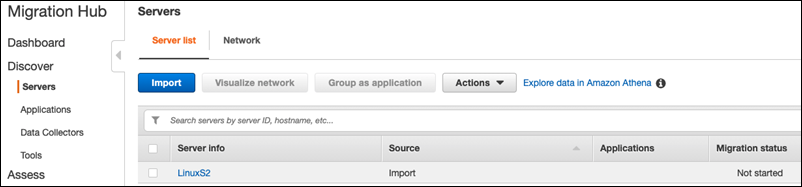

AWS Migration Hub is no longer open to new customers as of November 7, 2025. For capabilities similar to AWS Migration Hub, explore [AWS Transform](https://aws.amazon.com/transform "https://aws.amazon.com/transform").

# Prerequisites for Strategy Recommendations

The following are the prerequisites for using Migration Hub Strategy Recommendations.

- You must have one or more AWS accounts, and users set up for these accounts.
  For more information, see [Setting up Strategy Recommendations](setting-up.md "setting-up.md").
- The Strategy Recommendations application data collector client must be able to collect data
  remotely from servers. This requires that you use a set of credentials that work
  for all your Windows servers and a set of credentials that work for all of your
  Linux servers. The credentials must have permissions to create and delete
  directories in your servers.
- The version of the collector that is deployed in vCenter supports VMware
  vCenter Server V6.0, V6.5, 6.7 or 7.0.

You can also deploy the collector in an Amazon EC2 instance using the collector
AMI.

- Verify that your operating system (OS) environment is supported:
  - **Linux**
    - Amazon Linux 2012.03, 2015.03
    - Amazon Linux 2 (9/25/2018 update and later)
    - Ubuntu 12.04, 14.04, 16.04, 18.04, 20.04
    - Red Hat Enterprise Linux 5.11, 6.10, 7.3, 7.7, 8.1
    - CentOS 5.11, 6.9, 7.3
    - SUSE 11 SP4, 12 SP5

  - **Windows**
    - Windows Server 2008 R1 SP2, 2008 R2 SP1
    - Windows Server 2012 R1, 2012 R2
    - Windows Server 2016
    - Windows Server 2019

- For source code analysis, your GitHub and GitHub Enterprise repositories must
  have a personal access token with the **repo** scope that can
  be shared with the Strategy Recommendations collector client. For more information about
  creating a personal access token with the **repo** scope, see
  [Creating a personal access token](https://docs.github.com/en/free-pro-team@latest/github/authenticating-to-github/creating-a-personal-access-token "https://docs.github.com/en/free-pro-team@latest/github/authenticating-to-github/creating-a-personal-access-token") in the _GitHub
  Docs_.

To analyze .NET repositories for Porting Assistant for .NET recommendations, you must provide a
Windows machine that is set up with the Porting Assistant for .NET porting assessment tool. For more
information, see [Getting started with Porting Assistant for .NET](../../../portingassistant/latest/userguide/porting-assistant-getting-started.md "../../../portingassistant/latest/userguide/porting-assistant-getting-started.md") in the
_Porting Assistant for .NET User Guide_.

- To enable Strategy Recommendations for database analysis, you must enter credentials in
  AWS Secrets Manager. For more information, see [Strategy Recommendations database analysis](database-analysis.md "database-analysis.md").
- You must use AWS Application Discovery Service to collect data about your servers and
  applications in the AWS Migration Hub console before using Strategy Recommendations. You can use
  one of the following methods to collect the data.
  - **Migration Hub import** – With Migration Hub
    import, you can import information about your on-premises servers and
    applications into Migration Hub. For more information, see [Migration Hub Import](../../../application-discovery/latest/userguide/discovery-import.md "../../../application-discovery/latest/userguide/discovery-import.md") in
    the _Application Discovery Service User Guide_.
  - **AWS Application Discovery Service
    Agentless Collector** – The Agentless Collector is a
    VMware appliance that collects information about VMware virtual machines
    (VMs). For more information, see [Agentless Collector](../../../application-discovery/latest/userguide/agentless-collector.md "../../../application-discovery/latest/userguide/agentless-collector.md") in the
    _Application Discovery Service User Guide_.
  - **AWS Application Discovery Agent** – The Discovery Agent is
    AWS software that you install on your on-premises servers and VMs to
    capture system information and details of the network connections
    between systems. For more information, see [AWS Application Discovery Agent](../../../application-discovery/latest/userguide/discovery-agent.md "../../../application-discovery/latest/userguide/discovery-agent.md") in
    the _Application Discovery Service User Guide_.

- **Strategy Recommendations data collector** – If your servers
  are hosted in VMware vCenter, and you provide access, Strategy Recommendations can automatically
  fetch your server inventory. The Strategy Recommendations console will use the collected
  information to assist with the assessment.

###### Note

To verify that the Migration Hub import completed successfully, in the Migration Hub console
navigation pane, under **Discover**, choose
**Servers**. All the imported servers should be listed.

## Next

[Step 1: Download the Strategy Recommendations
collector](getting-started-dowmload-collector.md "getting-started-dowmload-collector.md")
