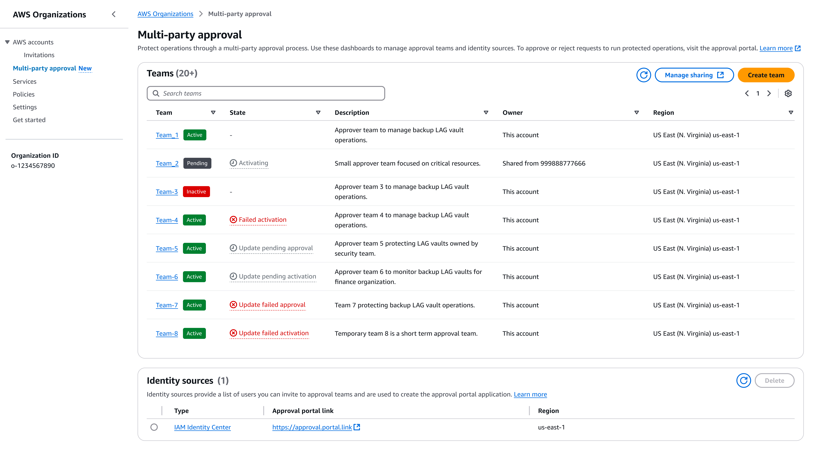

# Administrator tasks for Multi-party approval

As an administrator, you are responsible for managing and creating approval teams. When you create a team, you set the initial approval requirements and invite approvers to join the team.

When a team is active, you can request to update the team description, approval threshold, and approvers assigned to a team. You can also request to delete the team. Requests that you make require team approval to take effect.

**Use the Multi-party approval console for administrator tasks**

The Multi-party approval console is located in the AWS Organizations console, and is an interface for the Multi-party approval admin to create and manage their approval teams.

_Figure 1: Diagram depicting the Multi-party approval console._

###### Topics

- [Set up Multi-party approval](setting-up.md "setting-up.md")
- [Create team](create-team.md "create-team.md")
- [View team](admin-view-team.md "admin-view-team.md")
- [Update team](update-team.md "update-team.md")
- [Share team](share-team.md "share-team.md")
- [Delete team](delete-team.md "delete-team.md")
- [Cancel session](cancel-session.md "cancel-session.md")
- [Disable Multi-party approval](delete-identity-source.md "delete-identity-source.md")
