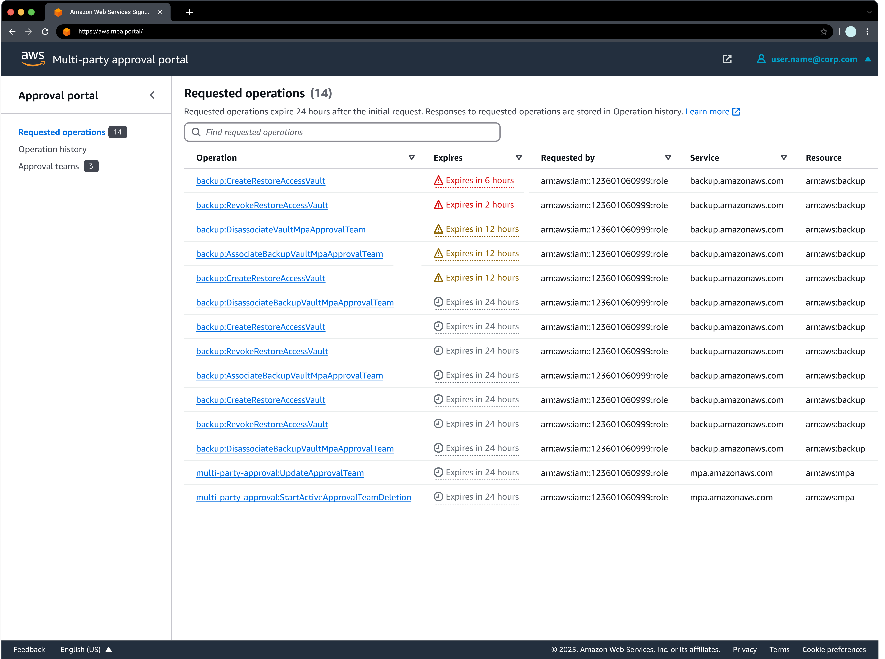
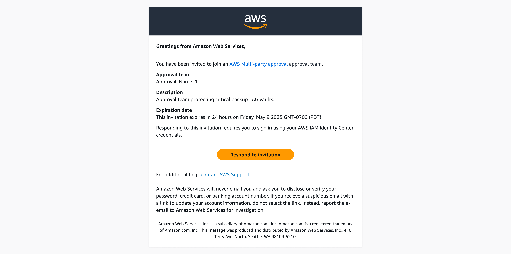

# Approver tasks for Multi-party approval

As an approver, you play a key role in reviewing and responding to requested operations that require team approval.
When you have accepted the team invitation and the team is active, you'll receive email notifications whenever there are pending requests that need your attention.

**Use the Multi-party approval portal for approver tasks**

The Multi-party approval portal is an AWS managed application for AWS IAM Identity Center.

It's the central hub where you can view and respond to requested operations and pending team invitations, view which teams you belong to, and view historical team decisions.

_Figure 1: Diagram depicting the Multi-party approval portal._

**Check for team invitations**

To view an invitation for an approval team, search your email inbox for "Multi-party approval team invitation".

_Figure 2: Diagram depicting a Multi-party approval team invitation._

###### Topics

- [Respond to requested operations](respond-request.md "respond-request.md")
- [View an approval team](approver-view-team.md "approver-view-team.md")
- [View operation history](view-operation-history.md "view-operation-history.md")
