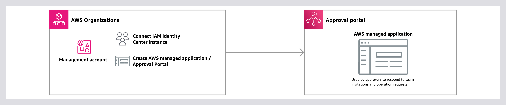

# Set up Multi-party approval

When you sign in to your organization's management account, you can set up Multi-party approval by navigating to the Multi-party approval console and creating a Multi-party approval identity source.

An _identity source_
is a Multi-party approval resource that models the connection between Multi-party approval and the AWS IAM Identity Center instance that manages the user authentication for approvers.


_Figure 1: Diagram depicting a Multi-party approval administrator setting up Multi-party approval._

## Create a Multi-party approval identity source

To create an identity source,
complete the following steps.

**Minimum permissions**

To create a Multi-party approval identity source, you need permission to run the following actions:

- `kms:Decrypt`
- `mpa:CreateIdentitySource`
- `sso:CreateApplication`
- `sso:DeleteApplication`
- `sso:DescribeApplication`
- `sso:DescribeInstance`
- `sso:ListInstances`
- `sso:PutApplicationAccessScope`
- `sso:PutApplicationAssignmentConfiguration`
- `sso:PutApplicationAuthenticationMethod`
- `sso:PutApplicationGrant`

If you are using the AWS Management Console, you also need permission to run the following actions:

- `kms:Decrypt`
- `organizations:DescribeOrganization`
- `organizations:ListDelegatedAdministrators`
- `sso:DescribeInstance`
- `sso:DescribeRegisteredRegions`
- `sso:GetSharedSsoConfiguration`
- `sso:ListInstances`

AWS Management Console

###### To create a Multi-party approval identity source

1. Open the Organizations console at [https://console.aws.amazon.com/organizations/](https://console.aws.amazon.com/organizations/ "https://console.aws.amazon.com/organizations/").
2. On the left navigation, choose **Multi-party approval**.
3. On the **Multi-party approval** console, choose **Set up Multi-party approval**.
4. On the **Set up Multi-party approval** page, wait for the Multi-party approval to search for your IAM Identity Center instance. If you don't have an IAM Identity Center instance, you will be prompted to create one.
5. After Multi-party approval has found your IAM Identity Center instance, choose **Complete setup**.

AWS CLI & AWS SDKs

###### To create a Multi-party approval identity source

You can use one of the following operations:

- AWS CLI: [list-instances](../../../cli/latest/reference/sso-admin/list-instances.md "../../../cli/latest/reference/sso-admin/list-instances.md") and [create-identity-source](../../../cli/latest/reference/mpa/create-identity-source.md "../../../cli/latest/reference/mpa/create-identity-source.md")
  1.  Run the following command to return a list of Amazon Resource Names (ARNs) for your IAM Identity Center instances:

  ```
  `$` `C:\>` **aws sso-admin list-instances**
  ```

  2.  Run the following command to create a Multi-party approval identity source with the available IAM Identity Center of your choice:

  ```
  `$` `C:\>` **aws mpa create-identity-source \
   --identity-source-parameters '{
   "IamIdentityCenter": {
   "InstanceArn": "arn:aws:sso:::instance/ssoins-`111122223333`",
   "Region": "`region`"
   }
   }'**
  ```

      + **`InstanceArn`**: Amazon Resource Name (ARN) for the IAM Identity Center instance you want to connect with Multi-party approval.
      + **`Region`**: AWS Region where the IAM Identity Center instance is located.

- AWS SDKs: [ListInstances](../../../singlesignon/latest/APIReference/API_ListInstances.md "../../../singlesignon/latest/APIReference/API_ListInstances.md") and [CreateIdentitySource](../APIReference/API_CreateIdentitySource.md "../APIReference/API_CreateIdentitySource.md")

###### What to do next

After you set up Multi-party approval, you can create approval teams in the Multi-party approval console or using the AWS CLI & AWS SDKs.
For more information, see [Create team](create-team.md "create-team.md").

## Considerations

**AWS Organizations is required**

Multi-party approval is a capability of AWS Organizations. You access the Multi-party approval console through the Organizations console.

To set up Organizations,
see [Getting started with AWS Organizations](../../../organizations/latest/userguide/orgs_getting-started.md "../../../organizations/latest/userguide/orgs_getting-started.md") in the _Organizations User Guide_.

**Organization instance of IAM Identity Center is required**

Multi-party approval requires access to your identities in AWS IAM Identity Center. To enable an organization instance, see [Enable IAM Identity Center](../../../singlesignon/latest/userguide/enable-identity-center.md "../../../singlesignon/latest/userguide/enable-identity-center.md") in the _IAM Identity Center User Guide_.

For your organization instance, we strongly recommend using an [external identity provider](../../../singlesignon/latest/userguide/manage-your-identity-source-idp.md "../../../singlesignon/latest/userguide/manage-your-identity-source-idp.md").
This setup separates IAM Identity Center administrative privileges from identity management, which helps prevent the admin from being able to bypass Multi-party approval mechanisms by changing approver passwords and assuming their identities.

**Cross-Region setup for the IAM Identity Center instance**

When you enable Multi-party approval and your IAM Identity Center instance in different Regions, Multi-party approval makes calls across Regions to IAM Identity Center. This means that [user and group](../../../singlesignon/latest/userguide/users-groups-provisioning.md "../../../singlesignon/latest/userguide/users-groups-provisioning.md") information moves across Regions.

If the Region where the IAM Identity Center instance is located experiences issues, approvers might temporarily be unable to access the Multi-party approval portal, and delivery of notifications about new approvals might be delayed.

**One identity source for Multi-party approval**

Creating an Multi-party approval identity source is a one-time operation, and you can only have one identity source for Multi-party approval.
